# 配置 Python 数据分析环境

在本章中，我们将介绍以下主题：

*   安装 Anaconda
*   探索 Jupyter 笔记本
*   探索 Jupyter 的替代品
*   管理 Anaconda 包
*   配置数据库

在本章中，我们将讨论如何安装和管理 Anaconda。 Anaconda 是一个包，我们将在本书的以下各章中使用。

## 什么是 Anaconda？

在本节中，我们将讨论什么是 Anaconda 以及为什么使用它。 我们将提供一个链接，以显示从其赞助商 Continuum Analytics 的网站下载 Anaconda 的位置，并讨论如何安装 Anaconda。 Anaconda 是 Python 和 R 编程语言的开源发行版。

在本书中，我们将专注于 Anaconda 专门用于 Python 的部分。 Anaconda 帮助我们将这些语言用于数据分析应用，包括大规模数据处理，预测分析以及科学和统计计算。 Continuum Analytics 为 Anaconda 提供企业支持，包括可帮助团队协作并提高其系统性能的版本，并提供一种部署使用 Anaconda 开发的模型的方法。 因此，Anaconda 出现在企业环境中，有抱负的分析师应该熟悉它的用法。 Anaconda 附带了本书中使用的许多包，包括 Jupyter，NumPy，pandas 以及其他许多数据分析中常用的包。 仅此一项就可以解释其受欢迎程度。

Anaconda 的安装包括现成的数据分析所需的大部分内容。 Conda 包管理器还可用于下载和安装新包。

为什么要使用 Anaconda？ Anaconda 专门为数据分析打包了 Python。 Anaconda 安装中包含了您项目中最重要的包。 除了 Anaconda 提供的一些性能提升，和 Continuum Analytics 对该包的企业支持之外，对于它的流行也不应感到惊讶。

## 安装 Anaconda

您可以从 Continuum Analytics 网站免费下载 Anaconda。 [下载主页面在这里](https://www.anaconda.com/download/)； 否则，很容易找到。 确保选择适合您系统的安装程序。 显然，选择适合您的操作系统的安装程序，但也要注意 Anaconda 具有 32 位和 64 位版本。 64 位版本为 64 位系统提供最佳性能。

Python 社区正处于从 Python 2.7 到 Python 3.6 的缓慢过渡中，这不是完全向后兼容的。 如果您需要使用 Python 2.7，可能是由于遗留代码或尚未更新为与 Python 3.6 兼容的包，请选择 Anaconda 的 Python 2.7 版本。 否则，我们将使用 Python 3.6。

以下屏幕截图来自 Anaconda 网站，分析人员可从该网站下载 Anaconda：


Anaconda website

如您所见，我们可以选择适用于操作系统（包括 Windows，macOS 和 Linux），处理器和 Python 版本的 Anaconda 安装。 导航到正确的操作系统和处理器，然后在 Python 2.7 和 Python 3.6 之间进行选择。

在这里，我们将使用 Python 3.6。 在 Windows 和 macOS 上进行安装最终等同于使用安装向导，该安装向导通常会为您的系统选择最佳选项，尽管它确实允许某些选项根据您的首选项而有所不同。

Linux 安装必须通过命令行完成，但是对于那些熟悉 Linux 安装的人来说，它应该不会太复杂。 最终，这相当于运行 Bash 脚本。 在本书中，我们将使用 Windows。

## 探索 Jupyter 笔记本

在本节中，我们将探索 Jupyter 笔记本，这是我们将使用 Python 进行数据分析的主要工具。 我们将看到什么是 Jupyter 笔记本，还将讨论 Markdown，这是我们在 Jupyter 笔记本中用于创建格式化文本的工具。 在 Jupyter 笔记本中，有两种类型的块。 有一些可执行的 Python 代码块，然后是带格式的，人类可读的文本块。

用户执行 Python 代码块，然后将结果直接插入文档中。 除非以同样的方式运行，否则代码块可以以任何顺序重新运行，而不必影响以后的块。 由于 Jupyter 笔记本基于 IPython，因此有一些附加功能，例如魔术命令。

Anaconda 随附 Jupyter 笔记本。 Jupyter 笔记本允许纯文本与代码混合。 可以使用称为 **Markdown** 的语言格式化纯文本。 它以纯文本格式完成。 我们也可以插入段落。 以下示例是您在 Markdown 中看到的一些常见语法：

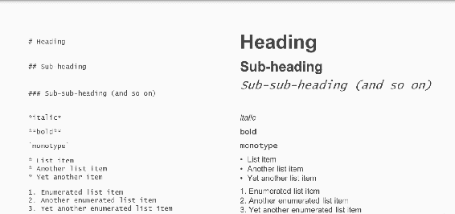

以下屏幕截图显示了 Jupyter 笔记本：

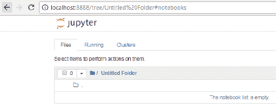

如您所见，它用尽了网络浏览器，例如 Chrome 或 Firefox，在这种情况下为 Chrome。 当我们开始 Jupyter 笔记本时，我们在文件浏览器中。 我们在一个新创建的目录`Untitled Folder`中。 在 Jupyter 笔记本中，有用于创建新笔记本，文本文件和文件夹的选项。 如前面的屏幕截图所示，当前没有保存笔记本。 我们将需要一个 Python 笔记本，可以通过在以下屏幕快照中显示的“新建”下拉菜单中选择 Python 选项来创建它。

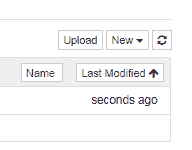

笔记本启动后，我们从一个代码块开始。 我们可以将此代码块更改为 Markdown 块，现在可以开始输入文本了。

例如，我们可以输入标题。 我们还可以输入纯文本以及粗体和斜体，如下面的屏幕快照所示：

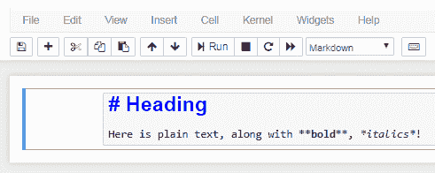

如您所见，在渲染结束时会有一些提示，但是实际上我们可以通过单击运行单元按钮来查看渲染。 如果要更改此设置，可以双击同一单元格。 现在我们回到纯文本编辑。 在这里我们添加单型，然后再次单击运行单元，如下所示：


在按下`Enter`时，随后将立即创建一个新单元格。 该单元格是一个 Python 单元格，我们可以在其中输入 Python 代码。 例如，我们可以创建一个变量。 我们多次打印`Hello, world!`，如以下屏幕截图所示：

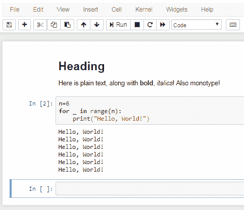

要查看执行单元时会发生什么，我们只需单击运行单元； 同样，当我们按`Enter`时，将创建一个新的单元块。 让我们将此单元格块标记为 Markdown 块。 如果要插入其他单元格，可以按下面的插入单元格。 在第一个单元格中，我们将输入一些代码，在第二个单元格中，我们可以输入依赖于第一个单元格中的代码的代码。 注意当我们尝试在第一个单元格中执行代码之前在第二个单元格中执行代码时会发生什么。 将产生一个错误，如下所示：


投诉变量`trigger`尚未定义。 为了使第二个单元正常工作，我们需要运行第一个单元。 然后，当我们运行第二个单元格时，我们将获得预期的输出。 现在假设我们要更改此单元格中的代码。 比方说，我们有`trigger = True`而不是`trigger = False`。 第二个单元将不知道该更改。 如果再次运行此单元格，则会得到相同的输出。 因此，我们将需要首先运行此单元格，从而影响更改。 然后我们可以运行第二个单元并获得预期的输出。

后台发生了什么？ 发生的事情是有一个内核，它基本上是一个正在运行的 Python 会话，它跟踪我们所有的变量以及到目前为止发生的所有事情。 如果单击内核，则可以看到重新启动内核的选项。 这将基本上重新启动我们的 Python 会话。 我们最初警告说，通过重新启动内核，所有变量都将丢失。

重新启动内核后，似乎没有任何更改，但是如果我们运行第二个单元，则将产生错误，因为变量`trigger`不存在。 我们将需要首先运行上一个单元，以便该单元正常工作。 相反，如果我们不仅要重启内核，还要重启内核并重新运行所有单元，则需要单击“重启并运行全部”。 重新启动内核后，将重新运行所有单元块。 它可能看起来好像没有发生任何事情，但是我们已经从第一个开始，运行它，运行第二个单元格，然后运行第三个单元格，如下所示：

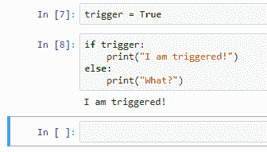

我们也可以导入库。 例如，我们可以从 Matplotlib 导入模块。 在这种情况下，为了使 Matplotlib 在 Jupyter 笔记本中交互工作，我们将需要使用魔术命令，该魔术命令以％开头，魔术命令的名称以及需要传递给的任何类型的参数。 它。 稍后，我们将在详细信息中介绍这些内容，但首先让我们运行该单元格。`plt`现在已经加载，现在我们可以使用它了。 例如，在最后一个单元格中，我们将输入以下代码：


请注意，此单元格的输出直接插入到文档中。 我们可以立即  看到创建的图。 回到魔术命令，这不是我们唯一可用的命令。 让我们看看其他命令：

*   魔术命令`magic`将打印有关魔术系统的信息，如以下屏幕截图所示：

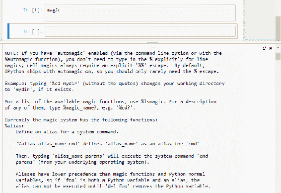

魔术命令的输出

*   另一个有用的命令是`timeit`，我们可以使用它来分析代码。 我们首先输入`timeit`，然后输入我们希望分析的代码，如下所示：


*   魔术命令`pwd`可用于查看工作目录是什么，如下所示：


*   魔术命令`cd`可用于更改工作目录，如下所示：

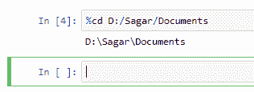

*   如果我们希望以交互模式启动 Matplotlib 和 NumPy，魔术命令`pylab`很有用，如下所示：


如果希望查看可用魔术命令的列表，可以键入`lsmagic`，如下所示：


如果需要快速参考表，可以使用魔术命令`quickref`，如下所示：


现在，我们已经完成了此笔记本的工作，让我们为其命名。 我们简单地称它为`My Notebook`。 通过单击编辑器窗格顶部的笔记本名称来完成此操作。 最后，您可以保存，并且保存后可以关闭和停止笔记本电脑。 因此，这将关闭笔记本并停止笔记本的内核。 那是离开笔记本电脑的干净方法。 现在注意，在我们的树中，我们可以看到保存笔记本的目录，并且可以看到该目录中存在笔记本。 它是`ipynb`文件。

## 探索 Jupyter 的替代品

现在，我们将考虑替代 Jupyter 笔记本。 我们将看：

*   Jupyter QT 控制台
*   Spider
*   Rodeo
*   Python 解释器
*   ptpython

我们将考虑的第一个替代方案是 Jupyter QT 控制台。 这是一个具有附加功能的 Python 解释器，专门用于数据分析。

以下屏幕截图显示了 Jupyter QT 控制台：


它与 Jupyter 笔记本非常相似。 实际上，它实际上是 Jupyter 笔记本的控制台版本。 注意这里我们有一些有趣的语法。 我们有`In [1]`，然后假设您要键入一个命令，例如：

```py
print ("Hello, world!")
```


我们看到一些输出，然后看到`In [2]`。

现在让我们尝试其他方法：

```py
1 + 1
```


在`In [2]`之后，我们看到`Out[2]`。 这是什么意思？ 这是一种在会话中跟踪历史命令及其输出的方法。 要访问`In [42]`的命令，我们输入`_i42`。 因此，在这种情况下，如果要查看命令 2 的输入，请键入`i2`。 注意，它给我们一个字符串`1 + 1`。实际上，我们可以运行此字符串。

如果我们输入`eval`，然后输入`_i2`，请注意，它给我们提供的输出与原始命令`In [2]`相同。 现在`Out[2]`怎么样？ 我们如何获取实际输出？ 在这种情况下，我们要做的只是`_`，然后是输出的数量，例如 2。这应该给我们 2。因此，这为您提供了一种更方便的方法来访问历史命令及其输出。

Jupyter 笔记本电脑的另一个优点是您可以看到图像。 例如，让我们运行 Matplotlib。 首先，我们将使用以下命令导入 Matplotlib：

```py
import matplotlib.pyplot as plt

```

导入 Matplotlib 之后，回想一下我们需要运行某种魔术，即 Matplotlib 魔术：

```py
%matplotlib inline

```

我们需要给它内联参数，现在我们可以创建一个 Matplotlib 图形。 请注意，该图像显示在命令的正下方。 当我们输入`_8`时，它表明创建了 Matplotlib 对象，但实际上并未显示图本身。 如您所见，与典型的 Python 控制台相比，我们可以以更高级的方式使用 Jupyter 控制台。 例如，让我们使用名为`Iris`的数据集； 使用以下行将其导入：

```py
from sklearn.datasets import load_iris

```

这是用于数据分析的非常常见的数据集。 它通常用作求值训练模型的一种方法。 我们还将在此上使用 k 均值聚类：

```py
from sklearn.cluster import KMeans

```

`load_Iris`函数实际上不是`Iris`数据集； 它是我们可以用来获取`Iris`数据集的函数。 以下命令实际上将使我们能够访问该数据集：

```py
iris  = load_iris()

```

现在，我们将在此数据集上训练 K 均值聚类方案：

```py
iris_clusters = KMeans(n_clusters = 3, init =  "random").fit(iris.data)

```

键入函数时，我们可以立即查看文档。 例如，我知道`n_clusters`参数的含义。 它实际上是函数中的原始文档字符串。 在这里，我希望聚类的数量为`3`，因为我知道此数据集中实际上有三个真实聚类。 既然已经训练了聚类方案，我们可以使用以下代码对其进行绘制：

```py
plt.scatter(iris.data[:, 0], iris.data[:, 1], c = iris_clusters.labels_)

```

## Spyder

Spyder 是与 Jupyter 笔记本或 Jupyter QT 控制台不同的 IDE。 它集成了 NumPy，SciPy，Matplotlib 和 IPython。 它可以通过插件扩展，并且包含在 Anaconda 中。

以下屏幕截图显示了 Spyder，这是一个用于数据分析和科学计算的实际 IDE：

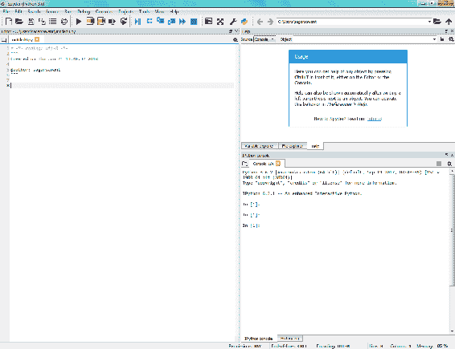

Spyder Python 3.6

在右侧，您可以转到文件资源管理器以搜索要加载的新文件。 在这里，我们要打开`iris_kmeans.py`。 这是一个文件，其中包含我们之前在 Jupyter QT 控制台中使用的所有命令。 请注意，在右侧，编辑器有一个控制台。 实际上就是 IPython 控制台，您将其视为 Jupyter QT 控制台。 我们可以通过单击 Run 选项卡来运行整个文件。 它将在控制台中运行，如下所示：

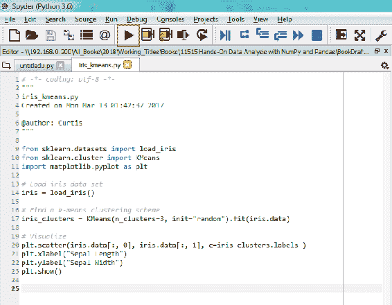

以下屏幕截图将作为输出：

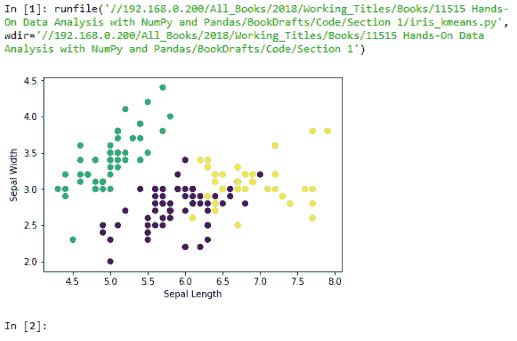

注意，最后我们看到了之前看到的聚类结果。 我们也可以在命令中以交互方式键入； 例如，我们可以使计算机说`Hello, world!`。

在编辑器中，我们输入一个新变量，例如`n = 5`。 现在，让我们在编辑器中运行此文件。 请注意，`n`是编辑器可以识别的变量。 现在让我们进行更改，例如`n = 6`。 除非我们再次实际运行此文件，否则控制台将不会意识到所做的更改。 因此，如果我再次在控制台中键入`n`，则没有任何变化，仍然是`5`。 您需要运行此行才能实际看到更改。

我们还有一个变量浏览器，可以在其中查看变量的值并进行更改。 例如，我可以将`n`的值从`6`更改为`10`，如下所示：

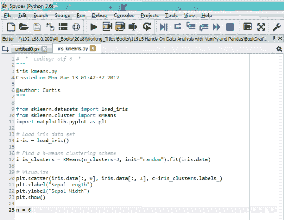

以下屏幕截图显示了输出：

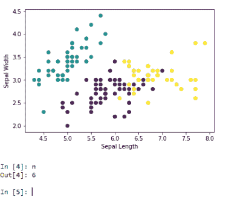

然后，当我进入控制台并询问`n`是什么时，它会说`10`：

```py
n
10

```

到此结束我们对 Spyder 的讨论。

## Rodeo

Rodeo 是 Yhat 开发的 Python IDE，专门用于数据分析应用。 它旨在模拟在 R 用户中很流行的 RStudio IDE，并且可以从 Rodeo 的网站上下载。 基本的 Python 解释器的唯一优点是每个 Python 安装程序都包含它，如下所示：

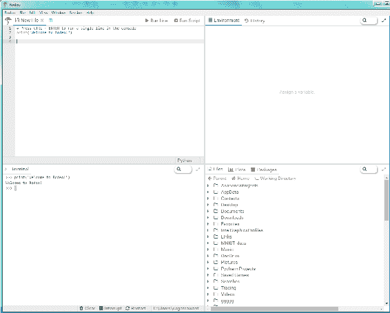

## ptpython

Jonathan Slenders 设计的`ptpython`可能是鲜为人知的基于控制台的 Python REPL。 它仅存在于控制台中，并且是他的独立项目。 您可以在 GitHub 上找到它。 它具有轻量级功能，但还包括语法突出显示，自动完成，甚至包括 IPython。 可以使用以下命令进行安装：

```py
pip install ptpython

```

到此，我们结束了有关 Jupyter 笔记本替代品的讨论。

## 使用 Conda 进行包管理

现在，我们将与 Conda 讨论包管理。 在本节中，我们将研究以下主题：

*   什么是 Conda？
*   管理 Conda 环境
*   使用 Conda 管理 Python
*   使用 Conda 管理包

## 什么是 Conda？

那么什么是 Conda？ Conda（Conda）是 Anaconda 的包管理器。 Conda 允许我们创建和管理多个环境，从而允许存在多个版本的 Python，R 及其相关包。 如果您需要使用不同版本的 Python 及其包针对不同的系统进行开发，这将非常有用。 Conda 允许您管理 Python 和 R 版本，并且还简化了包的安装和管理。

## Conda 环境管理

Conda 环境允许开发人员在其包中使用和管理不同版本的 Python。 这对于在遗留系统上进行测试和开发很有用。 可以保存，克隆和导出环境，以便其他人可以复制结果。

以下是一些常见的环境管理命令。

对于环境创建：

```py
conda create --name env_name prog1 prog2
conda create --name env_name python=3 prog3

```

对于列表环境：

```py
conda env list

```

要验证环境：

```py
conda info --envs

```

克隆环境：

```py
conda create --name new_env --clone old_env

```

删除环境：

```py
conda remove --name env_name -all

```

用户可以通过创建 YAML 文件来共享环境，收件人可以使用该文件来构建相同的环境。 您可以手动执行此操作，在其中可以有效地复制 Anaconda 所做的工作，但是让 Anaconda 为您创建 YAML 文件要容易得多。

创建了这样的文件后，或者如果您从其他用户那里收到了此文件，则创建新环境非常容易。

## 管理 Python

如前所述，Anaconda 允许您管理多个版本的 Python。 可以搜索并查看哪些版本的 Python 可用于安装。 您可以验证环境中使用的是哪个版本的 Python，甚至可以为 Python 2.7 创建环境。 您还可以更新当前环境中的 Python 版本。

## 包管理

假设我们对安装包`selenium`感兴趣，该包用于 Web 抓取和 Web 测试。 我们可以列出当前安装的包，并且可以给出安装新包的命令。

首先，我们应该搜索以查看 Conda 系统是否提供该包。 并非`pip`上可用的所有包都可从 Conda 获得。 也就是说，实际上可以安装`pip`提供的包，尽管希望，如果我们希望安装包，可以使用以下命令：

```py
conda install selenium

```

如果`selenium`是我们感兴趣的包，则可以从互联网自动下载它，除非您具有 Anaconda 可以直接从您的系统直接安装的文件。

要通过`pip`安装包，请使用以下命令：

```py
pip install package_name

```

当然，可以如下删除包：

```py
conda remove selenium

```

## 配置数据库

现在，我们将开始讨论设置数据库供您使用。 在本节中，我们将研究以下主题：

*   安装 MySQL
*   为 Python 安装 MySQL 连接器
*   创建，使用和删除数据库

为了使 MySQL 和 Python 一起使用，MySQL 连接器是必需的。 存在许多 SQL 数据库实现，尽管 MySQL 可能不是最简单的数据库管理系统，但它功能齐全，具有工业实力，在现实世界中很常见，而且它是免费和开源的，这意味着它是一个很好的学习工具。 您可以从 [MySQL 的网站](https://dev.mysql.com/downloads/)上获取 MySQL 社区版，它是免费和开源的版本。

## 安装 MySQL

对于 Linux 系统，如果可能，我建议您使用可用的任何包管理系统安装 MySQL。 如果您使用的是基于 Red-Hat 的发行版，则可以使用 YUM；如果您使用的是基于 Debian 的发行版，则可以使用 APT；或者，请使用 SUSE 的存储库系统。 如果您没有包管理系统，则可能需要从源代码安装 MySQL。

Windows 用户可以直接从其网站安装 MySQL。 您还应该注意，MySQL 包含 32 位和 64 位二进制文​​件，但是下载的任何程序都可能会为您的系统安装正确的版本。

您可以从以下网页下载适用于 Windows 的 MySQL：


我建议您使用 MySQL 安装程序。 向下滚动，然后在寻找要下载的二进制文件时，请注意，第一个二进制文件表示网络社区。 这将是一个安装程序，可在您进行安装时从互联网上下载 MySQL。 请注意，它比另一个二进制文件小得多。 它基本上包括了您能够安装 MySQL 所需的一切。 如果您继续关注的话，我会建议您下载该文件。

通常有可用的发行版。 这些应该是稳定的。 开发版本旁边是“常规版本”选项卡。 我建议您不要下载这些，除非您知道自己在做什么。

## MySQL 连接器

MySQL 的功能类似于系统上的驱动程序，其他应用则与 MySQL 交互，就好像它是驱动程序一样。 因此，您将需要下载一个 MySQL 连接器，以便能够将 MySQL 与 Python 结合使用。 这将允许 Python 与 MySQL 通信。 您最终要做的是将其加载到包中，然后开始与 MySQL 的连接。 可以从 [MySQL 的网站](https://dev.mysql.com/downloads/connector/)下载 Python 连接器。

该网页对于任何操作系统都是通用的，因此您需要选择适当的平台，例如 Linux，OS X 或 Windows。 无论您使用的是 32 位还是 64 位版本，都需要选择并下载与系统架构最匹配的安装程序，以及 Python 版本。 然后，您将使用安装向导以将其安装在系统上。

这是用于下载和安装连接器的页面：

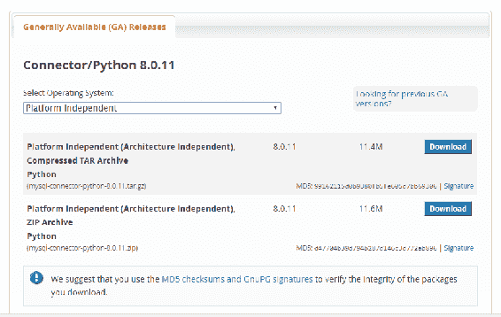

注意，我们可以在这里选择哪个平台合适。 我们甚至有独立于平台的版本和源代码版本。 也可以使用包管理系统进行安装，例如，如果使用的是基于 Debian 的系统，则为 APT；如果使用的是基于 Red-Hat 的系统，则为 Ubuntu 或 YUM，等等。 我们有许多不同的安装程序，因此我们需要知道我们正在使用哪个版本的 Python。 建议您使用与项目中实际使用的版本最接近的版本。 您还需要在 32 位和 64 位之间进行选择。 然后，单击下载并按照安装程序的说明进行操作。

因此，数据库管理是一个主要主题。 涉及数据库管理的所有内容将使我们远远超出本书的范围。 我们不会谈论好的数据库是如何设计的。 我建议您转到另一个资源，也许是另一个解释这些主题的 Packt 产品，因为它们很重要。 关于 SQL，我们只会告诉您基本级别使用 SQL 所需的命令。 也没有关于权限的讨论，因此我们将假设您的数据库对使用它的任何用户都具有完全权限，并且一次只有一个用户。

## 建立数据库

在 MySQL 命令行中安装 MySQL 之后，我们可以使用以下命令创建数据库，其后为数据库的名称：

```py
create database

```

每个命令必须以分号结尾； 否则，MySQL 将等到命令实际完成。

您可以使用以下命令查看所有可用的数据库：

```py
show databases
```

我们可以通过以下命令指定要使用的数据库：

```py
use database_name

```

如果要删除数据库，可以使用以下命令删除数据库：

```py
drop database database_name

```

这是 MySQL 命令行：

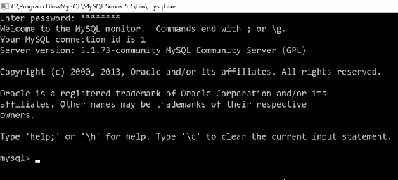

让我们练习管理数据库。 我们可以使用以下命令创建数据库：

```py
create database mydb

```

要查看所有数据库，我们可以使用以下命令：

```py
show databases

```

这里有多个数据库，其中一些来自其他项目，但是正如您所看到的，我们刚刚创建的数据库`mydb`显示如下：

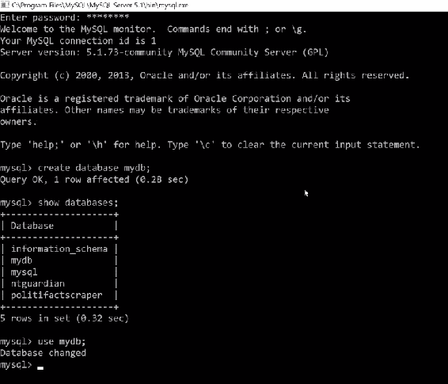

如果要使用此数据库，则可以使用命令`use mydb`。 MySQL 说数据库已更改。 这意味着当我发出诸如创建表，从表中读取或添加新数据之类的命令时，所有这些操作都将由数据库`mydb`完成。

假设我们要删除数据库`mydb`； 我们可以使用以下命令进行操作：

```py
drop database mydb

```

这将删除数据库。

## 总结

在本章中，向我们介绍了 Anaconda，了解了为什么它是一个有用的起点，然后下载并安装了它。 我们探索了 Jupyter 的一些替代方法，介绍了如何管理 Anaconda 包，还学习了如何设置 MySQL 数据库。 不过，在本书的其余部分中，我们都假定已经安装了 Anaconda。 在下一章中，我们将讨论如何使用 NumPy，它是数据分析中的有用包。 没有这个包，使用 Python 进行数据分析几乎是不可能的。