# 管理，建立索引和绘图

现在让我们简要介绍一下使用 pandas 方法对数据进行排序。 在本章中，我们将研究排序和排名。 排序是将数据按各种顺序排列，而排名则是查找数据如果经过排序将位于哪个顺序中。 我们将看看如何在 Pandas 中实现这一目标。 我们还将介绍 Pandas 的分层索引和绘图。

# 索引排序

在谈论排序时，我们需要考虑我们到底要排序什么。 有行，列，它们的索引以及它们包含的数据。 让我们首先看一下索引排序。 我们可以使用`sort_index`方法重新排列数据帧的行，以使行索引按顺序排列。 我们还可以通过将`sort_index`的访问参数设置为`1`来对列进行排序。 默认情况下，排序是按升序进行的； 后几行的值比前几行大，但是我们可以通过将`sort_index`值的升值设置为 false 来更改此行为。 这按降序排序。 默认情况下，此操作未就位。 为此，您需要将`sort_index`的就地参数设置为 true。

虽然我强调了对数据帧进行排序，但是对系列进行排序实际上是相同的。 让我们来看一个例子。 加载 NumPy 和 pandas 之后，我们创建一个数据帧并带有要排序的值，如以下屏幕快照所示：

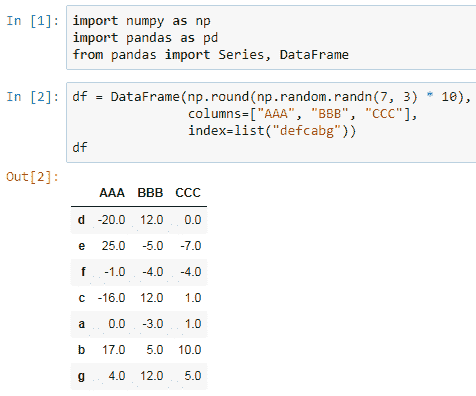

让我们对索引进行排序； 请注意，这没有就位：

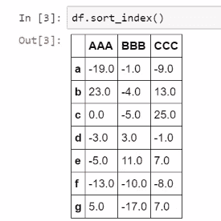

这次我们将列排序 ，我们将通过设置 `ascending=False` 来反向排列它们； 因此第一列现在是`CCC`，最后一列是`AAA`，如下所示：

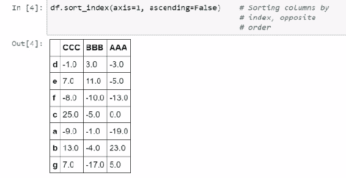

# 按值排序

如果我们希望对数据帧的行或一系列元素进行排序，则需要使用`sort_values`方法。 对于系列，您可以致电`sort_values`并每天致电。 但是，对于数据帧，您需要设置`by`参数； 您可以将`by`设置为一个字符串，以指示要作为排序依据的列，或者设置为字符串列表，以指示列名称。 根据该列表的第一列，将首先进行的排序； 然后，当出现领带时，将根据下一列进行排序，依此类推。

因此，让我们演示其中一些排序技术。 我们根据`AAA`列对数据帧的值进行排序，如以下屏幕截图所示：

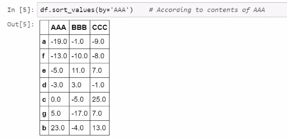

请注意，`AAA`中的所有条目现在都是按顺序排列的，尽管其他列的内容不多。 但是我们可以使用以下命令根据`BBB`排序并根据`CCC`打破平局。 结果如下：

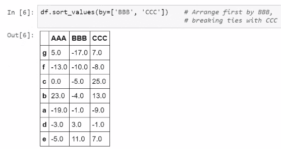

排名告诉我们如果元素按顺序排列将如何显示。 我们可以使用 rank 方法来查找系列或数据帧中元素的排名。 默认情况下，排名是按升序进行的； 将升序参数设置为 false 可更改此设置。 除非发生联系，否则排名很简单。 在这种情况下，您将需要一种确定排名的方法。 有四种处理联系的方法：平均值，最小值，最大值和第一种。 平均值给出平均等级，最小值赋予尽可能低的等级，最大值赋予尽可能最高的等级，然后首先使用序列中的顺序打破平局，以使它们永远不会发生。 当在数据帧上调用时，每一列都将单独排名，结果将是一个包含等级的数据帧。 现在，让我们看看这个排名。 我们要求`df`中条目的排名，这实际上是结果：

注意，我们看到了此数据帧每个条目的排名。 现在，请注意这里有一些联系，特别是对于列`CCC`的条目`e`和条目`g`。 我们使用平均值来打破平局，这是默认设置，但是如果我们愿意，可以将其设置为`max`，如下所示：

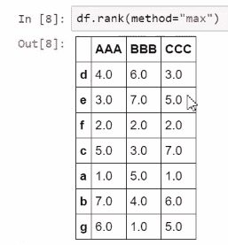

结果，这两个都排在第五位。 接下来，我们讨论分层索引。

# 分层索引

我们已经走了很长一段路，但是还没有完成。 我们需要谈论分层索引。 在本节中，我们研究层次索引，为何有用，如何创建索引以及如何使用它们。

那么，什么是层次结构索引？ 它们为索引带来了额外的结构，并以`MultiIndex`类对象的形式存在于 Pandas 中，但它们仍然是可以分配给序列或数据帧的索引。 对于分层索引，我们认为数据帧中的行或系列中的元素由两个或多个索引的组合唯一标识。 这些索引具有层次结构，选择一个级别的索引将选择具有该级别索引的所有元素。 我们可以走更理论的道路，并声称当我们有`MultiIndex`时，表格的尺寸会增加。 它的行为不是作为存在数据的正方形，而是作为多维数据集，或者至少是可能的。

当我们想要索引上的其他结构而不将该结构视为新列时，将使用分层索引。 创建`MultiIndex`的一种方法是在 Pandas 中使用`MultiIndex`对象的初始化方法。 我们也可以在创建 Pandas 系列或数据帧时隐式创建`MultiIndex`，方法是将列表列表传递给`index`参数，每个列表的长度与该系列的长度相同。 两种方法都是可以接受的，但是在第一种情况下，我们将有一个`index`对象分配给序列或要创建的数据帧。 第二个是同时创建系列和`MultiIndex`。

让我们创建一些层次结构索引。 导入 Pandas 和 NumPy 之后，我们直接使用`MultiIndex`对象创建`MultiIndex`。 现在，这种表示法可能有点难以理解，因此让我们创建该索引并解释刚刚发生的情况：

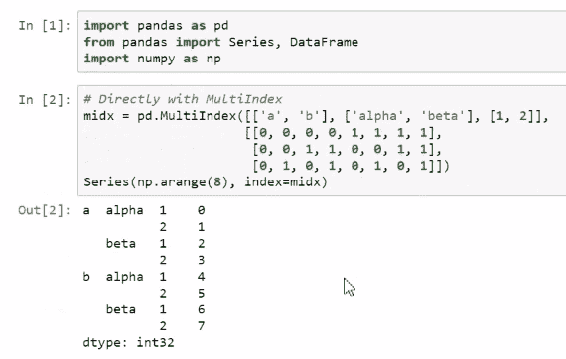

在这里，我们指定索引的级别，即`MultiIndex`可以取的可能值。 因此，对于第一级，我们有`a`和`b`； 对于第二级，`alpha`和`beta`； 对于第三级，`1`和`2`。 然后，我们为`MultiIndex`的每一行分配采用这些级别中的哪个级别。 因此，此第一列表的每个零指示值`a`，此列表的每个零指示值`b`。 然后第二个列表中的`alpha`为零，`beta`为。 在第三列表中，为零，`2`为零。 因此，在将`midx`分配给系列索引后，最终得到该对象。

创建`MultiIndex`的另一种方法是直接在创建我们感兴趣的系列时使用。这里，`index`参数已传递了多个列表，每个列表都是`MulitIndex`的一部分。

第一行用于`MulitIndex`的第一级，第二行用于第二级，第三行用于第三级。 这与我们在较早的情况下所做的非常相似，但是没有明确定义级别，然后定义该系列的每个值中的哪个级别，我们只需要输入我们感兴趣的值即可：

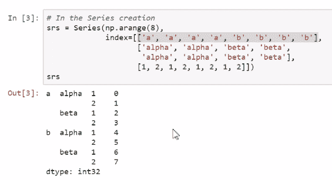

注意，这些产生相同的结果。

# 用分层索引切片序列

在切片时，一系列的层次索引类似于 NumPy 多维数组。 例如，如果使用方括号访问器，我们只需用逗号分隔层次结构索引的级别，然后对每个级别进行切片，就可以想象它们是某些高维对象各个维度的单独索引。 这适用于`loc`方法和序列，但不适用于数据帧； 我们待会儿再看。 使用`loc`时，切片索引时所有常用的技巧仍然有效，但是切片操作获得多个结果会更容易。

因此，让我们看一下实际操作中的`MultiIndex`系列。 我们要做的第一件事是切片第一层，仅选择第一层为`b`的那些元素； 结果是：

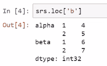

然后我们将其进一步缩小到`b`和`alpha`； 结果如下。 这将是该系列的 Alpha 片段（在前面的屏幕截图中）：

然后我们进一步选择它，因此如果要选择本系列的一个特定元素，我们必须走三个层次，如下所示：

如果我们希望选择序列中的每个元素，例如第一个级别为`a`，最后一个级别为`1`，则需要在中间放置一个冒号，以表示我们不在乎是否有 `alpha`或`beta`，结果如下：

当为数据帧提供层次结构索引时，我们仍然可以使用`loc`方法进行索引，但是这样做比序列更为棘手。 毕竟，我们不能用逗号分隔索引的级别，因为我们有第二维，即列。 因此，我们使用元组为切片数据帧的维度提供了说明，并提供了指示如何进行切片的对象。 元组的每个元素可以是数字，字符串或所需元素的列表。

使用元组时，我们不能真正使用冒号表示法。 我们将需要依靠切片器。 我们在这里看到如何复制切片器常用的一些切片符号。 我们可以将这些切片器传递给用于切片的元组的元素，以便我们可以执行所需的切片操作。 如果要选择所有列，我们仍然需要在`loc`中列的位置提供一个冒号。 自然，我们可以用更具体的切片方法（例如列表或单个元素）替换切片器。 现在，我从未谈论过如果列具有层次结构索引会发生什么情况。 这是因为课程本质上是相同的-因为列只是不同轴上的索引。

因此，现在让我们看一下管理附加到数据帧的层次结构索引。 我们要做的第一件事是创建带有分层索引的数据帧。 然后，我们选择该索引的第一级为`b`的所有行。 我们得到以下结果，这并不太令人震惊：

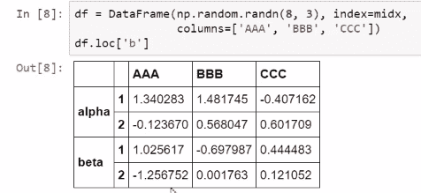

然后我们通过缩小`b`和`alpha`进行重复，但是请注意，我们现在必须使用元组以确保 alpha 不会被解释为我们感兴趣的列，如下所示：

然后，我们进一步缩小范围，如下所示：

现在，让我们尝试复制以前做过的一些事情，但是请记住，我们在这里不能再使用冒号了。 我们必须使用切片器。 因此，我们将在此处使用的切片调用与`srs.loc['b', 'alpha', 1]`中使用的切片调用相同。 我说`slice(None)`，这基本上意味着选择第二级中的所有内容：

如果要选择所有列，则必须在列的位置放一个冒号。 否则将引发错误。 在这里，我们将执行等效于使用`:'b'`的操作，因此我们从一开始就选择`b`。 结果如下：

最后，我们选择第一级中的所有内容，然后选择第二级中的所有内容，但是我们仅在第三级中选择，如下所示：

并注意，我们也一直在将索引调用传递给列，因为这是一个完全独立的调用。 现在，我们继续使用 Pandas 提供的绘图方法。

# 用 Pandas 绘图

在本节中，我们将讨论 pandas series 和数据帧提供的绘图方法。 您将看到如何轻松快速地创建许多有用的图。 Pandas 尚未提出完全属于自己的绘图功能。 相反，使用 pandas 方法从 pandas 对象创建的图只是对称为 **Matplotlib** 的绘图库进行更复杂调用的包装。 这是科学 Python 社区中众所周知的库，它是最早的绘图系统之一，也许是最常用的绘图系统，尽管其他绘图系统正在寻求替代它。

它最初是由 MATLAB 随附的绘图系统启发的，尽管现在它是它自己的野兽，但不一定是最容易使用的。 Matplotlib 具有许多功能，在本课程中，我们将只涉及其绘制的表面。 在本节中，我们将讨论在特定实例之外使用 Python 进行可视化的程度，即使可视化是从初始探索到呈现结果的数据分析的关键部分。 我建议寻找其他资源以了解有关可视化的更多信息。 例如，Packt 有专门针对该主题的视频课程。

无论如何，如果我们希望能够使用 pandas 方法进行绘图，则必须安装 Matplotlib 并可以使用。 如果您正在使用 Jupyter Notebook 或 Jupyter QtConsole 或其他基于 IPython 的环境，则建议运行`pylab`魔术。

# 绘图方法

关键的 pandas 对象，系列和数据帧提供了一种绘图方法，简称为 plot。 它可以轻松地创建 图表，例如折线图，散点图，条形图或所谓的核密度估计图（用于了解数据的形状） ， 等等。 可以创建许多图。 我们可以通过将`plot`中的 kind 参数设置为字符串来控制所需的绘图，以指示所需的绘图。 通常，这会产生一些带有通常选择的默认参数的图。 通过在 plot 方法中指定其他参数，我们可以更好地控制最终输出，然后将这些参数传递给 Matplotlib。 因此，我们可以控制诸如标签，绘图样式，*x* 限制，*y* 限制，不透明度和其他详细信息之类的问题。

存在用于创建不同图的其他方法。 例如，系列有一个称为 hist 的方法来创建直方图。

在本笔记本中，我将演示一些图形。 我要做的第一件事是在`pandas`中加载，并且我将使用`pylab`魔术（带有参数 inline 的 Matplotlib 魔术），以便我们可以在创建它们的那一刻看到绘图：

现在，我们创建一个包含三个随机游走的数据帧，这是概率论中研究和使用的一个过程。 可以通过创建标准的正常随机变量，然后对其进行累加总和来生成随机游动，如下所示：

我们使用 head 方法仅查看前五行。 这是了解数据集结构的好方法。 那么，这些地块是什么样的？ 好吧，让我们创建一个可视化它们的折线图，如下所示：

这些只是上下随机运动。 请注意，plot 方法会自动生成一个键和一个图例，并为不同的线分配颜色，这些线与我们要绘制的数据帧的列相对应。 让我们看一下该系列的图，如下所示：

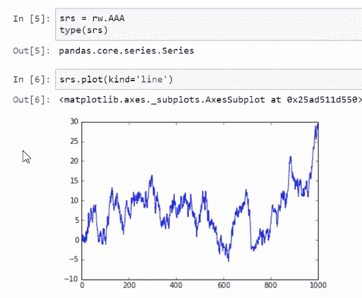

它有些先进，但是您可以看到，我们仍然可以使用序列创建这些图。

让我们指定一个参数`ylim`，以使该系列中绘图的比例与该数据帧的绘图的比例相同，如下所示：

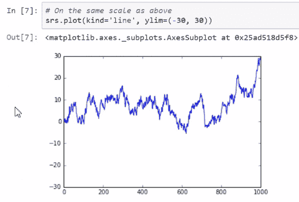

现在让我们看一些不同的情节。 在下一个屏幕截图中，让我们看一下该系列中值的直方图：

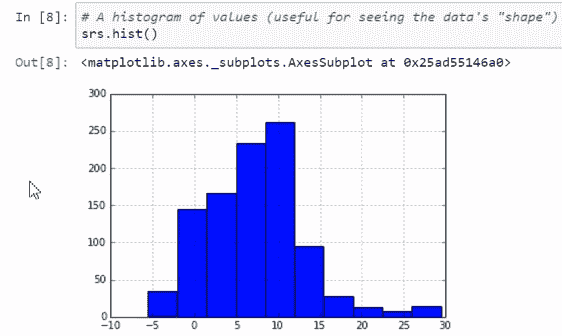

直方图是确定数据集形状的有用方法。 在这里，我们看到一个大致对称的钟形曲线形状。

我们还可以使用`plot`方法创建直方图，如下所示：

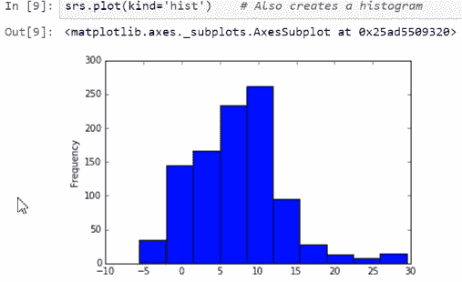

核密度估计器实际上是平滑的直方图。 使用直方图，您可以创建箱并计算数据集中有多少观测值落入这些箱中。 核密度估计器使用另一种方式来创建图，但是最终得到的是一条平滑曲线，如下所示：

让我们看看其他情节。 例如，我们为数据帧创建箱形图：

我们还可以创建散点图，并且在创建散点图时，我们需要指定哪一列对应`x`值，哪一列对应`y`值：

这里有很多数据点。 另一种方法是使用所谓的十六进制箱图，您可以将其视为 2D 直方图。 它计算落入真实平面上某些六角形面元的观测值，如下所示：

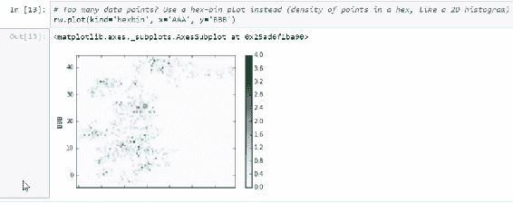

现在，这个十六进制图似乎不是很有用，所以让我们将网格大小设置为`25`：

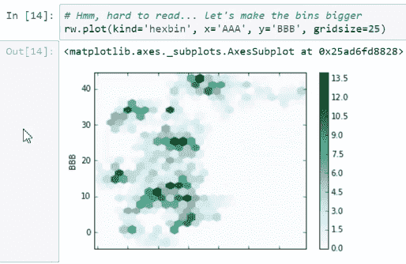

现在，我们有了一个更有趣的图，并且可以看到数据倾向于聚集的位置。 让我们计算图中各列的标准偏差，如下所示：

现在，让我们创建一个条形图以可视化这些标准偏差，如下所示：

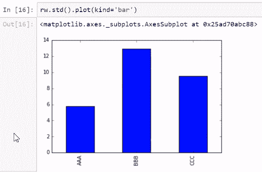

现在，让我们看一个称为**散点图矩阵**的高级工具，该工具可用于可视化数据集中的多个关系，如下所示：

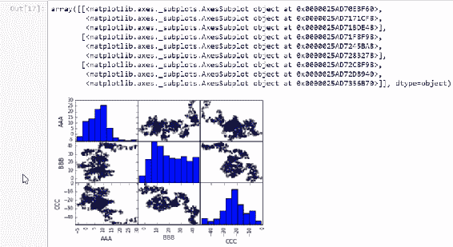

您可以创建更多图。 我诚挚地邀请您探索绘图方法，不仅是 Pandas 的绘图方法（我提供了许多示例的文档链接），而且还探讨了 Matplotlib 的  。

# 摘要

在本章中，我们从索引排序开始，并介绍了如何通过值进行排序。 我们介绍了层次聚类，并用层次索引对系列进行了切片。 最后，我们看到了各种绘图方法并进行了演示。

我们已经走了很长一段路。 我们已经建立了 Python 数据分析环境，并熟悉了基本工具。 祝一切顺利！