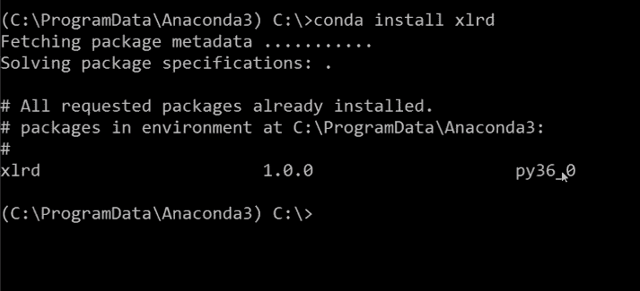
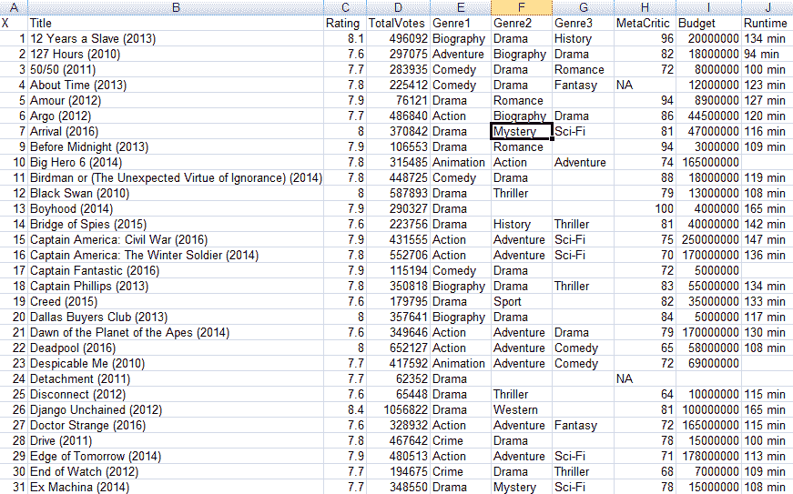
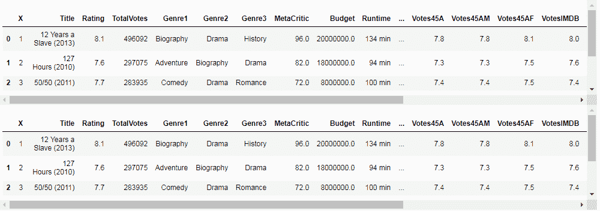
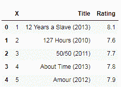
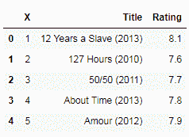
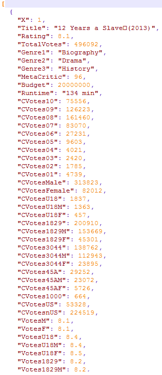
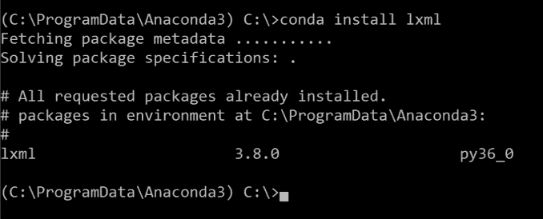
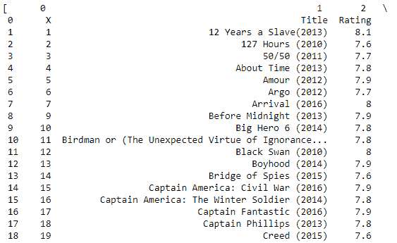

# 处理不同种类的数据集

在本章中，我们将学习如何在 Pandas 中使用不同种类的数据集格式。 我们将学习如何使用 Pandas 导入的 CSV 文件提供的高级选项。 我们还将研究如何在 Pandas 中使用 Excel 文件，以及如何使用`read_excel`方法的高级选项。 我们将探讨其他一些使用流行数据格式的 Pandas 方法，例如 HTML，JSON，PKL 文件，SQL 等。

# 从 CSV 文件读取数据时使用高级选项

在本部分中，我们将 CSV 和 Pandas 结合使用，并学习如何使用`read_csv`方法读取 CSV 数据集以及高级选项。

# 导入模块

首先，我们将使用以下命令导入`pandas`模块：

```py
import pandas as pd
```

要读取 CSV 文件，我们使用`read_csv`方法，如下所示：

```py
df = pd.read_csv('IMDB.csv', encoding = "ISO-8859-1")
df.head()
```

为了执行基本导入，请将数据集的文件名传递给`read_csv`，并将结果数据帧分配给变量。 在以下屏幕截图中，我们可以看到 Pandas 已将数据集转换为表格格式：


# 高级读取选项

在 Python 中，pandas 具有`read_csv`方法的许多高级选项，您可以在其中控制如何从 CSV 文件读取数据。

# 处理列，索引位置和名称

默认情况下，`read_csv`将 CSV 文件第一行中的条目视为列名。 我们可以通过将`header`设置为`None`来关闭此功能，如以下代码块所示：

```py
df = pd.read_csv('IMDB.csv', encoding = "ISO-8859-1", header=None)
df.head()
```

输出如下：


# 指定另一行作为标题

您还可以通过将行号传递给`header`选项，从而从其他行（而不是默认的第一行）设置列名，如下所示：

```py
df = pd.read_csv('IMDB.csv', encoding = "ISO-8859-1", header=2)
df.head()

```

输出如下：


# 将列指定为索引

默认情况下，`read_csv`在读取数据时分配一个默认的数字索引，该索引从零开始。 但是，您可以通过将列名传递给索引列选项来更改此行为。 然后，Pandas 会将索引设置为此列，如以下代码所示：

```py
df = pd.read_csv('IMDB.csv', encoding = "ISO-8859-1", index_col='Title')
df.head()
```

在这里，我们传递了电影标题作为索引名称。 现在，索引名称为`Title`，而不是默认的数字索引，如以下屏幕截图所示：


# 选择要读取的列的子集

我们还可以选择读取 CSV 文件中特定列的子集。 为此，我们将列名作为列表传递，以使用`columns`选项，如下所示：

```py
df = pd.read_csv('IMDB.csv', encoding = "ISO-8859-1", usecols=['Title', 'Genre1'])
df.head()
```

前面的代码段的输出如下：


# 处理缺失和不适用的数据

接下来，我们将看到如何通过读取 CSV 文件来处理丢失的数据。 默认情况下，`read_csv`认为缺少以下值并将其标记为`NaN`：


但是，您可以添加到此列表。 为此，只需将要视为`NaN`的值列表传递给，如以下代码所示：

```py
df = pd.read_csv('IMDB.csv', encoding = "ISO-8859-1", na_values=[''])
```

# 选择是否跳过空白行

有时整行没有值； 因此，我们可以在读取数据时选择处理这些行。 默认情况下，`read_csv`会忽略空白行，但是我们可以通过将`skip_blank_lines`设置为`False`来关闭此行，如下所示：

```py
df = pd.read_csv('IMDB.csv', encoding = "ISO-8859-1", skip_blank_lines=False)
```

# 数据解析选项

我们可以通过读取 CSV 文件来选择跳过哪些行。 我们可以将行号作为列表传递给`skiprows`选项。 第一行的索引为零，如下所示：

```py
df = pd.read_csv('IMDB.csv', encoding = "ISO-8859-1", skiprows = [1,3,7])
df.head()

```

输出如下：


# 从文件的页脚或结尾跳过行

要从页脚或文件末尾跳过行，请使用`skipfooter`选项并传递一个数字，该数字指定要跳过的行数。 在以下代码中，我们通过了`2`。 如我们所见，在跳过最后两行之后，我们创建的上一个数据帧与我们创建的数据帧之间存在差异：

```py
df.tail(2)
df = pd.read_csv('IMDB.csv', encoding = "ISO-8859-1", skipfooter=2, engine='python')
df.tail(2)
```

以下屏幕截图显示了输出：


# 读取文件的子集或一定数量的行

有时数据文件太大，我们只想看一下前几行。 我们可以通过将要导入的行数传递到`nrows`选项来做到这一点，如以下代码所示。 在这里，我们将`100`传递给`nrows`，然后`nrows`仅读取数据集中的前一百行：

```py
df = pd.read_csv('IMDB.csv', encoding = "ISO-8859-1", nrows=100)
df.shape
```

# 从 Excel 文件读取数据

在本节中，我们将学习如何使用 Pandas 使用 Excel 数据来处理表格，以及如何使用 Pandas 的`read_excel`方法从 Excel 文件中读取数据。 我们将阅读并探索一个真实的 Excel 数据集，并使用 xplore 解析一些可用于解析 Excel 数据的高级选项。

熊猫内部使用 Python Excel 库`rd`从 Excel 文件中提取数据。 我们可以通过执行`conda install xlrd`来安装它。

首先，请确保命令行程序在安装前以管理员模式运行，如以下屏幕截图所示：



以下屏幕截图显示了我们将使用 Pandas 阅读和探索的 Excel 数据集：



上一个屏幕截图是电影分级的集合，[可以在这里找到它](https://github.com/saipranava/IMDB)。

# 基本的 Excel 读取

我们正在使用 Pandas 的`read_excel`方法读取此数据。 以最简单的格式，我们只是将想要的 Excel 数据集的文件名传递给`read_excel`方法。 pandas 将 Excel 文件中的数据转换为 Pandas 数据帧。 Pandas 内部为此使用 Excel `rd`库。 在这里，Pandas 已读取数据并在内存中创建了表格数据对象，我们可以在我们的代码中访问，浏览和操作，如以下代码所示：

```py
df = pd.read_excel('IMDB.xlsx')
df.head()

```

前一个代码块的输出如下：


pandas 有很多高级选项，我们可以使用它们来控制应如何读取数据。如以下屏幕截图所示：


# 指定应读取的工作表

要指定应读取的纸张，请将值传递给`sheetname`选项。 如下面的屏幕快照所示，我们只是传递`0`，它是 Excel 工作表中第一张工作表的索引值。 这非常方便，尤其是当我们不知道确切的工作表名称时：

```py
df = pd.read_excel('IMDB.xlsx', sheetname=0)
df.head()
```

输出如下：


# 从多张表读取数据

Excel 数据集文件附带数据和多个工作表。 实际上，这是许多用户更喜欢 Excel 而不是 CSV 的主要原因之一。 幸运的是，Pandas 支持从多张纸中读取数据。

# 查找工作表名称

要找出工作表的名称，请将 Excel 文件传递到`ExcelFile`类，然后在结果对象上调用`sheet_names`属性。 该类将 Excel 文件中的图纸名称打印为列表。 如果我们想从名为`data-movies`的工作表中读取数据，它将类似于以下代码片段：

```py
xls_file = pd.ExcelFile('IMDB.xlsx')
xls_file.sheet_names
```

接下来，我们在之前创建的 Excel 文件对象上调用`parse`方法，并传入我们想要读取的工作表名称。 然后我们将结果分配给两个单独的数据帧对象，如下所示：

```py
df1 = xls_file.parse('movies')
df2 = xls_file.parse('by genre')
df1.head()
```

现在，我们从两个单独的数据帧，中的两个工作表中获取数据，如以下屏幕截图所示：



# 选择标题或列标签

默认情况下，pandas 会将列名称或标题设置为 Excel 文件中第一个非空白行的值。 但是，我们可以更改此行为。 在以下屏幕截图中，我们将值`3`传递给`header`选项，该选项告诉`read_excel`方法设置索引行`3`中的标题名称：

```py
df = pd.read_excel('IMDB.xlsx', sheetname=1, header=3)
df.head()
```

前面代码的输出如下：


# 没有标题

我们还可以告诉`read_excel`忽略标题并将所有行都视为记录。 只要 Excel 没有标题行，就很方便。 为此，我们将`header`设置为`None`和，如以下代码所示：

```py
df = pd.read_excel('IMDB.xlsx', sheetname=1, header=None)
df.head()
```

输出如下：


# 在开头跳过行

要跳过文件开头的行，只需将`skiprows`设置为要跳过的行数，如以下代码所示：

```py
df = pd.read_excel('IMDB.xlsx', sheetname=1, skiprows=7)
```

# 在末尾跳过行

为此，我们使用`skip_footer`选项，如下所示：

```py
df = pd.read_excel('IMDB.xlsx', sheetname=1, ski_footer=10)
```

# 选择列

我们还可以选择只读取列的子集。 这是通过将`parse_cols`选项设置为数值来完成的，这将导致将列从`0`读取到我们设置解析列值的任何索引。 我们在这种情况下设置了`parse_cols=2`，它将读取 Excel 文件中的前三列，如以下代码片段所示：

```py
df = pd.read_excel('IMDB.xlsx', sheetname= 0, parse_cols=2)
df.head()
```

以下是输出：



# 列名

我们可以选择给列使用不同的名称，而不是标题行中提供的默认名称。 为此，我们将列名列表传递给`names`参数，如下所示：

```py
df = pd.read_excel('IMDB.xlsx', sheetname=0, parse_cols = 2, names=['X','Title',
   'Rating'], )
df.head()
```

在下面的屏幕截图中，我们将列名设置为读取时传递的名称：



# 读取数据时设置索引

默认情况下，`read_excel`用数字索引标记零，从`0`开始。 我们可以将索引或行标签设置为更高的值或我们的选择。 为此，我们将数据集的列名传递给`index_col`选项。 在以下代码中，我们将索引设置为`Title`列：

```py
df = pd.read_excel('IMDB.xlsx', sheetname=0, index_col='Title')
df.head()
```

输出如下：


# 读取时处理丢失的数据

`read_excel`方法有一个值列表，它将被视为丢失，然后将其设置为`NaN`。 我们可以在使用`na_values`参数传递值列表时添加此代码，如以下代码所示：

```py
df = pd.read_excel('IMDB.xlsx', sheetname= 0, na_values=[' '])
```

# 读取其他流行格式的数据

在本节中，我们将探索 Pandas 的功能，以读取和使用各种流行的数据格式。 我们还将学习如何从 JSON 格式，HTML 文件和 PICKLE 数据集中读取数据，并且可以从基于 SQL 的数据库中读取数据。

# 读取 JSON 文件

JSON 是用于结构化数据的最小可读格式。 它主要用于在服务器和 Web 应用程序之间传输数据，以替代 XML，如以下屏幕快照所示：



# 将 JSON 数据读入 Pandas

为了读取 JSON 数据，pandas 提供了一种名为`read_json`的方法，其中我们传递了要读取的 JSON 数据文件的文件名和位置。 文件位置可以是本地文件，甚至可以是具有有效 URL 方案的互联网。 我们将结果数据帧分配给变量`DF`。

`read_json`方法读取 JSON 数据并将其转换为 Pandas 数据帧对象，即表格数据格式，如以下代码所示。 JSON 数据现在可以以数据帧格式轻松访问，可以更轻松地进行操作和浏览：

```py
movies_json = pd.read_json('IMDB.json')
movies_json.head()
```

上一个代码块将产生以下输出：


# 读取 HTML 数据

pandas 内部使用`lxml` Python 模块读取 HTML 数据。 您可以通过执行`conda install lxml`，从命令行程序安装它，如以下屏幕截图所示：



我们还可以从本地文件甚至直接从互联网导入 HTML 数据：


在这里，我们将 HTML 文件或 URL 的位置传递给`read_html`方法。`read_html`从 HTML 提取表格数据，然后将其转换为 Pandas 数据帧。 在以下代码中，我们以表格格式获取了从 HTML 文件提取的数据：

```py
pd.read_html('IMDB.html')
```

输出如下：



# 读取 PICKLE 文件

酸洗是将任何类型的 Python 对象（包括列表，字典等）转换为字符串的一种方式。 这个想法是，该字符串包含在另一个 Python 脚本中重构对象所需的所有信息。

我们使用`read_pickle`方法读取我们的 PICKLE 文件，如以下代码所示。 与其他数据格式一样，Pandas 根据读取的数据创建数据帧：

```py
df = pd.read_pickle('IMDB.p')
df.head()
```

输出如下：


# 读取 SQL 数据

在这里，我们将从流行的数据库浏览器 SQLite 中读取 SQL 数据，可以通过执行以下命令进行安装：

```py
conda install sqlite
```

然后，我们将导入 SQLite Python 模块，如下所示：

```py
import sqlite3
```

然后，创建与您要从中读取数据的 SQLite DB 的连接，如下所示：

```py
conn = sqlite3.connect("IMDB.sqlite")
df = pd.read_sql_query("SELECT * FROM IMDB;", conn)
df.head()
```

接下来，使用`read_sql_query`方法将您想要数据来自的 SQL 查询传递给 Pandas。 该方法读取数据并创建一个数据帧对象，如以下屏幕快照所示：

 

此演示使用了 SQLite 数据库，但您也可以从其他数据库读取数据。 为此，只需调用适当的 DB Python 模块即可。

# 从剪贴板读取数据

要从剪贴板读取数据，请先复制一些数据。 在以下示例中，我们从电影数据集中复制了一个表：


接下来，使用 pandas 的`read_clipboard`方法读取数据并创建一个数据帧，如下所示：

```py
df = pd.read_clipboard()
df.head()
```

从网页复制的数据现在作为数据帧存储在内存中，如以下屏幕截图所示。 在将数据快速导入 Pandas 时，此方法非常方便：


# 总结

在本章中，我们学习了如何在 Pandas 中使用不同种类的数据集格式。 我们学习了在导入 CSV 文件时如何使用 Pandas 提供的高级选项。 我们还看到了如何使用 Excel 数据集，并且探讨了可用于处理各种数据格式（例如 HTML，JSON，PICKLE 文件，SQL 等）的方法。

在下一章中，我们将学习如何在高级数据选择中使用 Pandas 技术。