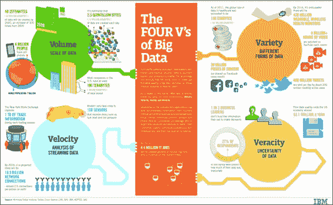

# 第 1 章 Pandas 简介和数据分析

在本章中，我们解决以下问题：

*   数据分析的动机
*   如何将 Python 和 Pandas 用于数据分析
*   Pandas 图书馆的描述
*   使用 Pandas 的好处

# 数据分析的动机

在本节中，我们将讨论使数据分析成为当今快速发展的技术环境中日益重要的工作领域的趋势。

## 我们生活在大数据世界中

在过去两年中，术语**大数据**已成为最热门的技术流行语之一。 现在，我们越来越多地在各种媒体上听到有关大数据的信息，并且大数据初创公司越来越多地吸引了风险投资。 零售领域的一个很好的例子是 Target Corporation，该公司已对大数据进行了大量投资，现在能够通过使用大数据来分析人们的在线购物习惯来识别潜在客户； 请参阅 [http://nyti.ms/19LT8ic](http://nyti.ms/19LT8ic) 上的相关文章。

松散地说，大数据是指这样一种现象，即数据量超过了数据接收者处理数据的能力。 这是一个有关大数据的 Wikipedia 条目，很好地总结了它： [http://en.wikipedia.org/wiki/Big_data](http://en.wikipedia.org/wiki/Big_data) 。

## 4 V 大数据

开始思考大数据复杂性的一个好方法是沿着所谓的 4 维，即大数据的 4V。 该模型最初由 Gartner 分析师 Doug Laney 于 2001 年引入 3V。3V 代表 Volume，Velocity 和 Variety，而 4th V 则由 Veracity 后来被 IBM 添加。 Gartner 的正式定义如下：

|   | *“大数据是高容量，高速度和/或种类繁多的信息资产，需要新的处理形式以实现增强的决策，洞察力发现和过程优化。”* |   |
|   | - *Laney，道格拉斯。 “大数据的重要性：定义”，Gartner* |

### 大数据量

大数据时代的**数据量**简直令人难以置信。 根据 IBM 的数据，到 2020 年，地球上的数据总量将激增至 40 ZB。 您听说正确的 40 ZB 为 43 万亿千兆字节，大约是 *4×1021* 字节。 有关此的更多信息，请参阅 Zettabyte 上的 Wikipedia 页面- [http://en.wikipedia.org/wiki/Zettabyte](http://en.wikipedia.org/wiki/Zettabyte) 。

为了了解这将是多少数据，让我参考 2010 年发布的 EMC 新闻稿，其中指出 1 ZB 大约等于：

|   | *“地球上每个男人，女人和孩子连续'鸣叫'持续 100 年创造的数字信息”或“ 750 亿个满载 16 GB 苹果 iPad，将使温布利大球场的整个区域满溢 41 ，勃朗峰隧道 84 次，欧洲核子研究组织的大型强子对撞机隧道 151 次，北京国家体育场 15.5 倍或台北 101 塔 23 倍……”* |   |
|   | - *EMC 研究预测，到 2020 年数据将增长 45 倍* |

数据增长的速度很大程度上受以下几个因素的推动：

*   互联网的快速增长。
*   从模拟媒体到数字媒体的转换，以及增强的捕获和存储数据的能力，这又通过更便宜，更强大的存储技术得以实现。 诸如照相机和可穿戴设备之类的数字数据输入设备已经激增，并且巨大的数据存储成本迅速下降。 Amazon Web Services 是价格便宜得多的趋势的一个典型例子。

设备的*互联网化*，或更确切地说是*物联网*，是一种常见的家用设备（例如我们的冰箱和汽车）将连接到 Internet 的现象。 这种现象只会加速上述趋势。

### 大数据的速度

从纯粹的技术角度来看，**速度**指的是大数据的吞吐量，即数据进入和处理的速度。 这对数据接收者需要多快的时间来处理数据以保持同步产生了影响。 实时分析是处理此特征的一种尝试。 可以帮助实现此目的的工具包括 Amazon Web Services Elastic Map Reduce。

在更宏的层面上，数据的速度也可以看作是提高了的速度，现在，数据和信息的传输和处理速度比以往任何时候都更快，更远。

高速数据和通信网络的激增，以及手机，平板电脑和其他连接设备的出现，是推动信息速度的主要因素。 速度的一些度量包括每秒的推文数量和每分钟的电子邮件数量。

### 各种大数据

大数据的**种类**来自具有生成数据的多种数据源以及所生成数据的不同格式。

这给必须处理数据的数据接收者带来了技术挑战。 数码相机，传感器，网络，手机等都是一些生成不同格式数据的数据生成器，而挑战在于能够处理所有这些格式并从数据中提取有意义的信息。 随着大数据时代的到来，数据格式的不断变化的性质引发了数据库技术行业的一场革命，NoSQL 数据库的兴起可以处理所谓的*非结构化*数据 格式可互换或不断变化的数据。 有关 Couchbase 的更多信息，请参阅“为什么使用 NoSQL- [http://bit.ly/1c3iVEc](http://bit.ly/1c3iVEc) ”。

### 大数据的准确性

大数据的第四个特征– **准确性**（稍后添加）是指需要验证或确认数据的*正确性*或数据代表真相的事实。 必须验证数据源，并将错误保持在最低限度。 根据 IBM 的估计，糟糕的数据质量每年给美国经济造成 3.1 万亿美元的损失。 例如，2008 年，医疗错误给美国造成了 195 亿美元的损失。 有关更多信息，请参阅 [http://bit.ly/1CTah5r](http://bit.ly/1CTah5r) 上的相关文章。 这是 IBM 的信息图，总结了大数据的 4V：



IBM 应对大数据的 4 V

## 如此多的数据，很少的分析时间

谷歌前首席执行官埃里克·施密特（Eric Sc​​hmidt）将数据分析描述为*万物的未来*。 作为参考，您可以在 [http://bit.ly/1KmqGCP](http://bit.ly/1KmqGCP) 上观看名为*为什么数据分析是万物的未来*的 YouTube 视频。

在大数据时代，数据的数量和速度将继续增加。 能够有效地收集，过滤和分析数据的公司所获得的信息将使他们能够在更短的时间内更好地满足客户的需求，这将获得比竞争对手更大的竞争优势。 例如，数据分析（*度量文化*）在 [http://www.amazon.com/](http://www.amazon.com/)的业务策略中起着非常关键的作用。 有关更多信息，请参阅 [http://bit.ly/1glnA1u](http://bit.ly/1glnA1u) 上的 Amazon.com 案例研究，智能见解。

## 迈向实时分析

随着技术和工具的发展，为了满足业务不断增长的需求，已经朝着所谓的实时分析迈进了一步。 有关英特尔“ Insight Everywhere”的更多信息，请访问 [http://intel.ly/1899xqo](http://intel.ly/1899xqo)。

在大数据互联网时代，以下是一些示例：

*   在线业务需要即时洞察力，以了解他们在在线市场中推出的新产品/功能的表现以及如何相应地调整其在线产品结构。 亚马逊就是一个很好的例子，他们的*客户既查看了此商品，又查看了*功能。
*   在金融领域，风险管理和交易系统几乎需要即时分析，以便根据数据驱动的见解做出有效的决策。

# Python 和 Pandas 如何融入数据分析组合

**Python** 编程语言是当今新兴的数据科学和分析领域中增长最快的语言之一。 Python 是由 Guido von Russom 于 1991 年创建的，其主要功能包括：

*   解释而不是编译
*   动态类型系统
*   通过对象引用传递值
*   模块化能力
*   综合图书馆
*   相对于其他语言的可扩展性
*   面向对象
*   大多数主要的编程范例都是过程式的，面向对象的，在较小程度上是功能性的。

### 注意

有关更多信息，请参见 Python 上的 Wikipedia 页面，网址为 [http://en.wikipedia.org/wiki/Python_%28programming_language%29](http://en.wikipedia.org/wiki/Python_%28programming_language%29) 。

使 Python 在数据科学中流行的特征包括其非常用户友好（人类可读）的语法，其被解释而不是编译的事实（导致更快的开发时间）以及其非常全面的用于分析和分析数据的库 ，以及其进行数值和统计计算的能力。 Python 的库提供了用于数据科学和分析的完整工具包。 主要内容如下：

*   **NumPy** ：强调数值计算的通用数组功能
*   **SciPy** ：数值计算
*   **Matplotlib** ：图形
*   **Pandas**：系列和数据框（一维和二维数组状类型）
*   **Scikit-Learn** ：机器学习
*   **NLTK** ：自然语言处理
*   **Statstool** ：统计分析

在本书中，我们将重点关注上一个列表中列出的第 4 个库 Pandas。

# 什么是 Pandas？

**pandas** 是由 Wes McKinney 在 2008 年开发的用于 Python 数据分析的高性能开源库。多年来，它已成为使用 Python 进行数据分析的事实上的标准库。 该工具得到了广泛的采用，它背后的社区很大（到 03/2014 为止有 220 多个贡献者和 9000 多个提交），快速迭代，功能和不断增强。

Pandas 的一些主要特征包括：

*   它可以处理不同格式的各种数据集：时间序列，表格异构数据和矩阵数据。
*   它有助于从各种来源（例如 CSV 和 DB / SQL）加载/导入数据。
*   它可以处理多种数据集操作：子集，切片，过滤，合并，groupBy，重新排序和重新整形。
*   它可以根据用户/开发人员定义的规则处理丢失的数据：忽略，转换为 0，依此类推。
*   它可以用于数据的解析和整理（转换）以及建模和统计分析。
*   它与 statsmodels，SciPy 和 scikit-learn 等其他 Python 库很好地集成在一起。
*   它提供了快速的性能，并且可以通过使用 **Cython** （Python 的 C 扩展）来进一步提高速度。

有关更多信息，请访问 [http://pandas.pydata.org/pandas-docs/stable/](http://pandas.pydata.org/pandas-docs/stable/) 上提供的官方 Pandas 文档。

# 使用 Pandas 的好处

Pandas 是 Python 数据分析语料库的核心组件。 Pandas 的显着特征是它提供的数据结构套件，自然适合于数据分析，主要是 DataFrame 以及程度较小的 Series（一维矢量）和 Panel（3D 表）。

简而言之，pandas 和 statstools 可以描述为 Python 对 R 的回答，即数据分析和统计编程语言，它既提供数据结构（如 R 数据框架），又提供丰富的统计库用于数据分析。

与使用 Java，C 或 C ++之类的语言进行数据分析相比，Pandas 的好处是多方面的：

*   **数据表示**：它可以通过其 DataFrame 和 Series 数据结构以简洁的方式轻松地以自然适合于数据分析的形式表示数据。 在 Java / C / C ++中进行等效操作需要许多行自定义代码，因为这些语言不是为数据分析而构建的，而是为网络和内核开发而构建的。
*   **数据子集和过滤**：它提供了简单的数据子集和过滤，这些过程是进行数据分析的基础。
*   **Concise and clear code**: Its concise and clear API allows the user to focus more on the core goal at hand, rather than have to write a lot of scaffolding code in order to perform routine tasks. For example, reading a CSV file into a DataFrame data structure in memory takes two lines of code, while doing the same task in Java/C/C++ would require many more lines of code or calls to non-standard libraries, as illustrated in the following table. Here, let's suppose that we had the following data:

    <colgroup class="calibre20"><col class="calibre21"> <col class="calibre21"> <col class="calibre21"> <col class="calibre21"> <col class="calibre21"> <col class="calibre21"> <col class="calibre21"> <col class="calibre21"></colgroup> 
    | 

    国家

     | 

    年

     | 

    二氧化碳排放量

     | 

    能量消耗

     | 

    出生率

     | 

    每千人的互联网使用量

     | 

    预期寿命

     | 

    人口

     |
    | --- | --- | --- | --- | --- | --- | --- | --- |
    | 白俄罗斯 | 2000 | 5.91 | 2988.71 | 1.29 | 18.69 | 68.01 | 1.00E + 07 |
    | Belarus | 2001 | 5.87 | 2996.81 |   | 43.15 |   | 9970260 |
    | Belarus | 2002 | 6.03 | 2982.77 | 1.25 | 89.8 | 68.21 | 9925000 |
    | Belarus | 2003 | 6.33 | 3039.1 | 1.25 | 162.76 |   | 9873968 |
    | Belarus | 2004 |   | 3143.58 | 1.24 | 250.51 | 68.39 | 9824469 |
    | Belarus | 2005 |   |   | 1.24 | 347.23 | 68.48 | 9775591 |

在 CSV 文件中，我们希望读取的数据如下所示：

```py
Country,Year,CO2Emissions,PowerConsumption,FertilityRate,InternetUsagePer1000, LifeExpectancy, PopulationBelarus,2000,5.91,2988.71,1.29,18.69,68.01,1.00E+07Belarus,2001,5.87,2996.81,,43.15,,9970260Belarus,2002,6.03,2982.77,1.25,89.8,68.21,9925000...Philippines,2000,1.03,514.02,,20.33,69.53,7.58E+07Philippines,2001,0.99,535.18,,25.89,,7.72E+07Philippines,2002,0.99,539.74,3.5,44.47,70.19,7.87E+07...Morocco,2000,1.2,489.04,2.62,7.03,68.81,2.85E+07Morocco,2001,1.32,508.1,2.5,13.87,,2.88E+07Morocco,2002,1.32,526.4,2.5,23.99,69.48,2.92E+07..
```

### Note

此处的数据取自世界银行的经济数据，网址为： [http://data.worldbank.org](http://data.worldbank.org) 。

在 Java 中，我们必须编写以下代码：

```py
public class CSVReader {
public static void main(String[] args) {
        String[] csvFile=args[1];CSVReader csvReader = new csvReader();List<Map>dataTable=csvReader.readCSV(csvFile);}public void readCSV(String[] csvFile){BufferedReader bReader=null;String line="";String delim=",";
  //Initialize List of maps, each representing a line of the csv fileList<Map> data=new ArrayList<Map>();
  try {bufferedReader = new BufferedReader(new   FileReader(csvFile));// Read the csv file, line by linewhile ((line = br.readLine()) != null){String[] row = line.split(delim);Map<String,String> csvRow=new HashMap<String,String>();
           csvRow.put('Country')=row[0]; csvRow.put('Year')=row[1];csvRow.put('CO2Emissions')=row[2]; csvRow.put('PowerConsumption')=row[3];csvRow.put('FertilityRate')=row[4];csvRow.put('InternetUsage')=row[1];csvRow.put('LifeExpectancy')=row[6];csvRow.put('Population')=row[7];data.add(csvRow);
        }
     } catch (FileNotFoundException e) {e.printStackTrace();
     } catch (IOException e) {e.printStackTrace();
    } 
 return data;}
```

但是，使用 Pandas，只需两行代码：

```py
import pandas as pdworldBankDF=pd.read_csv('worldbank.csv')
```

此外，Pandas 基于 NumPy 库构建，因此继承了此程序包的许多性能优势，尤其是在数值和科学计算方面。 使用 Python 时常被吹捧的一个缺点是，作为一种脚本语言，它相对于 Java / C / C ++等语言的性能一直很慢。 但是，Pandas 的情况并非如此。

# 摘要

我们生活在以 4V 的容量，速度，多样性和准确性为特征的大数据时代。 在可预见的将来，数据的数量和速度一直在增长。 能够利用和分析大数据以提取信息并根据此信息做出可操作的决策的公司将成为市场的赢家。 Python 是一种快速发展的，用户友好的，可扩展的语言，在数据分析中非常流行。

pandas 是 Python 工具包的核心库，用于数据分析。 它提供的特性和功能比许多其他流行的语言（例如 Java，C，C ++和 Ruby）使数据分析更加轻松和快捷。

因此，考虑到上一节中列出的 Python 的优势作为数据分析的一种选择，使用 Python 的数据分析从业人员应该变得对 Pandas 更为精通才能变得更加有效。 本书旨在帮助用户实现这一目标。