# 第 11 章机器学习简介

本章将引导用户进行机器学习的旋风之旅，重点介绍如何使用 pandas 库作为可用于预处理机器学习程序使用的数据的工具。 它还向用户介绍了`scikit-learn`库，它是 Python 中最流行的机器学习工具包。

在本章中，我们通过将机器学习技术应用于一个众所周知的问题来进行说明，该问题涉及对上个世纪之初在泰坦尼克号灾难中幸存的乘客进行分类。 本章讨论的各个主题包括：

*   Pandas 在机器学习中的作用
*   安装`scikit-learn`
*   机器学习概念简介
*   机器学习的应用– Kaggle Titanic 竞赛
*   使用 Pandas 进行数据分析和预处理
*   天真的解决泰坦尼克号问题的方法
*   `scikit-learn` ML 分类器界面
*   监督学习算法
*   无监督学习算法

# Pandas 在机器学习中的作用

我们将考虑用于机器学习的库称为`scikit-learn`。 `scikit-learn` Python 库提供了广泛的机器学习算法库，可用于创建从数据输入中学习的自适应程序。

但是，在`scikit-learn`可以使用此数据之前，必须对其进行一些预处理。 这就是 Pandas 进来的地方。在将数据传递给`scikit-learn`中实现的算法之前，Pandas 可用于预处理和过滤数据。

# scikit-learn 的安装

如第 2 章，*安装 Pandas 和支持软件*所述，安装 Pandas 及其随附库的最简单方法是使用第三方发行版，例如 Anaconda 和 完成它。 安装`scikit-learn`应该没有什么不同。 我将简要介绍从 Anaconda 开始在各种平台和第三方发行版上进行安装的步骤。 `scikit-learn`库需要以下库：

*   Python 2.6.x 或更高版本
*   NumPy 1.6.1 或更高版本
*   SciPy 0.9 或更高

假设您已经按照第 2 章，*安装 Pandas 和支持软件*中的说明安装了 Pandas，则这些依赖项应该已经存在。

## 通过 Anaconda 安装

您可以通过运行 conda Python 软件包管理器在 Anaconda 上安装`scikit-learn`：

```py
conda install scikit-learn

```

## 在 Unix 上安装（Linux / Mac OS X）

对于 Unix，最好从源代码安装（需要 C 编译器）。 假设已经安装了 pandas 和 NumPy，并且所需的依赖库已经到位，则可以通过运行以下命令通过 Git 安装`scikit-learn`：

```py
git clone https://github.com/scikit-learn/scikit-learn.git 
cd scikitlearn
python setup.py install
```

还可以使用`PyPi`中的`pip`将 Pandas 安装在 Unix 上：

```py
pip install pandas

```

## 在 Windows 上安装

要在 Windows 上安装，您可以打开控制台并运行以下命令：

```py
pip install –U scikit-learn

```

### 注意

有关安装的更多详细信息，您可以在以下位置查看官方`scikit-learn`文档： [http://scikit-learn.org/stable/install.html](http://scikit-learn.org/stable/install.html) 。

您还可以在 [https://github.com/scikit-learn/scikit-learn/blob/master/README.rst](https://github.com/scikit-learn/scikit-learn/blob/master/README.rst) 上查看`scikit-learn` Git 存储库的 README 文件。

# 机器学习导论

机器学习是创建从数据中学习的软件程序的艺术。 更正式地讲，它可以定义为构建使用可调参数来提高预测性能的自适应程序的实践。 它是人工智能的一个子领域。

我们可以根据他们要解决的问题的类型来分离机器学习程序。 这些问题被适当地称为学习问题。

从广义上讲，这些问题的两类分别称为有监督的学习问题和无监督的学习问题。 此外，有些混合问题的方面涉及这两个类别。

学习问题的输入由 *n* 行的数据集组成。 每一行代表一个样本，并且可能涉及一个或多个称为属性或特征的字段。

数据集可以规范地描述为由 n 个样本组成，每个样本由 *m* 个特征组成。 以下论文对机器学习进行了更详细的介绍：

*关于机器学习的一些有用的知识[上的](http://homes.cs.washington.edu/~pedrod/papers/cacm12.pdf)* http://homes.cs.washington.edu/~pedrod/papers/cacm12.pdf

## 有监督与无监督学习

对于有监督的学习问题，学习问题的输入是由*标记为*数据组成的数据集。 这意味着我们具有已知其值的输出。 向学习程序提供输入样本及其对应的输出，其目的是破译它们之间的关系。 这样的输入称为标记数据。 监督学习问题包括以下内容：

*   **分类**：学习的属性是分类（标称）或离散的
*   **回归**：学习的属性为数字/连续

在无监督学习或数据挖掘中，向学习程序提供输入，但没有相应的输出。 该输入数据称为未标记数据。 学习程序的目标是学习或解密隐藏的标签。 这些问题包括：

*   聚类
*   降维

## 使用文件分类的插图

机器学习技术的常见用法是在文档分类领域。 机器学习的两个主要类别可以应用于此问题-有监督和无监督学习。

### 监督学习

输入集合中的每个文档都分配有一个类别，即标签。 学习程序/算法使用输入的文档集合来学习如何对没有标签的另一组文档进行预测。 该方法称为*分类*。

### 无监督学习

输入集合中的文档未分配到类别。 因此，它们没有标签。 学习程序将其作为输入，并尝试对*进行群集*或发现相关或相似文档的组。 该方法称为*聚类*。

## 机器学习系统如何学习

机器学习系统利用所谓的分类器从数据中学习。 *分类器*是采用称为*特征值*的矩阵并生成输出矢量（也称为类）的接口。 这些特征值可以是离散的或连续的。 分类器包含三个核心组件：

*   **表示形式**：这是什么类型的分类器？
*   **评估**：分类器的质量如何？
*   **优化**：如何在替代方案中进行搜索？

# 机器学习的应用– Kaggle Titanic 竞赛

为了说明我们如何在机器学习旅程的开始时使用 Pandas 来帮助我们，我们将其应用于一个经典问题，该问题位于 Kaggle 网站（ [http://www.kaggle.com](http://www.kaggle.com) ）。 **Kaggle** 是针对机器学习问题的竞争平台。 Kaggle 背后的想法是使对使用数据解决预测分析问题感兴趣的公司将其数据发布到 Kaggle 上，并邀请数据科学家提出针对其问题的建议解决方案。 竞争可能会持续一段时间，并且竞争对手的排名会发布在排行榜上。 在比赛结束时，排名第一的选手将获得现金奖励。

为了说明如何使用`scikit-learn`将 Pandas 用于机器学习，我们将研究的经典问题是“泰坦尼克号：从 Kaggle 托管的灾难问题中学习机器，作为其经典的入门机器学习问题。 问题涉及的数据集是原始数据集。 因此，在将数据提交为`scikit-learn`中实现的机器学习算法的输入之前，Pandas 在数据的预处理和清理中非常有用。

## 泰坦尼克号：灾难问题中的机器学习

泰坦尼克号的数据集包括厄运之旅的乘客清单，各种功能以及指示变量，该变量指示乘客是否幸免于沉船。 问题的本质是，在给定乘客及其相关特征的情况下，能够预测该乘客是否在泰坦尼克号沉没中幸免于难。 请删除这句话。

数据包含两个数据集：一个训练数据集和另一个测试数据集。 训练数据集包含 891 个乘客案例，测试数据集包含 491 个乘客案例。

训练数据集还包含 11 个变量，其中 10 个是特征，还有 1 个依存/指示变量 Survived，它指示乘客是否幸免于难。

功能变量如下：

*   乘客 ID
*   舱
*   性别
*   Pclass（乘客舱）
*   去做
*   帕奇（父母和子女的数量）
*   年龄
*   兄弟姐妹（兄弟姐妹数）
*   出发

我们可以使用 Pandas 通过以下方式帮助我们预处理数据：

*   数据清理和某些变量的分类
*   排除不必要的功能，这些功能显然与乘客的生存能力无关，例如，其名称
*   处理丢失的数据

我们可以使用多种算法来解决此问题。 它们如下：

*   决策树
*   神经网络
*   随机森林
*   支持向量机

## 过度拟合的问题

**过度拟合**是机器学习中的一个众所周知的问题，程序会记住它作为输入输入的特定数据，从而在训练数据上获得完美的结果，而在测试数据上获得令人讨厌的结果。

为了防止过度拟合，可以在训练阶段使用 10 倍交叉验证技术在数据中引入可变性。

# 使用 Pandas 进行数据分析和预处理

在本节中，我们将使用 Pandas 对数据进行一些分析和预处理，然后再将其作为输入提交给`scikit-learn`。

## 检查数据

为了开始对数据进行预处理，让我们读取训练数据集并检查其外观。

在这里，我们将训练数据集读入 pandas DataFrame 并显示第一行：

```py
In [2]: import pandas as pd
 import numpy as np
# For .read_csv, always use header=0 when you know row 0 is the header row
 train_df = pd.read_csv('csv/train.csv', header=0)
In [3]: train_df.head(3)

```

输出如下：

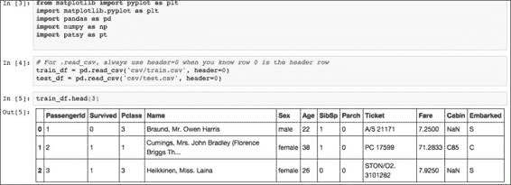

因此，我们可以看到各种功能： **PassengerId** ， **PClass** ，**名称**，**性别**，**年龄**， **Sibsp** ， **Parch** ，**机票**，**票价**，**客舱**和**登上了**。 立即想到的一个问题是：哪些功能可能会影响乘客是否幸存？

显然，PassengerID，Ticket Code 和 Name 不应影响生存能力，因为它们是*标识符*变量。 我们将在分析中跳过这些内容。

## 处理缺失值

我们必须在数据集中进行机器学习的一个问题是如何处理训练集中的缺失值。

让我们直观地确定功能集中缺少值的位置。

为此，我们可以使用由 Tom Augspurger 编写的 R 中的`missmap`函数的等效项。 下图以直观的方式显示了各种功能缺少的数据量：

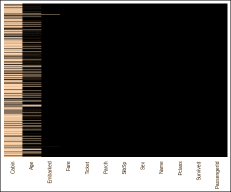

有关更多信息和用于生成此数据的代码，请参见以下内容： [http://bit.ly/1C0a24U](http://bit.ly/1C0a24U) 。

我们还可以计算每个功能缺少多少数据：

```py
In [83]: missing_perc=train_df.apply(lambda x: 100*(1-x.count().sum()/(1.0*len(x))))
In [85]: sorted_missing_perc=missing_perc.order(ascending=False)
 sorted_missing_perc
Out[85]: Cabin          77.104377
 Age            19.865320
 Embarked        0.224467
 Fare            0.000000
 Ticket          0.000000
 Parch           0.000000
 SibSp           0.000000
 Sex             0.000000
 Name            0.000000
 Pclass          0.000000
 Survived        0.000000
 PassengerId     0.000000
 dtype: float64

```

因此，我们可以看到大多数`Cabin`数据丢失了（77％），而大约[20％] `Age`数据丢失了。 然后，我们决定从学习功能集中删除`Cabin`数据，因为该数据太稀疏而无用。

让我们对我们要检查的各种功能做进一步的细分。 对于分类/离散特征，我们使用条形图。 对于连续值特征，我们使用直方图：

```py
In [137]:  import random
 bar_width=0.1
 categories_map={'Pclass':{'First':1,'Second':2, 'Third':3},
 'Sex':{'Female':'female','Male':'male'},
 'Survived':{'Perished':0,'Survived':1},
 'Embarked':{'Cherbourg':'C','Queenstown':'Q','Southampton':'S'},
 'SibSp': { str(x):x for x in [0,1,2,3,4,5,8]},
 'Parch': {str(x):x for x in range(7)}
 }
 colors=['red','green','blue','yellow','magenta','orange']
 subplots=[111,211,311,411,511,611,711,811]
 cIdx=0
 fig,ax=plt.subplots(len(subplots),figsize=(10,12))

 keyorder = ['Survived','Sex','Pclass','Embarked','SibSp','Parch']

for category_key,category_items in sorted(categories_map.iteritems(),
 key=lambda i:keyorder.index(i[0])):
 num_bars=len(category_items)
 index=np.arange(num_bars)
 idx=0
 for cat_name,cat_val in sorted(category_items.iteritems()):
 ax[cIdx].bar(idx,len(train_df[train_df[category_key]==cat_val]), label=cat_name,
 color=np.random.rand(3,1))
 idx+=1
 ax[cIdx].set_title('%s Breakdown' % category_key)
 xlabels=sorted(category_items.keys()) 
 ax[cIdx].set_xticks(index+bar_width)
 ax[cIdx].set_xticklabels(xlabels)
 ax[cIdx].set_ylabel('Count')
 cIdx +=1 
fig.subplots_adjust(hspace=0.8)
for hcat in ['Age','Fare']:
 ax[cIdx].hist(train_df[hcat].dropna(),color=np.random.rand(3,1))
 ax[cIdx].set_title('%s Breakdown' % hcat)
 #ax[cIdx].set_xlabel(hcat)
 ax[cIdx].set_ylabel('Frequency')
 cIdx +=1

fig.subplots_adjust(hspace=0.8)
plt.show()

```

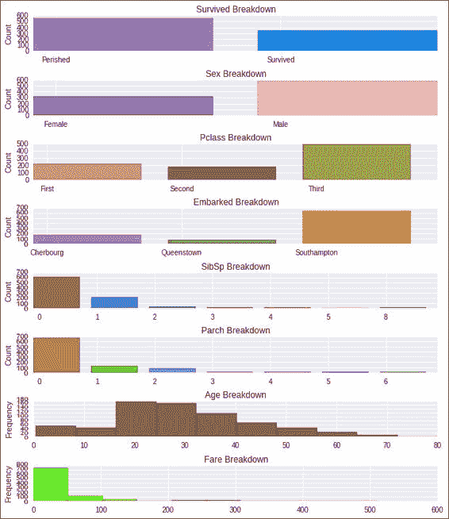

从上图中的数据和插图中，我们可以观察到以下内容：

*   死亡人数是幸存人数的两倍（62％比 38％）。
*   男乘客的数量大约是女乘客的两倍（65％比 35％）。
*   与头等舱和二等舱相比，三等舱的乘客增加了约 20％（55％对 45％）。
*   大多数乘客都是单人，也就是说，船上没有孩子，父母，兄弟姐妹或配偶。

这些观察结果可能会导致我们更深入地研究并调查生存机会，性别与票价等级之间是否存在某些相关性，特别是如果我们考虑到泰坦尼克号实行的是妇女和儿童优先政策（ [http://en.wikipedia.org/wiki/Women_and_children_first](http://en.wikipedia.org/wiki/Women_and_children_first) ），以及泰坦尼克号所载救生艇（20 艘）比设计的（32 艘）少的事实。

有鉴于此，让我们进一步检查生存率与其中某些功能之间的关系。 我们从性别开始：

```py
In [85]: from collections import OrderedDict
 num_passengers=len(train_df)
 num_men=len(train_df[train_df['Sex']=='male'])
 men_survived=train_df[(train_df['Survived']==1 ) & (train_df['Sex']=='male')]
 num_men_survived=len(men_survived)
 num_men_perished=num_men-num_men_survived
 num_women=num_passengers-num_men
 women_survived=train_df[(train_df['Survived']==1) & (train_df['Sex']=='female')]
 num_women_survived=len(women_survived)
 num_women_perished=num_women-num_women_survived
 gender_survival_dict=OrderedDict()
 gender_survival_dict['Survived']={'Men':num_men_survived,'Women':num_women_survived}
 gender_survival_dict['Perished']={'Men':num_men_perished,'Women':num_women_perished}
 gender_survival_dict['Survival Rate']= {'Men' : round(100.0*num_men_survived/num_men,2),'Women':round(100.0*num_women_survived/num_women,2)}
pd.DataFrame(gender_survival_dict)
Out[85]:

```

<colgroup class="calibre20"><col class="calibre21"> <col class="calibre21"> <col class="calibre21"> <col class="calibre21"></colgroup> 
| 

性别

 | 

幸存下来

 | 

灭亡

 | 

存活率

 |
| --- | --- | --- | --- |
| Men | 109 | 468 | 18.89 |
| Women | 233 | 81 | 74.2 |

现在，使用以下命令以条形图说明此数据：

```py
In [76]: #code to display survival by gender
 fig = plt.figure()
 ax = fig.add_subplot(111)
 perished_data=[num_men_perished, num_women_perished]
 survived_data=[num_men_survived, num_women_survived]
 N=2
 ind = np.arange(N)     # the x locations for the groups
 width = 0.35

 survived_rects = ax.barh(ind, survived_data, width,color='green')
 perished_rects = ax.barh(ind+width, perished_data, width,color='red')

 ax.set_xlabel('Count')
 ax.set_title('Count of Survival by Gender')
 yTickMarks = ['Men','Women']
 ax.set_yticks(ind+width)
 ytickNames = ax.set_yticklabels(yTickMarks)
 plt.setp(ytickNames, rotation=45, fontsize=10)

 ## add a legend
 ax.legend((survived_rects[0], perished_rects[0]), ('Survived', 'Perished') )
 plt.show()

```

上面的代码生成以下条形图：

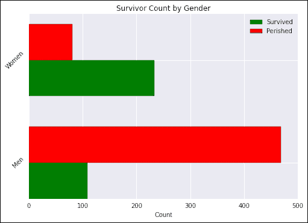

从前面的情节中，我们可以看到，大多数女性幸存下来（74％），而大多数男性丧生（只有 19％幸存）。

这导致我们得出以下结论：乘客的性别可能是乘客是否幸存的一个重要因素。

接下来，让我们看一下旅客舱位。 首先，我们生成三种乘客类别中每一种的幸存和死亡数据，以及生存率，并在表格中显示：

```py
In [86]: 
from collections import OrderedDict
num_passengers=len(train_df)
num_class1=len(train_df[train_df['Pclass']==1])
class1_survived=train_df[(train_df['Survived']==1 ) & (train_df['Pclass']==1)]
num_class1_survived=len(class1_survived)
num_class1_perished=num_class1-num_class1_survived
num_class2=len(train_df[train_df['Pclass']==2])
class2_survived=train_df[(train_df['Survived']==1) & (train_df['Pclass']==2)]
num_class2_survived=len(class2_survived)
num_class2_perished=num_class2-num_class2_survived
num_class3=num_passengers-num_class1-num_class2
class3_survived=train_df[(train_df['Survived']==1 ) & (train_df['Pclass']==3)]
num_class3_survived=len(class3_survived)
num_class3_perished=num_class3-num_class3_survived
pclass_survival_dict=OrderedDict()
pclass_survival_dict['Survived']={'1st Class':num_class1_survived,
 '2nd Class':num_class2_survived,
 '3rd Class':num_class3_survived}
pclass_survival_dict['Perished']={'1st Class':num_class1_perished,
 '2nd Class':num_class2_perished,
 '3rd Class':num_class3_perished}
pclass_survival_dict['Survival Rate']= {'1st Class' : round(100.0*num_class1_survived/num_class1,2),
 '2nd Class':round(100.0*num_class2_survived/num_class2,2),
 '3rd Class':round(100.0*num_class3_survived/num_class3,2),}
pd.DataFrame(pclass_survival_dict)

Out[86]:

```

<colgroup class="calibre20"><col class="calibre21"> <col class="calibre21"> <col class="calibre21"> <col class="calibre21"></colgroup> 
| 

旅客舱位

 | 

Survived

 | 

Perished

 | 

Survival Rate

 |
| --- | --- | --- | --- |
| 头等舱 | 136 | 80 | 62.96 |
| 二等 | 87 | 97 | 47.28 |
| 三等 | 119 | 372 | 24.24 |

然后，我们可以使用`matplotlib`来绘制数据，类似于前面所述的按性别划分的幸存者计数方法：

```py
In [186]:
fig = plt.figure()
ax = fig.add_subplot(111)
perished_data=[num_class1_perished, num_class2_perished, num_class3_perished]
survived_data=[num_class1_survived, num_class2_survived, num_class3_survived]
N=3
ind = np.arange(N)                # the x locations for the groups
width = 0.35
survived_rects = ax.barh(ind, survived_data, width,color='blue')
perished_rects = ax.barh(ind+width, perished_data, width,color='red')
ax.set_xlabel('Count')
ax.set_title('Survivor Count by Passenger class')
yTickMarks = ['1st Class','2nd Class', '3rd Class']
ax.set_yticks(ind+width)
ytickNames = ax.set_yticklabels(yTickMarks)
plt.setp(ytickNames, rotation=45, fontsize=10)
## add a legend
ax.legend( (survived_rects[0], perished_rects[0]), ('Survived', 'Perished'),
 loc=10 )
plt.show()

```

这将产生以下条形图：

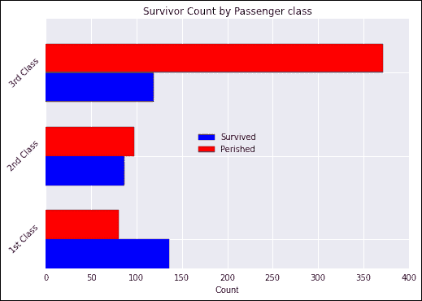

从前面的数据和说明中可以清楚地看出，乘客票价等级越高，生存的机会就越大。

鉴于性别和票价舱位似乎都在影响乘客的生存机会，让我们看看将这两个特征结合并绘制两者的结合时会发生什么。 为此，我们将在 Pandas 中使用`crosstab`函数。

```py
In [173]: survival_counts=pd.crosstab([train_df.Pclass,train_df.Sex],train_df.Survived.astype(bool))
 survival_counts
Out[173]:               Survived False  True
 Pclass       Sex 
 1            female    3     91
 male     77     45
 2            female    6     70
 male     91     17
 3            female   72     72
 male    300     47

```

现在让我们使用`matplotlib`显示此数据。 首先，让我们为显示目的做一些重新标记：

```py
In [183]: survival_counts.index=survival_counts.index.set_levels([['1st', '2nd', '3rd'], ['Women', 'Men']])
In [184]: survival_counts.columns=['Perished','Survived']

```

现在，我们使用 Pandas DataFrame 的`plot`函数绘制数据：

```py
In [185]: fig = plt.figure()
 ax = fig.add_subplot(111)
 ax.set_xlabel('Count')
 ax.set_title('Survivor Count by Passenger class, Gender')
 survival_counts.plot(kind='barh',ax=ax,width=0.75,
 color=['red','black'], xlim=(0,400))
Out[185]: <matplotlib.axes._subplots.AxesSubplot at 0x7f714b187e90>

```

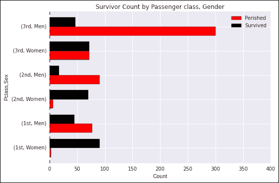

# 天真的解决泰坦尼克号问题的方法

我们对泰坦尼克号数据进行分类的首次尝试是使用*天真*但非常直观的方法。 此方法涉及以下步骤：

1.  选择一组特征 *S* ，这些特征会影响一个人是否生存。
2.  对于功能的每种可能组合，请使用训练数据指示大多数病例是否存活。 这可以在所谓的生存矩阵中进行评估。
3.  对于我们希望预测生存的每个测试示例，请查找对应于其特征值的特征组合，并将其预测值分配给生存表中的生存值。 这种方法是朴素的 K 最近邻居方法。

根据我们之前在分析中看到的内容，似乎对存活率影响最大的三个特征是：

*   旅客舱位
*   性别
*   客运费（桶装）

我们包括与乘客等级有关的乘客票价。

生存表看起来类似于以下内容：

```py
 NumberOfPeople  Pclass  PriceBucket     Sex  Survived
0                0       1            0  female         0
1                1       1            0    male         0
2                0       1            1  female         0
3                0       1            1    male         0
4                7       1            2  female         1
5               34       1            2    male         0
6                1       1            3  female         1
7               19       1            3    male         0
8                0       2            0  female         0
9                0       2            0    male         0
10              35       2            1  female         1
11              63       2            1    male         0
12              31       2            2  female         1
13              25       2            2    male         0
14               4       2            3  female         1
15               6       2            3    male         0
16              64       3            0  female         1
17             256       3            0    male         0
18              43       3            1  female         1
19              38       3            1    male         0
20              21       3            2  female         0
21              24       3            2    male         0
22              10       3            3  female         0
23               5       3            3    male         0

```

可以在随附的文件`survival_data.py`中找到用于生成此表的代码。 要查看我们如何使用该表，让我们看一下测试数据的摘要：

```py
In [192]: test_df.head(3)[['PassengerId','Pclass','Sex','Fare']]
Out[192]: PassengerId   Pclass  Sex     Fare
 0        892     3       male    7.8292
 1        893     3       female  7.0000
 2        894     2       male    9.6875

```

对于 892 乘客，我们看到他是男性，票价为 7.8292，并且他乘坐的是三等舱。

因此，用于此乘客的生存表查找的关键字是 *{Sex ='male'，Pclass = 3，PriceBucket = 0（因为 7.8292 落入存储桶 0 中）}* 。

如果我们在生存表（第 17 行）中查找与此键对应的生存值，则会看到该值是 0 = Perished； 这就是我们将要预测的价值。

类似地，对于乘客 893，我们有*键= {性别='女性'，Pclass = 3，PriceBucket = 0}* 。

这对应于第 16 行，因此，我们将预测 1，即生存，而她的预测生存为 1，即生存。

因此，我们的结果类似于以下命令：

```py
> head -4 csv/surv_results.csv 
PassengerId,Survived
892,0
893,1
894,0

```

该信息的来源位于： [http://bit.ly/1FU7mXj](http://bit.ly/1FU7mXj) 。

使用前面概述的生存表方法，可以在 Kaggle（ [http://www.kaggle.com](http://www.kaggle.com) ）上达到 0.77990 的精度。

生存表方法虽然直观，却是一种非常基本的方法，仅代表机器学习中各种可能性的冰山一角。

在以下各节中，我们将带动各种机器学习算法的旋风之旅，这些算法将帮助您（读者）对机器学习领域中可用的功能有所了解。

# scikit-学习 ML /分类器接口

我们将深入研究机器学习的基本原理，并通过`scikit-learn`基本 API 演示这些原理的用法。

`scikit-learn`库具有一个估计器接口。 我们通过使用线性回归模型来说明它。 例如，考虑以下内容：

```py
In [3]: from sklearn.linear_model import LinearRegression

```

实例化 estimator 接口以创建一个模型，在这种情况下为线性回归模型：

```py
In [4]: model = LinearRegression(normalize=True) 
In [6]: print model
 LinearRegression(copy_X=True, fit_intercept=True, normalize=True)

```

在这里，我们指定`normalize=True`，指示 x 值将在回归之前进行归一化。 **超参数**（估计器参数）在模型创建中作为参数传递。 这是创建具有可调参数的模型的示例。

当数据与估计器拟合时，从数据获得估计的参数。 让我们首先创建一些样本训练数据，这些样本训练数据通常关于`y = x/2`分布。 我们首先生成我们的`x`和`y`值：

```py
In [51]: sample_size=500
 x = []
 y = []

 for i in range(sample_size):
 newVal = random.normalvariate(100,10)
 x.append(newVal)
 y.append(newVal / 2.0 + random.normalvariate(50,5))

```

`sklearn`将`num_samples × num_features`的 2D 数组作为输入，因此我们将 x 数据转换为 2D 数组：

```py
In [67]: X = np.array(x)[:,np.newaxis]
 X.shape
Out[67]: (500, 1)

```

在这种情况下，我们有 500 个样本和 1 个特征 x。 现在，我们训练/拟合模型并显示斜率（系数）和回归线的截距，即预测：

```py
In [71]: model.fit(X,y)
 print "coeff=%s, intercept=%s" % (model.coef_,model.intercept_)
 coeff=[ 0.47071289], intercept=52.7456611783

```

可以如下所示：

```py
In [65]: plt.title("Plot of linear regression line and training data")
 plt.xlabel('x')
 plt.ylabel('y')
 plt.scatter(X,y,marker='o', color='green', label='training data');
 plt.plot(X,model.predict(X), color='red', label='regression line')
 plt.legend(loc=2)

Out[65]: [<matplotlib.lines.Line2D at 0x7f11b0752350]

```

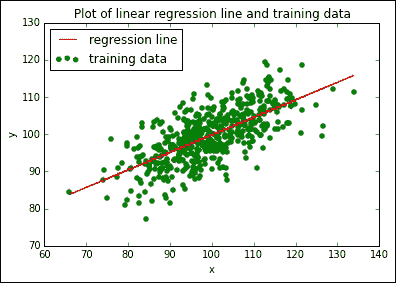

要总结 estimator 接口的基本用法，请按照下列步骤操作：

1.  定义模型- *LinearRegression* ， *SupportVectorMachine* ， *DecisionTrees* 等。 您可以在此步骤中指定所需的超参数。 例如，如先前指定的`normalize=True`。
2.  定义模型后，可以通过在上一步中定义的模型上调用`fit(..)`方法来对数据进行训练。
3.  拟合模型后，可以对测试数据调用`predict(..)`方法以进行预测或估计。
4.  在监督学习问题的情况下，`predict(X)`方法将获得未标记的观察值`X`，并返回预测的标记`y`。

### Note

有关更多参考，请参见以下内容： [http://bit.ly/1FU7mXj](http://bit.ly/1FU7mXj) 和 [http://bit.ly/1QqFN2V](http://bit.ly/1QqFN2V) 。

# 监督学习算法

我们将简要介绍一些著名的监督学习算法，并了解如何将其应用于前面所述的泰坦尼克号生存预测问题。

## 使用 Patsy 构建模型以进行 scikit 学习

在开始学习机器学习算法之前，我们需要了解一些`Patsy`库。 我们将利用`Patsy`设计将与`scikit-learn`结合使用的功能。 `Patsy`是用于创建称为设计矩阵的软件包。 这些设计矩阵是输入数据中要素的变换。 转换由称为公式的表达式指定，这些表达式对应于我们希望机器学习程序在学习中使用哪些功能的规范。

一个简单的例子如下：

假设我们希望 y 与其他 x，a 和 b 变量以及 a 和 b 之间的相互作用线性回归。 然后，我们可以指定模型如下：

```py
import patsy as pts
pts.dmatrices("y ~ x + a + b + a:b", data)

```

在代码的前一行中，公式由以下表达式指定：`y ~ x + a + b + a:b`。

### Note

进一步的参考，请查看： [http://patsy.readthedocs.org/en/latest/overview.html](http://patsy.readthedocs.org/en/latest/overview.html)

## 一般样板代码说明

在本节中，我们将介绍使用`Patsy`和`scikit-learn`实现以下各种算法的样板代码。 这样做的原因是以下算法的大多数代码都是可重复的。

在以下各节中，将介绍算法的工作原理，并将提供每种算法专用的代码作为本章的附件。

1.  首先，通过使用以下命令行来确保我们位于正确的文件夹中。 假设工作目录位于`~/devel/Titanic`，我们有：

    ```py
    In [17]: %cd ~/devel/Titanic
     /home/youruser/devel/sandbox/Learning/Kaggle/Titanic

    ```

2.  在这里，我们导入所需的软件包并阅读我们的培训和测试数据集：

    ```py
    In [18]: import matplotlib.pyplot as plt
     import pandas as pd
     import numpy as np
     import patsy as pt
    In [19]: train_df = pd.read_csv('csv/train.csv', header=0)
     test_df = pd.read_csv('csv/test.csv', header=0) 

    ```

3.  接下来，我们指定要提交给`Patsy`的公式：

    ```py
    In [21]: formula1 = 'C(Pclass) + C(Sex) + Fare'
     formula2 = 'C(Pclass) + C(Sex)'
     formula3 = 'C(Sex)'
     formula4 = 'C(Pclass) + C(Sex) + Age + SibSp + Parch'
     formula5 = 'C(Pclass) + C(Sex) + Age + SibSp + Parch + C(Embarked)' 
     formula6 = 'C(Pclass) + C(Sex) + Age + SibSp + C(Embarked)'
     formula7 = 'C(Pclass) + C(Sex) + SibSp + Parch + C(Embarked)'
     formula8 = 'C(Pclass) + C(Sex) + SibSp + Parch + C(Embarked)'

    In [23]: formula_map = {'PClass_Sex_Fare' : formula1,
     'PClass_Sex' : formula2,
     'Sex' : formula3,
     'PClass_Sex_Age_Sibsp_Parch' : formula4,
     'PClass_Sex_Age_Sibsp_Parch_Embarked' : formula5,
     'PClass_Sex_Embarked' : formula6,
     'PClass_Sex_Age_Parch_Embarked' : formula7,
     'PClass_Sex_SibSp_Parch_Embarked' : formula8
     }

    ```

我们将定义一个函数来帮助我们处理缺失值。 下面的函数在 DataFrame 中查找具有空值的单元格，获取一组相似的乘客，并将空值设置为该组相似乘客的该功能的平均值。 相似的乘客定义为与具有零特征值的乘客具有相同性别和乘客等级的乘客。

```py
In [24]: 
def fill_null_vals(df,col_name):
 null_passengers=df[df[col_name].isnull()]
 passenger_id_list = null_passengers['PassengerId'].tolist()
 df_filled=df.copy()
 for pass_id in passenger_id_list:
 idx=df[df['PassengerId']==pass_id].index[0]
 similar_passengers = df[(df['Sex']== 
 null_passengers['Sex'][idx]) & 
 (df['Pclass']==null_passengers['Pclass'][idx])]
 mean_val = np.mean(similar_passengers[col_name].dropna())
 df_filled.loc[idx,col_name]=mean_val
 return df_filled

```

在这里，我们创建培训和测试数据框的填充版本。

我们的测试 DataFrame 是拟合的`scikit-learn`模型将生成的预测，以产生输出，并将其提交给 Kaggle 进行评估：

```py
In [28]: train_df_filled=fill_null_vals(train_df,'Fare')
 train_df_filled=fill_null_vals(train_df_filled,'Age')
 assert len(train_df_filled)==len(train_df)
 test_df_filled=fill_null_vals(test_df,'Fare')
 test_df_filled=fill_null_vals(test_df_filled,'Age')
 assert len(test_df_filled)==len(test_df)

```

这是对`scikit-learn`的调用的实际实现，以通过拟合模型从训练数据中学习，然后在测试数据集上生成预测。 注意，尽管这是样板代码，但出于说明目的，实际调用了特定算法，在这种情况下为`DecisionTreeClassifier`。

将输出数据写入具有描述性名称的文件，例如`csv/dt_PClass_Sex_Age_Sibsp_Parch_1.csv`和`csv/dt_PClass_Sex_Fare_1.csv`。

```py
In [29]: 
from sklearn import metrics,svm, tree
for formula_name, formula in formula_map.iteritems():
 print "name=%s formula=%s" % (formula_name,formula)
 y_train,X_train = pt.dmatrices('Survived ~ ' + formula, 
 train_df_filled,return_type='dataframe')
 y_train = np.ravel(y_train)
 model = tree.DecisionTreeClassifier(criterion='entropy', 
 max_depth=3,min_samples_leaf=5)
 print "About to fit..."
 dt_model = model.fit(X_train, y_train)
 print "Training score:%s" % dt_model.score(X_train,y_train)
 X_test=pt.dmatrix(formula,test_df_filled)
 predicted=dt_model.predict(X_test)
 print "predicted:%s" % predicted[:5]
 assert len(predicted)==len(test_df)
 pred_results = pd.Series(predicted,name='Survived')
 dt_results = pd.concat([test_df['PassengerId'], 
 pred_results],axis=1)
 dt_results.Survived = dt_results.Survived.astype(int)
 results_file = 'csv/dt_%s_1.csv' % (formula_name)
 print "output file: %s\n" % results_file
 dt_results.to_csv(results_file,index=False)

```

前面的代码遵循一个标准配方，其摘要如下：

1.  阅读训练和测试数据集
2.  填写我们希望在两个数据集中考虑的要素的所有缺失值
3.  为我们希望在`Patsy`中生成机器学习模型的各种功能组合定义公式
4.  对于每个公式，请执行以下步骤：
    1.  调用`Patsy`为我们的训练功能集和训练标签集（由`X_train`和`y_train`指定）创建设计矩阵。
    2.  实例化适当的`scikit-learn`分类器。 在这种情况下，我们使用`DecisionTreeClassifier`。
    3.  通过调用`fit(..)`方法拟合模型。
    4.  调用`Patsy`可以通过调用`patsy.dmatrix(..)`为我们的预测输出创建设计矩阵（`X_test`）。
    5.  预测`X_test`设计矩阵，并将结果保存在预测的变量中。
    6.  将我们的预测写入输出文件，该文件将提交给 Kaggle。

我们将考虑以下监督学习算法：

*   逻辑回归
*   支持向量机
*   决策树
*   随机森林

## 逻辑回归

在逻辑回归中，我们尝试基于一个或多个输入预测变量来预测分类变量（即离散值相关变量）的结果。

逻辑回归可以被认为等同于应用线性回归，但是适用于离散或分类变量。 但是，在二元逻辑回归（适用于 Titanic 问题）的情况下，我们试图拟合的函数不是线性函数，因为我们仅试图预测只能采用两个值的结果- 0 和 1。使用线性函数进行回归是没有意义的，因为输出不能取 0 到 1 之间的值。理想情况下，我们需要为二进制值输出的回归建模的某种形式是值的阶跃函数 0 和 1。但是，这样的函数定义不明确且不可微，因此定义了具有更好属性的近似值：逻辑函数。 逻辑函数取 0 到 1 之间的值，但偏向 0 和 1 的极值，可以用作分类变量回归的良好近似值。

Logistic 回归函数的形式定义如下：


下图很好地说明了为什么逻辑函数适合于二进制逻辑回归：

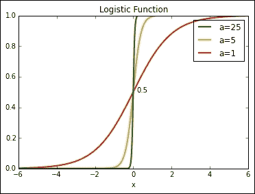

我们可以看到，随着我们增加参数 a 的值，我们可以更接近接受 0 到 1 的值以及我们要建模的阶跃函数。 如果 *f（x）< 0.5* ，则将上述功能的一个简单应用是将输出值设置为 0，否则将其设置为 1。

用于绘制功能的代码包含在`plot_logistic.py`中。

### Note

可以在以下位置找到对逻辑回归的更详细的检查： [http://en.wikipedia.org/wiki/Logit](http://en.wikipedia.org/wiki/Logit) 和 [http://logisticregressionanalysis.com/86-what-is -逻辑回归](http://logisticregressionanalysis.com/86-what-is-logistic-regression)。

在对泰坦尼克号问题进行逻辑回归时，我们希望预测一个二进制结果，即乘客是否幸存。

我们修改了样板代码，以使用`scikit-learn`的`sklearn.linear_model.LogisticRegression`类。

将我们的数据提交给 Kaggle 后，获得了以下结果：

<colgroup class="calibre20"><col class="calibre21"> <col class="calibre21"></colgroup> 
| 

式

 | 

Kaggle 得分

 |
| --- | --- |
| C（Pclass）+ C（性别）+票价 | 0.76077 |
| C（Pclass）+ C（性别） | 0.76555 |
| C（性别） | 0.76555 |
| C（Pclass）+ C（性别）+年龄+ SibSp + Parch | 0.74641 |
| C（Pclass）+ C（性别）+年龄+ Sibsp + Parch + C（贴身） | 0.75598 |

可以在`run_logistic_regression_titanic.py`文件中找到实现逻辑回归的代码。

## 支持向量机

**支持向量机**（ **SVM** ）是一种功能强大的监督学习算法，用于分类和回归。 它是一种判别式分类器，它在数据的聚类或分类之间绘制边界，因此可以根据新点所属的聚类对它们进行分类。

SVM 不仅可以找到边界线，还可以找到边界线。 他们还尝试确定两侧边界的边距。 SVM 算法试图找到周围具有最大可能余量的边界。

支持向量是定义边界周围最大边缘的点，请删除这些点，并可能找到较大的边缘。

因此，命名为 support，因为它们支持边界线周围的边距。 支持向量很重要。 如下图所示：

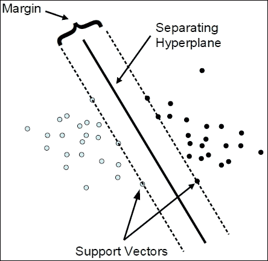

### Note

有关此的更多信息，请参考 [http://winfwiki.wi-fom.de/images/c/cf/Support_vector_2.png](http://winfwiki.wi-fom.de/images/c/cf/Support_vector_2.png) 。

为了使用 SVM 算法进行分类，我们指定了以下三个内核之一：线性，多边形和 rbf（也称为径向基函数）。

然后，我们导入**支持向量分类器**（ **SVC** ）：

```py
from sklearn import svm

```

然后，我们实例化一个 SVM 分类器，拟合模型，并预测以下内容：

```py
model = svm.SVC(kernel=kernel)
svm_model = model.fit(X_train, y_train)
X_test = pt.dmatrix(formula, test_df_filled)
. . .

```

Upon submitting our data to Kaggle, the following results were obtained:

<colgroup class="calibre20"><col class="calibre21"> <col class="calibre21"> <col class="calibre21"></colgroup> 
| 

Formula

 | 

内核类型

 | 

Kaggle Score

 |
| --- | --- | --- |
| C(Pclass) + C(Sex) + Fare | 聚 | 0.71292 |
| C(Pclass) + C(Sex) | poly | 0.76555 |
| C(Sex) | poly | 0.76555 |
| C(Pclass) + C(Sex) + Age + SibSp + Parch | poly | 0.75598 |
| C（Pclass）+ C（性别）+年龄+ Parch + C（下巴） | poly | 0.77512 |
| C（Pclass）+ C（性别）+年龄+ Sibsp + Parch + C（下巴） | poly | 0.79426 |
| C(Pclass) + C(Sex) + Age + Sibsp + Parch + C(Embarked) | rbf | 0.7512 |

可以在以下文件中完整查看该代码：`run_svm_titanic.py`。

在这里，我们看到内核类型为 poly（多项式）且 Pclass，Sex，Age，Sibsp 和 Parch 功能组合的 SVM 在提交给 Kaggle 时产生最佳效果。 出人意料的是，似乎登机点（入舱）以及乘客是独自旅行还是与家人一起旅行（Sibsp + Parch）确实对乘客的生存机会产生了重大影响。

后一种影响可能是由于对《铁达尼号》实行了妇女和儿童优先的政策。

## 决策树

决策树背后的基本思想是使用训练数据集创建决策树以进行预测。

它根据单个要素的值将训练数据集递归地分成子集。 每个拆分对应于决策树中的一个节点。 拆分过程一直进行到每个子集都是纯的为止，也就是说，所有元素都属于一个类。 这总是有效的，除非有重复的训练示例属于不同的类别。 在这种情况下，多数阶级获胜。

最终结果是用于对测试数据集进行预测的规则集。

决策树在模仿人类如何对事物进行分类的过程中对一系列二进制选择进行编码，但是通过使用信息标准来决定哪个问题在每个步骤中最有用。

例如，您是否希望确定动物 x 是哺乳动物，鱼类还是爬行动物； 在这种情况下，我们会问以下问题：

```py
- Does x have fur?
Yes: x is a mammal
No: Does x have feathers?
Yes: x is a bird
No: Does x have scales?
Yes: Does x have gills?
Yes: x is a fish
No: x is a reptile
No: x is an amphibian

```

这将生成类似于以下内容的决策树：

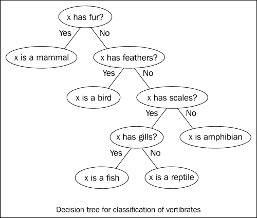

### Note

请参阅以下链接以获取更多信息：

[http://bit.ly/1C0cM2e](http://bit.ly/1C0cM2e) 。

问题在每个节点上的二进制拆分是决策树算法的本质。 决策树的主要缺点是它们可能*过拟合*数据。

它们是如此灵活，以至于在深度较大的情况下，它们可以记住输入，当将它们用于看不见的数据分类时，结果很差。

解决此问题的方法是使用多个决策树，这被称为使用集成估计器。 整体估计器的一个示例是随机森林算法，我们将在后面讨论。

要在`scikit-learn`中使用决策树，我们导入`tree`模块：

```py
from sklearn import tree

```

We then instantiate an SVM classifier, fit the model, and predict the following:

```py
model = tree.DecisionTreeClassifier(criterion='entropy', 
 max_depth=3,min_samples_leaf=5)
dt_model = model.fit(X_train, y_train)X_test = dt.dmatrix(formula, test_df_filled)
#. . .

```

将我们的数据提交给 Kaggle 后，可获得以下结果：

<colgroup class="calibre20"><col class="calibre21"> <col class="calibre21"></colgroup> 
| 

Formula

 | 

Kaggle Score

 |
| --- | --- |
| C(Pclass) + C(Sex) + Fare | 0.77033 |
| C(Pclass) + C(Sex) | 0.76555 |
| C(Sex) | 0.76555 |
| C(Pclass) + C(Sex) + Age + SibSp + Parch | 0.76555 |
| C（Pclass）+ C（性别）+年龄+帕奇+C（靠背） | 0.78947 |
| C(Pclass) + C(Sex) + Age + Sibsp + Parch + C(Embarked) | 0.79426 |

## 随机森林

随机森林和决策树一样，都是非参数模型的一个例子。 随机森林基于决策树。 决策边界是从数据本身获悉的。 它不必是直线，多项式或径向基函数。 随机森林模型建立在决策树概念的基础上，产生大量决策树或森林。 它从数据中随机抽取一个样本，并识别出一组特征以增长每个决策树。 在决策树集之间比较模型的错误率，以找到产生最强分类模型的特征集。

要在`scikit-learn`中使用随机森林，我们导入`RandomForestClassifier`模块：

```py
from sklearn import RandomForestClassifier

```

然后，我们实例化`random forest`分类器，拟合模型，并预测以下内容：

```py
model = RandomForestClassifier(n_estimators=num_estimators, 
 random_state=0)
rf_model = model.fit(X_train, y_train)
X_test = dt.dmatrix(formula, test_df_filled)
. . .

```

将我们的数据提交给 Kaggle（公式： *C（Pclass）+ C（Sex）+ Age + Sibsp + Parch + C（Embarked）*），可获得以下结果：

<colgroup class="calibre20"><col class="calibre21"> <col class="calibre21"></colgroup> 
| 

Formula

 | 

Kaggle Score

 |
| --- | --- |
| 10 | 0.74163 |
| 100 | 0.76077 |
| 1000 | 0.76077 |
| 10000 | 0.77990 |
| 100000 | 0.77990 |

# 无监督学习算法

在无监督学习中，我们最关心两个任务：降维和聚类。

## 降维

降维用于帮助系统地可视化高维数据。 这很有用，因为我们的人脑只能看到三个空间维度（可能是一个时间维度），但是大多数数据集涉及的维度要高得多。

用于降维的典型技术是**主成分分析**（ **PCA** ）。 PCA 涉及使用线性代数技术将高维数据投影到低维空间上。 这不可避免地涉及信息丢失，但是通常通过按正确的维数和维数进行投影，可以使信息丢失最小化。 一种常见的降维技术是在我们的数据中找到解释最大差异（信息的代理）的变量组合，并沿这些维度进行投影。

在无监督学习问题的情况下，我们没有标签集（Y），因此，我们仅对输入数据`X`本身调用`fit()`，对于 PCA，我们将调用`transform()`而不是`transform()` HTG3]，因为我们正在尝试将数据转换为新的表示形式。

我们将用来演示 USL 的数据集之一是虹膜数据集，它可能是所有机器学习中最著名的数据集。

`scikit-learn`库提供了一组预打包的数据集，可通过`sklearn.datasets`模块使用。 虹膜数据集就是其中之一。

虹膜数据集由来自三种不同种类的虹膜花（杂色，setosa 和 virginica）的 150 个数据样本组成，每种类型有 50 个样本。 数据集包含四个要素/维度：

*   花瓣长度
*   花瓣宽度
*   萼片长度
*   萼片宽度

长度和宽度值以厘米为单位。 可以按以下方式加载：

```py
from sklearn.datasets import load_iris 
iris = load_iris()

```

在我们的无监督学习检查中，我们将专注于如何可视化和聚类数据。

在讨论无监督学习之前，让我们先检查一下虹膜数据。 `load_iris()`命令返回所谓的束对象，该对象本质上是一个字典，除了包含数据的键之外，还包含键。 因此，我们有以下内容：

```py
In [2]: iris_data.keys()
Out[2]: ['target_names', 'data', 'target', 'DESCR', 'feature_names']

```

此外，数据本身看起来类似于以下内容：

```py
In [3]: iris_data.data.shape
Out[3]: (150, 4)

```

这对应于四个特征的 150 个样本。 这四个功能如下所示：

```py
In [4]: print iris_data.feature_names
['sepal length (cm)', 'sepal width (cm)', 'petal length (cm)', 'petal width (cm)']

```

我们还可以看一下实际数据：

```py
In [9]: print iris_data.data[:2]
[[ 5.1  3.5  1.4  0.2]
 [ 4.9  3\.   1.4  0.2]]

```

我们的目标名称（我们要尝试预测的名称）看起来类似于以下内容：

```py
In [10]: print iris_data.target_names
 ['setosa' 'versicolor' 'virginica']

```

如前所述，虹膜特征集对应于五维数据，因此我们无法在色图上对其进行可视化。 我们可以做的一件事是选择两个特征并将它们相互绘制，同时使用颜色区分物种特征。 接下来，我们对所有可能的功能组合进行此操作，一次为一组六个不同的可能性选择两个。 这些组合如下：

*   隔垫宽度与隔垫长度
*   萼片宽度与花瓣宽度
*   萼片宽度与花瓣长度
*   萼片长度与花瓣宽度
*   萼片长度与花瓣长度
*   花瓣宽度与花瓣长度

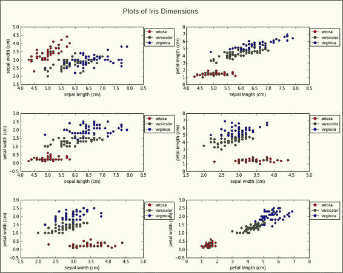

可以在以下文件中找到用于此目的的代码：`display_iris_dimensions.py`。 从前面的图中可以看出，setosa 点倾向于自身聚类，而 virginica 点和杂色点之间有一些重叠。 这可能使我们得出结论，后两个物种彼此之间的联系比与 setosa 物种的联系更紧密。

但是，这些是二维数据切片。 如果我们想更全面地查看数据，并用一些表示的所有萼片和花瓣尺寸的视图，该怎么办？

如果在我们的二维图未显示的尺寸之间存在迄今尚未发现的联系怎么办？ 有一种可视化的方法吗？ 输入降维。 我们将使用降维来提取萼片和花瓣尺寸的两个组合，以帮助可视化。

我们可以应用降维来做到这一点，如下所示：

```py
In [118]: X, y = iris_data.data, iris_data.target
 from sklearn.decomposition import PCA
 pca = PCA(n_components=2)
 pca.fit(X)
 X_red=pca.transform(X)
 print "Shape of reduced dataset:%s" % str(X_red.shape)

 Shape of reduced dataset:(150, 2)

```

因此，我们看到缩小的数据集现在是二维的。 让我们以二维方式直观地显示数据，如下所示：

```py
In [136]: figsize(8,6)
 fig=plt.figure()
 fig.suptitle("Dimensionality reduction on iris data")
 ax=fig.add_subplot(1,1,1)
 colors=['red','yellow','magenta']
 cols=[colors[i] for i in iris_data.target]
 ax.scatter(X_red[:,0],X[:,1],c=cols)
Out[136]:
<matplotlib.collections.PathCollection at 0x7fde7fae07d0>

```

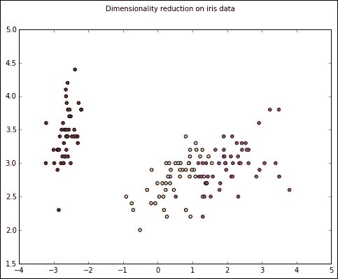

我们可以检查 PCA 缩减的两个维度的构成，如下所示：

```py
In [57]:
print "Dimension Composition:"
idx=1
for comp in pca.components_:
 print "Dim %s" % idx
 print " + ".join("%.2f x %s" % (value, name)
 for value, name in zip(comp, iris_data.feature_names))
 idx += 1

Dimension Composition:
Dim 1
0.36 x sepal length (cm) + -0.08 x sepal width (cm) + 0.86 x petal length (cm) + 0.36 x petal width (cm)
Dim 2
-0.66 x sepal length (cm) + -0.73 x sepal width (cm) + 0.18 x petal length (cm) + 0.07 x petal width (cm)

```

因此，我们可以看到两个减小的尺寸是所有四个萼片和花瓣尺寸的线性组合。

该信息的来源位于： [https://github.com/jakevdp/sklearn_pycon2014](https://github.com/jakevdp/sklearn_pycon2014) 。

## K 均值聚类

聚类背后的想法是根据给定的标准将数据集中的相似点分组在一起，从而在数据中找到聚类。

K-means 算法旨在将一组数据点划分为 K 个聚类，以使每个数据点都属于具有最近均值或质心的聚类。

为了说明 K 均值聚类，我们可以将其应用于通过 PCA 获得的减少虹膜数据集，但是在这种情况下，我们不像在监督学习中那样将实际标签传递给`fit(..)`方法：

```py
In [142]: from sklearn.cluster import KMeans
 k_means = KMeans(n_clusters=3, random_state=0)
 k_means.fit(X_red)
 y_pred = k_means.predict(X_red)

```

现在，我们显示聚类数据，如下所示：

```py
In [145]: figsize(8,6)
 fig=plt.figure()
 fig.suptitle("K-Means clustering on PCA-reduced iris data, K=3")
 ax=fig.add_subplot(1,1,1)
 ax.scatter(X_red[:, 0], X_red[:, 1], c=y_pred);

```

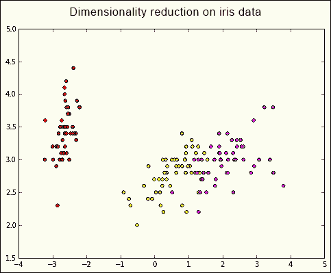

请注意，我们的 K 均值算法集群并不完全对应于通过 PCA 获得的维度。 可从 [https://github.com/jakevdp/sklearn_pycon2014](https://github.com/jakevdp/sklearn_pycon2014) 获得源代码。

### Note

有关`scikit-learn`中 K 均值聚类的更多信息，通常可以在以下位置找到：

[http://scikit-learn.org/stable/auto_examples/cluster/plot_cluster_iris.html](http://scikit-learn.org/stable/auto_examples/cluster/plot_cluster_iris.html) 和 [http://en.wikipedia.org/wiki/K-means_clustering](http://en.wikipedia.org/wiki/K-means_clustering) 。

# 摘要

在本章中，我们展开了机器学习的旋风之旅，研究了 Pandas 在特征提取，选择和工程中的作用，以及学习了机器学习中的关键概念，例如监督学习与无监督学习。 我们还简要介绍了两种机器学习方法中的一些关键算法，并使用`scikit-learn`包利用这些算法来学习数据并做出预测。 本章并不是要对机器学习进行全面的介绍，而是要说明如何使用 Pandas 来协助机器学习领域的用户。