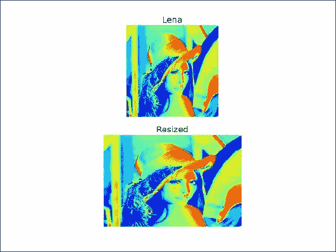
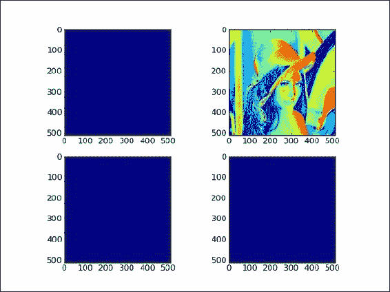
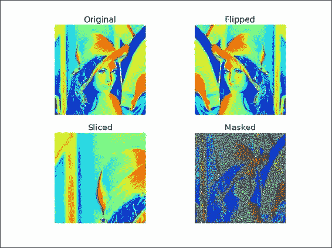
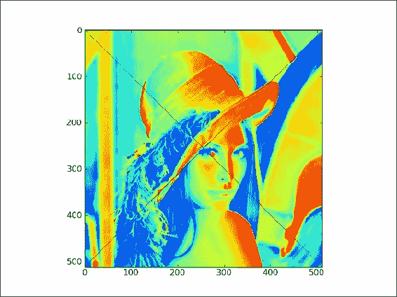
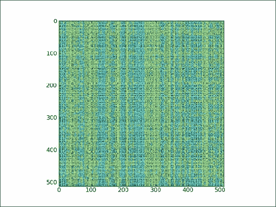
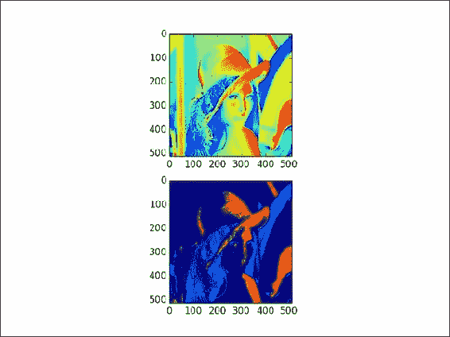
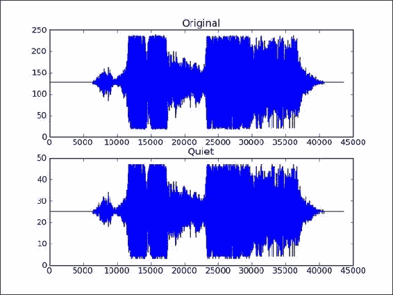

# 二、高级索引和数组概念

在本章中，我们将介绍以下秘籍：

*   安装 SciPy
*   安装 PIL
*   调整图像大小
*   比较视图和副本
*   翻转 Lena
*   花式索引
*   用位置列表编制索引
*   用布尔值建立索引
*   数独的大招
*   广播数组

# 简介

NumPy 以其高效的数组而闻名。 之所以成名，部分原因是索引容易。 我们将演示使用图像的高级索引技巧。 在深入研究索引之前，我们将安装必要的软件 -- SciPy 和 PIL。 如果您认为有此需要，请参阅第 1 章“使用 IPython”的“安装 matplotlib”秘籍。

在本章和其他章中，我们将使用以下导入：

```py
import numpy as np 
import matplotlib.pyplot as plt
import scipy
```

我们还将尽可能为`print()` Python 函数使用最新的语法。

### 注意

Python2 是仍然很流行的主要 Python 版本，但与 Python3 不兼容。Python2 直到 2020 年才正式失去支持。主要区别之一是`print()`函数的语法。 本书使用的代码尽可能与 Python2 和 Python3 兼容。

本章中的一些示例涉及图像处理。 为此，我们将需要 **Python 图像库**（**PIL**），但不要担心； 必要时会在本章中提供帮助您安装 PIL 和其他必要 Python 软件的说明和指示。

# 安装 SciPy

SciPy 是科学的  Python 库，与 NumPy 密切相关。 实际上，SciPy 和 NumPy 在很多年前曾经是同一项目。 就像 NumPy 一样，SciPy 是一个开放源代码项目，已获得 BSD 许可。 在此秘籍中，我们将安装 SciPy。 SciPy 提供高级功能，包括统计，信号处理，线性代数，优化，FFT，ODE 求解器，插值，特殊功能和积分。 NumPy 有一些重叠，但是 NumPy 主要提供数组功能。

## 准备

在第 1 章，“使用 IPython”中，我们讨论了如何安装`setuptools`和`pip`。 如有必要，请重新阅读秘籍。

## 操作步骤

在此秘籍中，我们将完成安装 SciPy 的步骤：

*   **从源安装**：如果已安装 Git，则可以使用以下命令克隆 SciPy 存储库：

    ```py
    $ git clone https://github.com/scipy/scipy.git

    $ python setup.py build
    $ python setup.py install --user

    ```

    这会将 SciPy 安装到您的主目录。 它需要 Python 2.6 或更高版本。

    在构建之前，您还需要安装 SciPy 依赖的以下包：

    *   `BLAS`和`LAPACK`库
    *   C 和 Fortran 编译器

    您可能已经在 NumPy 安装过程中安装了此软件。

*   **在 Linux 上安装 SciPy**：大多数 Linux 发行版都包含 SciPy 包。 我们将遵循一些流行的 Linux 发行版中的必要步骤（您可能需要以 root 用户身份登录或具有`sudo`权限）：
    *   为了在 RedHat，Fedora 和 CentOS 上安装 SciPy，请从命令行运行以下指令：

        ```py
        $ yum install python-scipy

        ```

    *   为了在 Mandriva 上安装 SciPy，请运行以下命令行指令：

        ```py
        $ urpmi python-scipy

        ```

    *   为了在 Gentoo 上安装 SciPy，请运行以下命令行指令：

        ```py
        $ sudo emerge scipy

        ```

    *   在 Debian 或 Ubuntu 上，我们需要输入以下指令：

        ```py
        $ sudo apt-get install python-scipy

        ```

*   **在 MacOSX 上安装 SciPy**：需要 Apple Developer Tools（XCode），因为它包含`BLAS`和`LAPACK`库。 可以在 App Store 或 Mac 随附的安装 DVD 中找到它。 [或者您可以从 Apple Developer 的连接网站获取最新版本](https://developer.apple.com/xcode/)。 确保已安装所有内容，包括所有可选软件包。

    您可能已经为 NumPy 安装了 Fortran 编译器。 `gfortran`的二进制文件可以在[这个链接](http://r.research.att.com/tools/)中找到。

*   **使用`easy_install`或`pip`安装 SciPy**：您可以使用以下两个命令中的任何一个来安装 SciPy（`sudo`的需要取决于权限）：

    ```py
    $ [sudo] pip install scipy
    $ [sudo] easy_install scipy

    ```** 
*   **在 Windows 上安装**：如果已经安装 Python，则首选方法是下载并使用二进制发行版。 或者，您可以安装 Anaconda 或 Enthought Python 发行版，该发行版与其他科学 Python 包一起提供。
*   **检查安装**：使用以下代码检查 SciPy 安装：

    ```py
    import scipy
    print(scipy.__version__)
    print(scipy.__file__)
    ```

    这应该打印正确的 SciPy 版本。

## 工作原理

大多数包管理器都会为您解决依赖项（如果有）。 但是，在某些情况下，您需要手动安装它们。 这超出了本书的范围。

## 另见

如果遇到问题，可以在以下位置寻求帮助：

*   `freenode`的`#scipy` IRC 频道
*   [SciPy 邮件列表](http://www.scipy.org/scipylib/mailing-lists.html)

# 安装 PIL

PIL（Python 图像库）是本章中进行图像处理的先决条件。 如果愿意，可以安装 Pillow，它是 PIL 的分支。 有些人喜欢 Pillow API； 但是，我们不会在本书中介绍其安装。

## 操作步骤

让我们看看如何安装 PIL：

*   **在 Windows 上安装 PIL**：[使用 Windows 中的 PIL 可执行文件安装 PIL](http://www.pythonware.com/products/pil/)。
*   **在 Debian 或 Ubuntu 上安装**：在  Debian 或 Ubuntu 上，使用以下命令安装 PIL：

    ```py
    $ sudo apt-get install python-imaging

    ```

*   使用`easy_install`或`pip`安装：在编写本书时，似乎 RedHat，Fedora 和 CentOS 的软件包管理器没有对 PIL 的直接支持。 因此，如果您使用的是这些 Linux 发行版之一，请执行此步骤。

    使用以下任一命令安装  ：

    ```py
    $ easy_install PIL
    $ sudo pip install PIL

    ```

## 另见

*   可在[这里](http://pillow.readthedocs.org/en/latest/installation.html) 找到有关 PILLOW（PIL 的分支）的说明。

# 调整图像大小

在此秘籍中，我们将把 Lena 的样例图像（在 SciPy 发行版中可用）加载到数组中。 顺便说一下，本章不是关于图像操作的。 我们将只使用图像数据作为输入。

### 注意

Lena Soderberg 出现在 1972 年的《花花公子》杂志中。 由于历史原因，这些图像之一经常用于图像处理领域。 不用担心，该图像完全可以安全工作。

我们将使用`repeat()`函数调整图像大小。 此函数重复一个数组，这意味着在我们的用例中按一定的大小调整图像大小。

## 准备

此秘籍的前提条件是必须安装 SciPy，matplotlib 和 PIL。 看看本章和第 1 章，“使用 IPython”的相应秘籍。

## 操作步骤

通过以下步骤调整图像大小：

1.  首先，导入`SciPy`。 SciPy 具有`lena()`函数。 它用于将图像加载到 NumPy 数组中：

    ```py
    lena = scipy.misc.lena()

    ```

    从 0.10 版本开始发生了一些重构，因此，如果您使用的是旧版本，则正确的代码如下：

    ```py
    lena = scipy.lena()
    ```

2.  使用`numpy.testing`包中的`assert_equal()`函数检查 Lena 数组的形状-这是可选的完整性检查测试：

    ```py
    np.testing.assert_equal((LENA_X, LENA_Y), lena.shape)
    ```

3.  使用`repeat()`函数调整 Lena 数组的大小。 我们在`x`和`y`方向上给此函数一个调整大小的因子：

    ```py
    resized = lena.repeat(yfactor, axis=0).repeat(xfactor, axis=1)
    ```

4.  我们将在同一网格的两个子图中绘制 Lena 图像和调整大小后的图像。 使用以下代码在子图中绘制 Lena 数组：

    ```py
    plt.subplot(211)
    plt.title("Lena")
    plt.axis("off")
    plt.imshow(lena)
    ```

    matplotlib `subplot()`函数创建一个子图。 此函数接受一个三位整数作为参数，其中第一位是行数，第二位是列数，最后一位是子图的索引，从 1 开始。`imshow()` 功能显示图像。 最后，`show()`函数显示最终结果。

    将调整大小后的数组绘制在另一个子图中并显示它。 索引现在为 2：

    ```py
    plt.subplot(212)
    plt.title("Resized")
    plt.axis("off")
    plt.imshow(resized)
    plt.show()
    ```

    以下屏幕截图显示了结果，以及原始图像（第一幅）和调整大小后的图像（第二幅）：

    

    以下是本书代码包中`resize_lena.py`文件中该秘籍的完整代码：

    ```py
    import scipy.misc
    import matplotlib.pyplot as plt
    import numpy as np

    # This script resizes the Lena image from Scipy.

    # Loads the Lena image into an array
    lena = scipy.misc.lena()

    #Lena's dimensions
    LENA_X = 512
    LENA_Y = 512

    #Check the shape of the Lena array
    np.testing.assert_equal((LENA_X, LENA_Y), lena.shape)

    # Set the resize factors
    yfactor = 2
    xfactor = 3

    # Resize the Lena array
    resized = lena.repeat(yfactor, axis=0).repeat(xfactor, axis=1)

    #Check the shape of the resized array
    np.testing.assert_equal((yfactor * LENA_Y, xfactor * LENA_Y), resized.shape)

    # Plot the Lena array
    plt.subplot(211)
    plt.title("Lena")
    plt.axis("off")
    plt.imshow(lena)

    #Plot the resized array
    plt.subplot(212)
    plt.title("Resized")
    plt.axis("off")
    plt.imshow(resized)
    plt.show()
    ```

## 工作原理

`repeat()`函数重复数组，在这种情况下，这会导致原始图像的大小改变。 `subplot()` matplotlib 函数创建一个子图。 `imshow()`函数显示图像。 最后，`show()`函数显示最终结果。

## 另见

*   第 1 章“使用 IPython”中的“安装 matplotlib”
*   本章中的“安装 SciPy”
*   本章中的“安装 PIL”
*   [这个页面](http://docs.scipy.org/doc/numpy/reference/generated/numpy.repeat.html)中介绍了`repeat()`函数。

# 创建视图和副本

了解何时处理共享数组视图以及何时具有数组数据的副本，这一点很重要。 例如，切片将创建一个视图。 这意味着，如果您将切片分配给变量，然后更改基础数组，则此变量的值将更改。 我们将根据著名的 Lena 图像创建一个数组，复制该数组，创建一个视图，最后修改视图。

## 准备

前提条件与先前的秘籍相同。

## 操作步骤

让我们创建 Lena 数组的副本和视图：

1.  创建 Lena 数组的副本：

    ```py
    acopy = lena.copy()

    ```

2.  创建数组的视图：

    ```py
    aview = lena.view()

    ```

3.  使用`flat`迭代器将视图的所有值设置为`0`：

    ```py
    aview.flat = 0

    ```

    最终结果是只有一个图像（与副本相关的图像）显示了花花公子模型。 其他图像完全消失：

    

    以下是本教程的代码，显示了本书代码包中`copy_view.py`文件中数组视图和副本的行为：

    ```py
    import scipy.misc
    import matplotlib.pyplot as plt

    lena = scipy.misc.lena()
    acopy = lena.copy()
    aview = lena.view()

    # Plot the Lena array
    plt.subplot(221)
    plt.imshow(lena)

    #Plot the copy
    plt.subplot(222)
    plt.imshow(acopy)

    #Plot the view
    plt.subplot(223)
    plt.imshow(aview)

    # Plot the view after changes
    aview.flat = 0
    plt.subplot(224)
    plt.imshow(aview)

    plt.show()
    ```

## 工作原理

如您所见，通过在程序结尾处更改视图，我们更改了原始 Lena 数组。 这样就产生了三张蓝色（如果您正在查看黑白图像，则为空白）图像-复制的数组不受影响。 重要的是要记住，视图不是只读的。

## 另见

*   NumPy `view()`函数的文档位于[这里](http://docs.scipy.org/doc/numpy/reference/generated/numpy.ndarray.view.html)

# 翻转 Lena

我们将翻转  SciPy Lena 图像-当然，所有这些都是以科学的名义，或者至少是作为演示。 除了翻转图像，我们还将对其进行切片并对其应用遮罩。

## 操作步骤

步骤如下：

1.  使用以下代码围绕垂直轴翻转 Lena 数组：

    ```py
    plt.imshow(lena[:,::-1])

    ```

2.  从图像中切出一部分并将其绘制出来。 在这一步中，我们将看一下 Lena 数组的形状。 该形状是表示数组大小的元组。 以下代码有效地选择了花花公子图片的左上象限：

    ```py
    plt.imshow(lena[:lena.shape[0]/2,:lena.shape[1]/2])

    ```

3.  通过在 Lena 数组中找到所有偶数的值，对图像应用遮罩（这对于演示目的来说是任意的）。 复制数组并将偶数值更改为 0。 这样会在图像上放置很多蓝点（如果您正在查看黑白图像，则会出现暗点）：

    ```py
    mask = lena % 2 == 0
    masked_lena = lena.copy()
    masked_lena[mask] = 0

    ```

    所有这些工作都会产生`2 x 2`的图像网格，如以下屏幕截图所示：

    

    这是本书代码包中`flip_lena.py`文件中此秘籍的完整代码：

    ```py
    import scipy.misc
    import matplotlib.pyplot as plt

    # Load the Lena array
    lena = scipy.misc.lena()

    # Plot the Lena array
    plt.subplot(221)
    plt.title('Original')
    plt.axis('off')
    plt.imshow(lena)

    #Plot the flipped array
    plt.subplot(222)
    plt.title('Flipped')
    plt.axis('off')
    plt.imshow(lena[:,::-1])

    #Plot a slice array
    plt.subplot(223)
    plt.title('Sliced')
    plt.axis('off')
    plt.imshow(lena[:lena.shape[0]/2,:lena.shape[1]/2])

    # Apply a mask
    mask = lena % 2 == 0
    masked_lena = lena.copy()
    masked_lena[mask] = 0
    plt.subplot(224)
    plt.title('Masked')
    plt.axis('off')
    plt.imshow(masked_lena)

    plt.show()
    ```

## 另见

*   第 1 章“使用 IPython”中的“安装 matplotlib”
*   本章中的“安装 SciPy”
*   本章中的“安装 PIL”

# 花式索引

在本教程中，我们将应用花式索引将 Lena 图像的对角线值设置为 0。这将沿着对角线绘制黑线并交叉，这不是因为图像有问题，而仅仅作为练习。 花式索引是不涉及整数或切片的索引； 这是正常的索引编制。

## 操作步骤

我们将从第一个对角线开始：

1.  将第一个对角线的值设置为`0`。

    要将对角线值设置为`0`，我们需要为`x`和`y`值定义两个不同的范围：

    ```py
    lena[range(xmax), range(ymax)] = 0

    ```

2.  将另一个对角线的值设置为`0`。

    要设置另一个对角线的值，我们需要一组不同的范围，但是原理保持不变：

    ```py
    lena[range(xmax-1,-1,-1), range(ymax)] = 0

    ```

    最后，我们得到带有对角线标记的图像，如以下屏幕截图所示：

    

    以下是本书代码集中`fancy.py`文件中该秘籍的完整代码：

    ```py
    import scipy.misc
    import matplotlib.pyplot as plt

    # This script demonstrates fancy indexing by setting values
    # on the diagonals to 0.

    # Load the Lena array
    lena = scipy.misc.lena()
    xmax = lena.shape[0]
    ymax = lena.shape[1]

    # Fancy indexing
    # Set values on diagonal to 0
    # x 0-xmax
    # y 0-ymax
    lena[range(xmax), range(ymax)] = 0

    # Set values on other diagonal to 0
    # x xmax-0
    # y 0-ymax
    lena[range(xmax-1,-1,-1), range(ymax)] = 0

    # Plot Lena with diagonal lines set to 0
    plt.imshow(lena)
    plt.show()
    ```

## 工作原理

我们为`x`值和`y`值定义了单独的范围。 这些范围用于索引 Lena 数组。 花式索引是基于内部 NumPy 迭代器对象执行的。 执行以下步骤：

1.  创建迭代器对象。
2.  迭代器对象绑定到数组。
3.  数组元素通过迭代器访问。

## 另见

*   [花式索引的实现文档](http://docs.scipy.org/doc/numpy-dev/reference/internals.code-explanations.html#fancy-indexing-check)

# 位置列表索引

让我们使用`ix_()`函数来随机播放 Lena 图像。 此函数根据多个序列创建网格。

## 操作步骤

我们将从随机改组数组索引开始：

1.  使用`numpy.random`模块的`shuffle()`函数创建随机索引数组：

    ```py
    def shuffle_indices(size):
       arr = np.arange(size)
       np.random.shuffle(arr)

       return arr
    ```

2.  绘制乱序的索引：

    ```py
    plt.imshow(lena[np.ix_(xindices, yindices)])

    ```

    我们得到的是一张完全打乱的 Lena 图像，如以下屏幕截图所示：

    

    这是本书代码包中`ix.py`文件中秘籍的完整代码：

    ```py
    import scipy.misc
    import matplotlib.pyplot as plt
    import numpy as np

    # Load the Lena array
    lena = scipy.misc.lena()
    xmax = lena.shape[0]
    ymax = lena.shape[1]

    def shuffle_indices(size):
       '''
       Shuffles an array with values 0 - size
       '''
       arr = np.arange(size)
       np.random.shuffle(arr)

       return arr

    xindices = shuffle_indices(xmax)
    np.testing.assert_equal(len(xindices), xmax)
    yindices = shuffle_indices(ymax)
    np.testing.assert_equal(len(yindices), ymax)

    # Plot Lena
    plt.imshow(lena[np.ix_(xindices, yindices)])
    plt.show()
    ```

## 另见

*   [`ix_()`函数的文档页面](http://docs.scipy.org/doc/numpy/reference/generated/numpy.ix_.html)

# 布尔值索引

布尔索引是基于布尔数组的索引  ，属于奇特索引的类别。

## 操作步骤

我们将这种索引技术应用于图像：

1.  在对角线上带有点的图像。

    这在某种程度上类似于本章中的“花式索引”秘籍。 这次，我们在图像的对角线上选择模`4`：

    ```py
    def get_indices(size):
       arr = np.arange(size)
       return arr % 4 == 0
    ```

    然后，我们只需应用此选择并绘制点：

    ```py
    lena1 = lena.copy() 
    xindices = get_indices(lena.shape[0])
    yindices = get_indices(lena.shape[1])
    lena1[xindices, yindices] = 0
    plt.subplot(211)
    plt.imshow(lena1)
    ```

2.  在最大值的四分之一到四分之三之间选择数组值，并将它们设置为`0`：

    ```py
    lena2[(lena > lena.max()/4) & (lena < 3 * lena.max()/4)] = 0
    ```

    带有两个新图像的图看起来类似于以下屏幕截图所示：

    

    这是本书代码包中`boolean_indexing.py`文件中该秘籍的完整代码：

    ```py
    import scipy.misc
    import matplotlib.pyplot as plt
    import numpy as np

    # Load the Lena array
    lena = scipy.misc.lena()

    def get_indices(size):
       arr = np.arange(size)
       return arr % 4 == 0

    # Plot Lena
    lena1 = lena.copy() 
    xindices = get_indices(lena.shape[0])
    yindices = get_indices(lena.shape[1])
    lena1[xindices, yindices] = 0
    plt.subplot(211)
    plt.imshow(lena1)

    lena2 = lena.copy() 
    # Between quarter and 3 quarters of the max value
    lena2[(lena > lena.max()/4) & (lena < 3 * lena.max()/4)] = 0
    plt.subplot(212)
    plt.imshow(lena2)

    plt.show()
    ```

## 工作原理

由于布尔值索引是一种花式索引，因此它的工作方式基本相同。 这意味着索引是在特殊的迭代器对象的帮助下发生的。

## 另见

*   “花式索引”

# 数独的步幅技巧

`ndarray` 类具有`strides`字段，它是一个元组，指示通过数组时要在每个维中步进的字节数。 让我们对将数独谜题拆分为`3 x 3`正方形的问题应用一些大步技巧。

### 注意

对数独的规则进行解释超出了本书的范围。 简而言之，数独谜题由`3 x 3`的正方形组成。 这些正方形均包含九个数字。 有关更多信息，请参见[这里](http://en.wikipedia.org/wiki/Sudoku)。

## 操作步骤

应用如下的跨步技巧：

1.  让我们定义`sudoku`数组。 此数组充满了一个实际的已解决的数独难题的内容：

    ```py
    sudoku = np.array([
        [2, 8, 7, 1, 6, 5, 9, 4, 3],
        [9, 5, 4, 7, 3, 2, 1, 6, 8],
        [6, 1, 3, 8, 4, 9, 7, 5, 2],
        [8, 7, 9, 6, 5, 1, 2, 3, 4],
        [4, 2, 1, 3, 9, 8, 6, 7, 5],
        [3, 6, 5, 4, 2, 7, 8, 9, 1],
        [1, 9, 8, 5, 7, 3, 4, 2, 6],
        [5, 4, 2, 9, 1, 6, 3, 8, 7],
        [7, 3, 6, 2, 8, 4, 5, 1, 9]
        ])
    ```

2.  `ndarray`的`itemsize`字段为我们提供了数组中的字节数。 给定`itemsize`，请计算步幅：

    ```py
    strides = sudoku.itemsize * np.array([27, 3, 9, 1])
    ```

3.  现在我们可以使用`np.lib.stride_tricks`模块的`as_strided()`函数将拼图分解成正方形：

    ```py
    squares = np.lib.stride_tricks.as_strided(sudoku, shape=shape, strides=strides)
    print(squares)
    ```

    该代码打印单独的数独正方形，如下所示：

    ```py
    [[[[2 8 7]
        [9 5 4]
        [6 1 3]]

      [[1 6 5]
        [7 3 2]
        [8 4 9]]

      [[9 4 3]
        [1 6 8]
        [7 5 2]]]

     [[[8 7 9]
        [4 2 1]
        [3 6 5]]

      [[6 5 1]
        [3 9 8]
        [4 2 7]]

      [[2 3 4]
        [6 7 5]
        [8 9 1]]]

     [[[1 9 8]
        [5 4 2]
        [7 3 6]]

      [[5 7 3]
        [9 1 6]
        [2 8 4]]

      [[4 2 6]
        [3 8 7]
        [5 1 9]]]]
    ```

    以下是本书代码包中`strides.py`文件中此秘籍的完整源代码：

    ```py
    import numpy as np

    sudoku = np.array([
       [2, 8, 7, 1, 6, 5, 9, 4, 3],
       [9, 5, 4, 7, 3, 2, 1, 6, 8],
       [6, 1, 3, 8, 4, 9, 7, 5, 2],
       [8, 7, 9, 6, 5, 1, 2, 3, 4],
       [4, 2, 1, 3, 9, 8, 6, 7, 5],
       [3, 6, 5, 4, 2, 7, 8, 9, 1],
       [1, 9, 8, 5, 7, 3, 4, 2, 6],
       [5, 4, 2, 9, 1, 6, 3, 8, 7],
       [7, 3, 6, 2, 8, 4, 5, 1, 9]
       ])

    shape = (3, 3, 3, 3)

    strides = sudoku.itemsize * np.array([27, 3, 9, 1])

    squares = np.lib.stride_tricks.as_strided(sudoku, shape=shape, strides=strides)
    print(squares)
    ```

## 工作原理

我们应用了跨步技巧，将数独谜题拆分为`3 x 3`的正方形。 步幅告诉我们通过数独数组时每一步需要跳过的字节数。

## 另见

*   `strides`属性的文档在[这里](http://docs.scipy.org/doc/numpy/reference/generated/numpy.ndarray.strides.html)

# 广播数组

在不知道的情况下，您可能已经广播了数组。 简而言之，即使操作数的形状不同，NumPy 也会尝试执行操作。 在此秘籍中，我们将一个数组和一个标量相乘。 标量被扩展为数组操作数的形状，然后执行乘法。 我们将下载一个音频文件并制作一个更安静的新版本。

## 操作步骤

让我们从读取 WAV 文件开始：

1.  我们将使用标准的 Python 代码下载 Austin Powers 的音频文件。 SciPy 具有 WAV 文件模块，可让您加载声音数据或生成 WAV 文件。 如果已安装 SciPy，则我们应该已经有此模块。 `read()`函数返回`data`数组和采样率。 在此示例中，我们仅关心数据：

    ```py
    sample_rate, data = scipy.io.wavfile.read(WAV_FILE)
    ```

2.  使用 matplotlib 绘制原始 WAV 数据。 将子图命名为`Original`：

    ```py
    plt.subplot(2, 1, 1)
    plt.title("Original")
    plt.plot(data)
    ```

3.  现在，我们将使用 NumPy 制作更安静的音频样本。 这只是通过与常量相乘来创建具有较小值的新数组的问题。 这就是广播魔术发生的地方。 最后，由于 WAV 格式，我们需要确保与原始数组具有相同的数据类型：

    ```py
    newdata = data * 0.2
    newdata = newdata.astype(np.uint8)
    ```

4.  可以将新数组写入新的 WAV 文件，如下所示：

    ```py
    scipy.io.wavfile.write("quiet.wav",
        sample_rate, newdata)
    ```

5.  使用 matplotlib 绘制新数据数组：

    ```py
    plt.subplot(2, 1, 2)
    plt.title("Quiet")
    plt.plot(newdata)

    plt.show()
    ```

    结果是原始 WAV 文件数据和具有较小值的新数组的图，如以下屏幕快照所示：

    

    这是本书代码包中`broadcasting.py`文件中该秘籍的完整代码：

    ```py
    import scipy.io.wavfile
    import matplotlib.pyplot as plt
    import urllib2
    import numpy as np

    # Download audio file
    response = urllib2.urlopen('http://www.thesoundarchive.com/austinpowers/smashingbaby.wav')
    print(response.info())
    WAV_FILE = 'smashingbaby.wav'
    filehandle = open(WAV_FILE, 'w')
    filehandle.write(response.read())
    filehandle.close()
    sample_rate, data = scipy.io.wavfile.read(WAV_FILE)
    print("Data type", data.dtype, "Shape", data.shape)

    # Plot values original audio
    plt.subplot(2, 1, 1)
    plt.title("Original")
    plt.plot(data)

    # Create quieter audio
    newdata = data * 0.2
    newdata = newdata.astype(np.uint8)
    print("Data type", newdata.dtype, "Shape", newdata.shape)

    # Save quieter audio file
    scipy.io.wavfile.write("quiet.wav",
        sample_rate, newdata)

    # Plot values quieter file
    plt.subplot(2, 1, 2)
    plt.title("Quiet")
    plt.plot(newdata)

    plt.show()
    ```

## 另见

以下链接提供了更多背景信息：

*   [`scipy.io.read()`函数](http://docs.scipy.org/doc/scipy/reference/generated/scipy.io.wavfile.read.html)
*   [`scipy.io.write()`函数](http://docs.scipy.org/doc/scipy/reference/generated/scipy.io.wavfile.write.html)
*   在[这个链接](http://docs.scipy.org/doc/numpy/user/basics.broadcasting.html)中解释了广播概念。