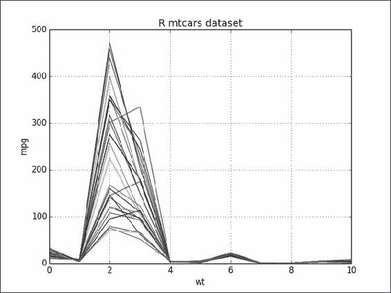
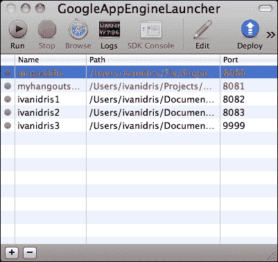

# 四、将 NumPy 与世界的其他地方连接

在本章中，我们将介绍以下秘籍：

*   使用缓冲协议
*   使用数组接口
*   与 MATLAB 和 Octave 交换数据
*   安装 RPy2
*   R 的接口
*   安装 JPype
*   将 NumPy 数组发送到 JPype
*   安装 Google App Engine
*   在 Google Cloud 上部署 NumPy 代码
*   在 PythonAnywhere Web 控制台中运行 NumPy 代码

# 简介

本章是关于互操作性的。 我们必须不断提醒自己，NumPy 在科学（Python）软件生态系统中并不孤单。 与 SciPy 和 matplotlib 一起工作非常容易。 还存在用于与其他 Python 包互操作性的协议。 在 Python 生态系统之外，Java，R，C 和 Fortran 等语言非常流行。 我们将详细介绍与这些环境交换数据的细节。

此外，我们还将讨论如何在云上获取 NumPy 代码。 这是在快速移动的空间中不断发展的技术。 您可以使用许多选项，其中包括 Google App Engine 和 PythonAnywhere。

# 使用缓冲协议

基于 C 的  Python 对象具有所谓的**缓冲区接口**。 Python 对象  可以公开其数据以进行直接访问，而无需复制它们。 缓冲区协议使我们能够与其他 Python 软件进行通信，例如 **Python 图像库**（**PIL**）。

我们将看到一个从 NumPy 数组保存 PIL 图像的示例。

## 准备

如有必要，请安装 PIL 和 SciPy。 有关说明，查阅本秘籍的“另请参阅”部分。

## 操作步骤

该秘籍的完整代码在本书代码捆绑的`buffer.py`文件中：

```py
import numpy as np
import Image #from PIL import Image (Python3)
import scipy.misc

lena = scipy.misc.lena()
data = np.zeros((lena.shape[0], lena.shape[1], 4), dtype=np.int8)
data[:,:,3] = lena.copy()
img = Image.frombuffer("RGBA", lena.shape, data, 'raw', "RGBA", 0, 1)
img.save('lena_frombuffer.png')

data[:,:,3] = 255 
data[:,:,0] = 222 
img.save('lena_modified.png')
```

首先，我们需要一个 NumPy 数组来玩：

1.  在前面的章节中，我们看到了如何加载 Lena 的样例图像。 创建一个填充零的数组，并使用图像数据填充 alpha 通道：

    ```py
    lena = scipy.misc.lena()
    data = np.zeros((lena.shape[0], lena.shape[1], 4), dtype=numpy.int8)
    data[:,:,3] = lena.copy()
    ```

2.  使用 PIL API 将数据另存为 RGBA 图像：

    ```py
    img = Image.frombuffer("RGBA", lena.shape, data, 'raw', "RGBA", 0, 1)
    img.save('lena_frombuffer.png')
    ```

3.  Modify the data array by getting rid of the image data and making the image red. Save the image with the PIL API:

    ```py
    data[:,:,3] = 255 
    data[:,:,0] = 222 
    img.save('lena_modified.png')
    ```

    以下是之前的图片：

    

### 注意

在计算机  图形中，原点的位置与您从高中数学中知道的通常的直角坐标系不同。 原点位于屏幕，画布或图像的左上角，[*y* 轴向下](http://en.wikipedia.org/wiki/2D_computer_graphics#Non-standard_orientation_of_the_coordinate_system)。

PIL 图像对象的数据由于缓冲接口的作用而发生了变化，因此，我们看到以下图像：


## 工作原理

我们从缓冲区（一个 NumPy 数组）创建了一个 PIL 图像。 更改缓冲区后，我们看到更改反映在图像对象中。 我们这样做时没有复制 PIL 图像对象； 相反，我们直接访问并修改了其数据，以使  模型的图片显示红色图像。 通过一些简单的更改，代码就可以与其他基于 PIL 的库一起使用，例如 Pillow。

## 另见

*   第 2 章，“高级索引和数组概念”中的“安装 PIL”
*   第 2 章，“高级索引和数组概念”中的“安装 SciPy”
*   [这个页面](http://docs.python.org/2/c-api/buffer.html)中介绍了 Python 缓冲区协议。

# 使用数组接口

数组  接口是用于与其他 Python 应用通信的另一种机制。 顾名思义，该协议仅适用于类似数组的对象。 进行了示范。 让我们再次使用 PIL，但不保存文件。

## 准备

我们将重用先前秘籍中的部分代码，因此前提条件是相似的。 在这里，我们将跳过上一秘籍的第一步，并假定它已经为人所知。

## 操作步骤

该秘籍的代码在本书代码捆绑的`array_interface.py`文件中：

```py
from __future__ import print_function
import numpy as np
import Image
import scipy.misc

lena = scipy.misc.lena()
data = np.zeros((lena.shape[0], lena.shape[1], 4), dtype=np.int8)
data[:,:,3] = lena.copy()
img = Image.frombuffer("RGBA", lena.shape, data, 'raw', "RGBA", 0, 1)
array_interface = img.__array_interface__
print("Keys", array_interface.keys())
print("Shape", array_interface['shape'])
print("Typestr", array_interface['typestr'])

numpy_array = np.asarray(img)
print("Shape", numpy_array.shape)
print("Data type", numpy_array.dtype)
```

以下步骤将使我们能够探索数组接口：

1.  The PIL Image object has an `__array_interface__` attribute. Let's inspect its content. The value of this attribute is a Python dictionary:

    ```py
    array_interface = img.__array_interface__
    print("Keys", array_interface.keys()) 
    print("Shape", array_interface['shape'])
    print("Typestr", array_interface['typestr'])
    ```

    此代码显示以下信息：

    ```py
    Keys ['shape', 'data', 'typestr']
    Shape (512, 512, 4)
    Typestr |u1

    ```

2.  The `ndarray` NumPy class has an `__array_interface__` attribute as well. We can convert the PIL image into a NumPy array with the `asarray()` function:

    ```py
    numpy_array = np.asarray(img)
    print("Shape", numpy_array.shape)
    print("Data type", numpy_array.dtype)
    ```

    数组的形状和数据类型如下：

    ```py
    Shape (512, 512, 4)
    Data type uint8

    ```

如您所见，形状没有改变。

## 工作原理

数组接口或协议使我们可以在类似数组的 Python 对象之间共享数据。 NumPy 和 PIL 都提供了这样的接口。

## 另见

*   本章中的“使用缓冲协议”
*   数组接口在[这个页面](http://docs.scipy.org/doc/numpy/reference/arrays.interface.html)中进行了详细描述。

# 与 MATLAB 和 Octave 交换数据

MATLAB 及其开放源代码 Octave 是流行的数学应用。 `scipy.io`程序包具有`savemat()`函数，该功能允许您将 NumPy 数组存储为`.mat`文件作为 Python 字典的值。

## 准备

安装  MATLAB 或 Octave 超出了本书的范围。 [Octave 网站](http://www.gnu.org/software/octave/download.html)上有一些安装的指南。 如有必要，检查本秘籍的“另请参阅”部分，来获取安装 SciPy 的说明。

## 操作步骤

该秘籍的完整代码在本书代码捆绑的`octave.py`文件中：

```py
import numpy as np
import scipy.io

a = np.arange(7)

scipy.io.savemat("a.mat", {"array": a})
```

一旦安装了 MATLAB 或 Octave，就需要按照以下步骤存储 NumPy 数组：

1.  创建一个 NumPy 数组，然后调用`savemat()`将其存储在`.mat`文件中。 此函数有两个参数-文件名和包含变量名和值的字典。

    ```py
    a = np.arange(7)
    scipy.io.savemat("a.mat", {"array": a})

    ```

2.  导航到创建文件的目录。 加载文件并检查数组：

    ```py
    octave-3.4.0:2> load a.mat
    octave-3.4.0:3> array
    array =

     0
     1
     2
     3
     4
     5
     6

    ```

## 另见

*   第 2 章，“高级索引和数组概念”中的“安装 SciPy”
*   [`savemat()`函数的 SciPy 文档](http://docs.scipy.org/doc/scipy-0.14.0/reference/generated/scipy.io.savemat.html)

# 安装 RPy2

**R** 是一种流行的  脚本语言，用于统计和数据分析。 **RPy2** 是 R 和 Python 之间的接口。 我们将在此秘籍中安装 RPy2。

## 操作步骤

如果要安装 RPy2，请选择以下选项之一：

*   Installing with `pip` or `easy_install`: RPy2 is available on PYPI, so we can install it with this command:

    ```py
    $ easy_install rpy2

    ```

    另外，我们可以使用以下命令：

    ```py
    $ sudo pip install rpy2
    $ pip freeze|grep rpy2
    rpy2==2.4.2

    ```

*   **从源代码安装**：我们  可以从`tar.gz`源安装 RPy2：

    ```py
    $ tar -xzf <rpy2_package>.tar.gz
    $ cd <rpy2_package>
    $ python setup.py build install

    ```

## 另见

*   [R 编程语言主页](http://www.r-project.org/)
*   [RPy2 项目页面](http://rpy.sourceforge.net/)

# R 的接口

RPy2 只能用作从 Python 调用 R，而不能相反。 我们将导入一些样本 R 数据集并绘制其中之一的数据。

## 准备

如有必要，请安装 RPy2。 请参阅先前的秘籍。

## 操作步骤

该秘籍的完整代码在本书代码捆绑的`rdatasets.py`文件中：

```py
from rpy2.robjects.packages import importr
import numpy as np
import matplotlib.pyplot as plt

datasets = importr('datasets')
mtcars = datasets.__rdata__.fetch('mtcars')['mtcars']

plt.title('R mtcars dataset')
plt.xlabel('wt')
plt.ylabel('mpg')
plt.plot(mtcars)
plt.grid(True)
plt.show()
```

`motorcars`数据集在[这个页面](https://stat.ethz.ch/R-manual/R-devel/library/datasets/html/mtcars.html)中进行了描述。 让我们从加载此样本 R 数据集开始：

1.  使用 RPy2 `importr()`函数将数据集加载到数组中。 此功能可以导入`R`包。 在此示例中，我们将导入数据集 R 包。 从`mtcars`数据集创建一个 NumPy 数组：

    ```py
    datasets = importr('datasets')
    mtcars = np.array(datasets.mtcars)
    ```

2.  Plot the dataset with matplotlib:

    ```py
    plt.plot(mtcars)
    plt.show()
    ```

    数据包含**英里每加仑**（`mpg`）和**重量**（`wt`）值，单位为千分之一磅。 以下屏幕快照显示了数据，它是一个二维数组：

    

## 另见

*   第 1 章“使用 IPython”中的“安装 matplotlib”

# 安装 JPype

**Jython** 是  用于 Python 和 Java 的默认互操作性解决方案。 但是，Jython 在 **Java 虚拟机**（**JVM**）上运行。 因此，它无法访问主要用 C 语言编写的 NumPy 模块。 **JPype** 是一个开放源代码项目，试图解决此问题。 接口发生在 Python 和 JVM 之间的本机级别上。 让我们安装 JPype。

## 操作步骤

1.  从[这里](http://sourceforge.net/projects/jpype/files/)下载 JPype。
2.  打开  的包装，然后运行以下命令：

    ```py
    $ python setup.py install

    ```

# 将 NumPy 数组发送到 JPype

在此  秘籍中，我们将启动 JVM 并向其发送 NumPy 数组。 我们将使用标准 Java 调用打印接收到的数组。 显然，您将需要安装 Java。

## 操作步骤

该秘籍的完整代码在本书代码捆绑的`hellojpype.py`文件中：

```py
import jpype
import numpy as np

#1\. Start the JVM
jpype.startJVM(jpype.getDefaultJVMPath())

#2\. Print hello world
jpype.java.lang.System.out.println("hello world")

#3\. Send a NumPy array
values = np.arange(7)
java_array = jpype.JArray(jpype.JDouble, 1)(values.tolist())

for item in java_array:
   jpype.java.lang.System.out.println(item)

#4\. Shutdown the JVM
jpype.shutdownJVM()
```

首先，我们需要从 JPype 启动 JVM：

1.  从 JPype 启动 JVM； JPype 可以方便地找到默认的 JVM 路径：

    ```py
    jpype.startJVM(jpype.getDefaultJVMPath())
    ```

2.  仅出于传统原因，让我们打印`"hello world"`：

    ```py
    jpype.java.lang.System.out.println("hello world")
    ```

3.  创建一个 NumPy 数组，将其转换为 Python 列表，然后将其传递给 JPype。 现在很容易打印数组元素：

    ```py
    values = np.arange(7)
    java_array = jpype.JArray(jpype.JDouble, 1)(values.tolist())

    for item in java_array:
        jpype.java.lang.System.out.println(item)
    ```

4.  After we are done, let's shut down the JVM:

    ```py
    jpype.shutdownJVM()
    ```

    JPype 中一次只能运行一个  JVM。 如果我们忘记关闭 JVM，则可能导致意外错误。 程序输出如下：

    ```py
    hello world
    0.0
    1.0
    2.0
    3.0
    4.0
    5.0
    6.0
    JVM activity report     :
     classes loaded       : 31
    JVM has been shutdown

    ```

## 工作原理

JPype 允许我们启动和关闭 JVM。 它为标准 Java API 调用提供了包装器。 如本例所示，我们可以传递要由 JArray 包装器转换为 Java 数组的 Python 列表。 JPype 使用 **Java 本机接口**（**JNI**），这是本机 C 代码和 Java 之间的桥梁。 不幸的是，使用 JNI 会损害性能，因此您必须注意这一事实。

## 另见

*   本章中的“安装 JPype”
*   [JPype 主页](http://jpype.sourceforge.net/)

# 安装 Google App Engine

**Google App Engine**（**GAE**）使您可以在 Google Cloud 上构建 Web 应用。 自 2012 年以来，  是 NumPy 的官方支持； 您需要一个 Google 帐户才能使用 GAE。

## 操作步骤

第一步是下载 GAE：

1.  Download GAE for your operating system from [https://developers.google.com/appengine/downloads](https://developers.google.com/appengine/downloads).

    您也可以从此页面下载文档和 GAE Eclipse 插件。 如果使用 Eclipse 开发，则一定要安装它。

2.  The development environment.

    GAE 带有一个模拟生产云的开发环境。 在撰写本书时，GAE 正式仅支持 Python 2.5 和 2.7。 GAE 将尝试在您的系统上找到 Python； 但是，例如，如果您有多个 Python 版本，则可能需要自行设置。 您可以在启动器应用的**首选项**对话框中设置此设置。

    SDK 中有两个重要的脚本：

    *   `dev_appserver.py`：开发服务器
    *   `appcfg.py`：部署在云上

    在 Windows 和 Mac 上，有一个 GAE 启动器应用。 启动器具有**运行**和**部署**按钮，它们执行与上述脚本相同的操作。

    

# 在 Google Cloud 上部署 NumPy 代码

部署  GAE 应用非常容易。 对于  NumPy，需要额外的配置步骤，但这仅需几分钟。

## 操作步骤

让我们创建一个新的应用：

1.  使用启动器创建一个新应用（**文件 | 新应用**）。 命名为`numpycloud`。 这将创建一个包含以下文件的同名文件夹：
    *   `app.yaml`：YAML 应用配置文件
    *   `favicon.ico`：一个图标
    *   `index.yaml`：自动生成的文件
    *   `main.py`：Web 应用的主要入口点
2.  Add NumPy to the libraries.

    首先，我们  需要让 GAE 知道我们要使用 NumPy。 将以下行添加到库部分中的`app.yaml`配置文件中：

    ```py
    - name: NumPy
      version: "1.6.1"
    ```

    这不是最新的 NumPy 版本，但它是 GAE 当前支持的最新版本。 配置文件应具有以下内容：

    ```py
    application: numpycloud
    version: 1
    runtime: python27
    api_version: 1
    threadsafe: yes

    handlers:
    - url: /favicon\.ico
      static_files: favicon.ico
      upload: favicon\.ico

    - url: .*
      script: main.app

    libraries:
    - name: webapp2
      version: "2.5.1"
    - name: numpy
      version: "1.6.1"
    ```

3.  To demonstrate that we can use NumPy code, let's modify the `main.py` file. There is a `MainHandler` class with a handler method for GET requests. Replace this method with the following code:

    ```py
    def get(self):
        self.response.out.write('Hello world!<br/>')
        self.response.out.write('NumPy sum = ' + str(numpy.arange(7).sum()))
    ```

    最后，我们将提供以下代码：

    ```py
    import webapp2
    import numpy

    class MainHandler(webapp2.RequestHandler):
        def get(self):
          self.response.out.write('Hello world!<br/>')
          self.response.out.write('NumPy sum = ' + str(numpy.arange(7).sum()))

    app = webapp2.WSGIApplication([('/', MainHandler)],
                                  debug=True)
    ```

如果您  单击**在 GAE 启动器中浏览**按钮（在 Linux 上，以项目根为参数运行`dev_appserver.py`），则您应该在默认浏览器中看到一个包含以下文字的网页：

```py
Hello world!NumPy sum = 21
```

## 工作原理

GAE 是免费的，具体取决于使用了多少资源。 您最多可以创建 10 个 Web 应用。 GAE 采用沙盒方法，这意味着 NumPy 暂时无法使用，但现在可以使用，如本秘籍所示。

# 在 PythonAnywhere Web 控制台中运行 NumPy 代码

在第 1 章，“使用 IPython”中，我们已经看到了运行 PythonAnywhere 控制台的过程，而没有任何权限。 此秘籍将需要您有一个帐户，但不要担心-它是免费的，如果您不需要太多资源，至少是免费的。

注册是一个非常简单的过程，此处将不涉及。 NumPy 已经与其他 Python 软件一起安装。 有关完整列表，请参见[这里](https://www.pythonanywhere.com/batteries_included/)。

我们将建立一个简单的脚本，该脚本每分钟从 Google 财经获取价格数据，并使用 NumPy 对价格进行简单的统计。

## 操作步骤

当我们  签名后，我们可以登录并查看 **PythonAnywhere** 信息中心。


1.  Write the code. The complete code for this example is as follows:

    ```py
    from __future__ import print_function
    import urllib2
    import re
    import time
    import numpy as np

    prices = np.array([])

    for i in xrange(3):
       req = urllib2.Request('http://finance.google.com/finance/info?client=ig&q=AAPL')
       req.add_header('User-agent', 'Mozilla/5.0')
       response = urllib2.urlopen(req)
       page = response.read()
       m = re.search('l_cur" : "(.*)"', page)
       prices = np.append(prices, float(m.group(1)))
       avg = prices.mean()
       stddev = prices.std()

       devFactor = 1
       bottom = avg - devFactor * stddev
       top = avg + devFactor * stddev
       timestr = time.strftime("%H:%M:%S", time.gmtime())

       print(timestr, "Average", avg, "-Std", bottom, "+Std", top)
       time.sleep(60)
    ```

    除我们在其中生长包含价格的 NumPy 数组并计算价格的均值和标准差的位以外，大多数都是标准 Python。 如果有股票代号，例如`AAPL`，则可以使用 URL 从 Google 财经下载 JSON 格式的价格数据。 该 URL 当然可以更改。

    接下来，我们使用正则表达式解析 JSON 以提取价格。 此价格已添加到 NumPy 数组中。 我们计算价格的均值和标准差。 价格是根据标准差乘以我们指定的某个因素后在时间戳的顶部和底部打印出来的。

2.  Upload the code.

    在本地计算机上完成代码后，我们可以将脚本上传到 PythonAnywhere。 转到仪表板，然后单击**文件**选项卡。 从页面底部的小部件上传脚本。

3.  要运行代码，请单击**控制台**选项卡，然后单击 **Bash** 链接。 PythonAnywhere 应该立即为我们创建一个 bash 控制台。 现在，我们可以在一个标准差范围内运行`AAPL`程序，如以下屏幕截图所示：

## 工作原理

如果您想在远程服务器上运行 NumPy 代码，则 PythonAnywhere 是完美的选择，尤其是当您需要程序在计划的时间执行时。 至少对于免费帐户而言，进行交互式工作并不那么方便，因为每当您在 Web 控制台中输入文本时都会有一定的滞后。

但是，正如我们所看到的，可以在本地创建和测试程序，并将其上传到 PythonAnywhere。 这也会释放本地计算机上的资源。 我们可以做一些花哨的事情，例如根据股价发送电子邮件或安排在交易时间内激活脚本  。 通过  ，使用 Google App Engine 也可以做到这一点，但是它是通过 Google 方式完成的，因此您需要了解其 API。