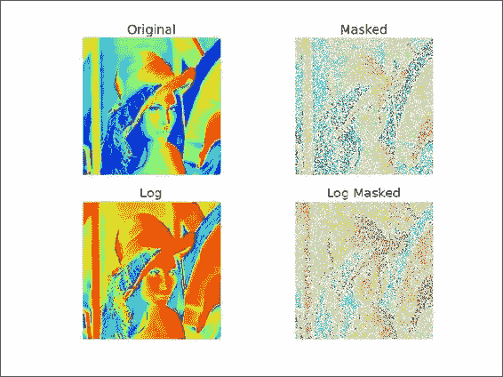
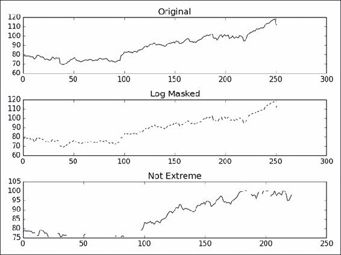

# 六、特殊数组和通用函数

在本章中，我们将介绍以下秘籍：

*   创建通用函数
*   查找勾股三元组
*   用`chararray`执行字符串操作
*   创建一个遮罩数组
*   忽略负值和极值
*   使用`recarray`函数创建一个得分表

# 简介

本章是关于特殊数组和通用函数的。 这些是您每天可能不会遇到的主题，但是它们仍然很重要，因此在此需要提及。**通用函数（Ufuncs）**逐个元素或标量地作用于数组。 Ufuncs 接受一组标量作为输入，并产生一组标量作为输出。 通用函数通常可以映射到它们的数学对等物上，例如加法，减法，除法，乘法等。 这里提到的特殊数组是基本 NumPy 数组对象的所有子类，并提供其他功能。

# 创建通用函数

我们可以使用`frompyfunc()` NumPy 函数从 Python 函数创建通用函数。

## 操作步骤

以下步骤可帮助我们创建通用函数：

1.  定义一个简单的 Python 函数以使输入加倍：

    ```py
    def double(a):
        return 2 * a
    ```

2.  Create the universal function with `frompyfunc()`. Specify the number of input arguments and the number of objects (both are equal to `1`) returned:

    ```py
    from __future__ import print_function
    import numpy as np

    def double(a):
       return 2 * a

    ufunc = np.frompyfunc(double, 1, 1)
    print("Result", ufunc(np.arange(4)))
    ```

    该代码在执行时输出以下输出：

    ```py
    Result [0 2 4 6]

    ```

## 工作原理

我们定义了一个 Python 函数，该函数会将接收到的数字加倍。 实际上，我们也可以将字符串作为输入，因为这在 Python 中是合法的。 我们使用`frompyfunc()` NumPy 函数从此 Python 函数创建了一个通用函数。 通用函数是 NumPy 类，具有特殊功能，例如广播和适用于 NumPy 数组的逐元素处理。 实际上，许多 NumPy 函数都是通用函数，但是都是用 C 编写的。

## 另见

*   [`frompyfunc()` NumPy 函数的文档](http://docs.scipy.org/doc/numpy/reference/generated/numpy.frompyfunc.html)

# 找到勾股三元组

对于本教程，您可能需要阅读[有关**勾股三元组**的维基百科页面](http://en.wikipedia.org/wiki/Pythagorean_triple)。 勾股三元组是一组三个自然数，即`a < b < c`，为此，。

这是勾股三元组的示例：。

勾股三元组与**勾股定理**密切相关，您可能在中学几何学过的。

勾股三元组代表直角三角形的三个边，因此遵循勾股定理。 让我们找到一个分量总数为 1,000 的勾股三元组。 我们将使用欧几里得公式进行此操作：


在此示例中，我们将看到通用函数的运行。

## 操作步骤

欧几里得公式定义了`m`和`n`索引。

1.  创建包含以下索引的数组：

    ```py
    m = np.arange(33)
    n = np.arange(33)
    ```

2.  第二步是使用欧几里得公式计算勾股三元组的数量`a`，`b`和`c`。 使用`outer()`函数获得笛卡尔积，差和和：

    ```py
    a = np.subtract.outer(m ** 2, n ** 2)
    b = 2 * np.multiply.outer(m, n)
    c = np.add.outer(m ** 2, n ** 2)
    ```

3.  现在，我们有许多包含`a`，`b`和`c`值的数组。 但是，我们仍然需要找到符合问题条件的值。 使用`where()` NumPy 函数查找这些值的索引：

    ```py
    idx =  np.where((a + b + c) == 1000)
    ```

4.  使用`numpy.testing`模块检查解决方案：

    ```py
    np.testing.assert_equal(a[idx]**2 + b[idx]**2, c[idx]**2)
    ```

以下代码来自本书代码包中的`triplets.py`文件：

```py
from __future__ import print_function
import numpy as np

#A Pythagorean triplet is a set of three natural numbers, a < b < c, for which,
#a ** 2 + b ** 2 = c ** 2
#
#For example, 3 ** 2 + 4 ** 2 = 9 + 16 = 25 = 5 ** 2.
#
#There exists exactly one Pythagorean triplet for which a + b + c = 1000.
#Find the product abc.

#1\. Create m and n arrays
m = np.arange(33)
n = np.arange(33)

#2\. Calculate a, b and c
a = np.subtract.outer(m ** 2, n ** 2)
b = 2 * np.multiply.outer(m, n)
c = np.add.outer(m ** 2, n ** 2)

#3\. Find the index
idx =  np.where((a + b + c) == 1000)

#4\. Check solution
np.testing.assert_equal(a[idx]**2 + b[idx]**2, c[idx]**2)
print(a[idx], b[idx], c[idx])
      # [375] [200] [425]
```

## 工作原理

通用函数不是实函数，而是表示函数的对象。 实用程序具有`outer()`方法，我们已经在实践中看到它。 NumPy 的许多标准通用函数都是用 C 实现的  ，因此比常规的 Python 代码要快。 Ufuncs 支持逐元素处理和类型转换，这意味着更少的循环。

## 另见

*   [`outer()`通用函数的文档](http://docs.scipy.org/doc/numpy/reference/generated/numpy.ufunc.outer.html)

# 使用`chararray`执行字符串操作

NumPy 具有保存字符串的专用`chararray`对象。 它是`ndarray`的子类，并具有特殊的字符串方法。 我们将从 Python 网站下载文本并使用这些方法。 `chararray`相对于普通字符串数组的优点如下：

*   索引时会自动修剪数组元素的空白
*   字符串末尾的空格也被比较运算符修剪
*   向量化字符串操作可用，因此不需要循环

## 操作步骤

让我们创建字符数组：

1.  创建字符数组作为视图：

    ```py
    carray = np.array(html).view(np.chararray)
    ```

2.  使用`expandtabs()`函数将制表符扩展到空格。 此函数接受制表符大小作为参数。 如果未指定，则值为`8`：

    ```py
    carray = carray.expandtabs(1)
    ```

3.  Split lines with the `splitlines()` function into separate lines:

    ```py
    carray = carray.splitlines()
    ```

    以下是此示例的完整代码：

    ```py
    import urllib2
    import numpy as np
    import re

    response = urllib2.urlopen('http://python.org/')
    html = response.read()
    html = re.sub(r'<.*?>', '', html)
    carray = np.array(html).view(np.chararray)
    carray = carray.expandtabs(1)
    carray = carray.splitlines()
    print(carray)
    ```

## 工作原理

我们看到了专门的`chararray`类在起作用。 它提供了一些矢量化的字符串操作以及有关空格的便捷行为。

## 另见

*   [`chararray`类的文档](http://docs.scipy.org/doc/numpy/reference/generated/numpy.chararray.html)

# 创建遮罩的数组

**遮罩数组**可用于忽略丢失或无效的数据项。 `numpy.ma`模块中的`MaskedArray`类是`ndarray`的子类，带有遮罩。 我们将使用 Lena 图像作为数据源，并假装其中一些数据已损坏。 最后，我们将绘制原始图像，原始图像的对数值，遮罩数组及其对数值。

## 操作步骤

让我们创建被屏蔽的数组：

1.  要创建一个遮罩数组，我们需要指定一个遮罩。 创建一个随机遮罩，其值为`0`或`1`：

    ```py
    random_mask = np.random.randint(0, 2, size=lena.shape)
    ```

2.  Using the mask from the previous step, create a masked array:

    ```py
    masked_array = np.ma.array(lena, mask=random_mask)
    ```

    以下是此遮罩数组教程的完整代码：

    ```py
    from __future__ import print_function
    import numpy as np
    from scipy.misc import lena
    import matplotlib.pyplot as plt

    lena = lena()
    random_mask = np.random.randint(0, 2, size=lena.shape)

    plt.subplot(221)
    plt.title("Original")
    plt.imshow(lena)
    plt.axis('off')

    masked_array = np.ma.array(lena, mask=random_mask)
    print(masked_array)
    plt.subplot(222)
    plt.title("Masked")
    plt.imshow(masked_array)
    plt.axis('off')
    plt.subplot(223)
    plt.title("Log")
    plt.imshow(np.log(lena))
    plt.axis('off')

    plt.subplot(224)
    plt.title("Log Masked")
    plt.imshow(np.log(masked_array))
    plt.axis('off')

    plt.show()
    ```

    这是显示结果图像的屏幕截图：

    

## 工作原理

我们对 NumPy 数组应用了随机的遮罩。 这具有忽略对应于遮罩的数据的效果。 您可以在`numpy.ma` 模块中找到一系列遮罩数组操作  。 在本教程中，我们仅演示了如何创建遮罩数组。

## 另见

*   [`numpy.ma`模块的文档](http://docs.scipy.org/doc/numpy/reference/maskedarray.html)

# 忽略负值和极值

当我们想忽略负值时，例如当取数组值的对数时，屏蔽的数组很有用。 遮罩数组的另一个用例是排除极值。 这基于极限值的上限和下限。

我们将把这些技术应用于股票价格数据。 我们将跳过前面几章已经介绍的下载数据的步骤。

## 操作步骤

我们将使用包含负数的数组的对数：

1.  Create an array containing numbers divisible by three:

    ```py
    triples = np.arange(0, len(close), 3)
    print("Triples", triples[:10], "...")
    ```

    接下来，使用与价格数据数组大小相同的数组创建一个数组：

    ```py
    signs = np.ones(len(close))
    print("Signs", signs[:10], "...")
    ```

    借助您在第 2 章，“高级索引和数组概念”中学习的索引技巧，将每个第三个数字设置为负数。

    ```py
    signs[triples] = -1
    print("Signs", signs[:10], "...")
    ```

    最后，取该数组的对数：

    ```py
    ma_log = np.ma.log(close * signs)
    print("Masked logs", ma_log[:10], "...")
    ```

    这应该为`AAPL`打印以下输出：

    ```py
    Triples [ 0  3  6  9 12 15 18 21 24 27] ...
    Signs [ 1\.  1\.  1\.  1\.  1\.  1\.  1\.  1\.  1\.  1.] ...
    Signs [-1\.  1\.  1\. -1\.  1\.  1\. -1\.  1\.  1\. -1.] ...
    Masked logs [-- 5.93655586575 5.95094223368 -- 5.97468290742 5.97510711452 --
     6.01674381162 5.97889061623 --] ...

    ```

2.  Let's define extreme values as being one standard deviation below the mean, or one standard deviation above the mean (this is just for demonstration purposes). Write the following code to mask extreme values:

    ```py
    dev = close.std()
    avg = close.mean()
    inside = numpy.ma.masked_outside(close, avg - dev, avg + dev)
    print("Inside", inside[:10], "...")
    ```

    此代码显示前十个元素：

    ```py
    Inside [-- -- -- -- -- -- 409.429675172 410.240597855 -- --] ...

    ```

    绘制原始价格数据，绘制对数后的数据，再次绘制指数，最后绘制基于标准差的遮罩后的数据。 以下屏幕截图显示了结果（此运行）：

    

    本教程的完整程序如下：

    ```py
    from __future__ import print_function
    import numpy as np
    from matplotlib.finance import quotes_historical_yahoo
    from datetime import date
    import matplotlib.pyplot as plt
    def get_close(ticker):
       today = date.today()
       start = (today.year - 1, today.month, today.day)

       quotes = quotes_historical_yahoo(ticker, start, today)

       return np.array([q[4] for q in quotes])

    close = get_close('AAPL')

    triples = np.arange(0, len(close), 3)
    print("Triples", triples[:10], "...")

    signs = np.ones(len(close))
    print("Signs", signs[:10], "...")

    signs[triples] = -1
    print("Signs", signs[:10], "...")

    ma_log = np.ma.log(close * signs)
    print("Masked logs", ma_log[:10], "...")

    dev = close.std()
    avg = close.mean()
    inside = np.ma.masked_outside(close, avg - dev, avg + dev)
    print("Inside", inside[:10], "...")

    plt.subplot(311)
    plt.title("Original")
    plt.plot(close)

    plt.subplot(312)
    plt.title("Log Masked")
    plt.plot(np.exp(ma_log))

    plt.subplot(313)
    plt.title("Not Extreme")
    plt.plot(inside)

    plt.tight_layout()
    plt.show()
    ```

## 工作原理

`numpy.ma`模块中的功能掩盖了数组元素，我们认为这些元素是非法的。 例如，`log()`和`sqrt()`函数不允许使用负值。 屏蔽值类似于数据库和编程中的`NULL`或`None`值。 具有屏蔽值的所有操作都将导致屏蔽值。

## 另见

*   [`numpy.ma`模块的文档](http://docs.scipy.org/doc/numpy/reference/maskedarray.html)

# 使用`recarray`函数创建得分表

`recarray`类是`ndarray`的子类。 这些数组可以像数据库中一样保存记录，具有不同的数据类型。 例如，我们可以存储有关员工的记录，其中包含诸如薪水之类的数字数据和诸如员工姓名之类的字符串。

现代经济理论告诉我们，投资归结为优化风险和回报。 [风险是由对数回报的**标准差**表示的](http://en.wikipedia.org/wiki/Rate_of_return#Arithmetic_and_logarithmic_return)。 另一方面，奖励由对数回报的平均值表示。 我们可以拿出相对分数，高分意味着低风险和高回报。 这只是理论上的，未经测试，所以不要太在意。 我们将计算几只股票的得分，并将它们与股票代号一起使用 NumPy `recarray()`函数中的表格格式存储。

## 操作步骤

让我们从创建记录数组开始：

1.  为每个记录创建一个包含符号，标准差得分，平均得分和总得分的记录数组：

    ```py
    weights = np.recarray((len(tickers),), dtype=[('symbol', np.str_, 16), 
        ('stdscore', float), ('mean', float), ('score', float)])
    ```

2.  To keep things simple, initialize the scores in a loop based on the log returns:

    ```py
    for i, ticker in enumerate(tickers):
       close = get_close(ticker)
       logrets = np.diff(np.log(close))
       weights[i]['symbol'] = ticker
       weights[i]['mean'] = logrets.mean()
       weights[i]['stdscore'] = 1/logrets.std()
       weights[i]['score'] = 0
    ```

    如您所见，我们可以使用在上一步中定义的字段名称来访问元素。

3.  现在，我们有一些数字，但是它们很难相互比较。 归一化分数，以便我们以后可以将它们合并。 在这里，归一化意味着确保分数加起来为：

    ```py
    for key in ['mean', 'stdscore']:
        wsum = weights[key].sum()
        weights[key] = weights[key]/wsum
    ```

4.  The overall score will just be the average of the intermediate scores. Sort the records on the overall score to produce a ranking:

    ```py
    weights['score'] = (weights['stdscore'] + weights['mean'])/2
    weights['score'].sort()
    ```

    The following is the complete code for this example:

    ```py
    from __future__ import print_function
    import numpy as np
    from matplotlib.finance import quotes_historical_yahoo
    from datetime import date

    tickers = ['MRK', 'T', 'VZ']

    def get_close(ticker):
       today = date.today()
       start = (today.year - 1, today.month, today.day)

       quotes = quotes_historical_yahoo(ticker, start, today)

       return np.array([q[4] for q in quotes])

    weights = np.recarray((len(tickers),), dtype=[('symbol', np.str_, 16), 
       ('stdscore', float), ('mean', float), ('score', float)])

    for i, ticker in enumerate(tickers):
       close = get_close(ticker)
       logrets = np.diff(np.log(close))
       weights[i]['symbol'] = ticker
       weights[i]['mean'] = logrets.mean()
       weights[i]['stdscore'] = 1/logrets.std()
       weights[i]['score'] = 0

    for key in ['mean', 'stdscore']:
       wsum = weights[key].sum()
       weights[key] = weights[key]/wsum

    weights['score'] = (weights['stdscore'] + weights['mean'])/2
    weights['score'].sort()

    for record in weights:
       print("%s,mean=%.4f,stdscore=%.4f,score=%.4f" % (record['symbol'], record['mean'], record['stdscore'], record['score']))
    ```

    该程序产生以下输出：

    ```py
    MRK,mean=0.8185,stdscore=0.2938,score=0.2177
    T,mean=0.0927,stdscore=0.3427,score=0.2262
    VZ,mean=0.0888,stdscore=0.3636,score=0.5561

    ```

分数已归一化，因此值介于`0`和`1`之间，我们尝试从秘籍开始使用定义获得最佳收益和风险组合 。 根据输出，`VZ`得分最高，因此是最好的投资。 当然，这只是一个 NumPy 演示，数据很少，所以不要认为这是推荐。

## 工作原理

我们计算了几只股票的得分，并将它们存储在`recarray` NumPy 对象中。 这个数组使我们能够混合不同数据类型的数据，在这种情况下，是股票代码和数字得分。 记录数组使我们可以将字段作为数组成员访问，例如`arr.field`。 本教程介绍了记录数组的创建。 您可以在`numpy.recarray`模块中找到更多与记录数组相关的功能。

## 另见

*   [`numpy.recarray`模块的文档](http://docs.scipy.org/doc/numpy/reference/generated/numpy.recarray.html)