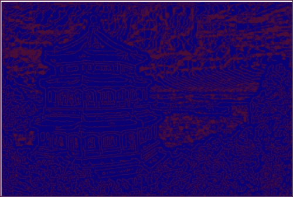
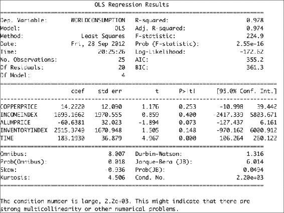
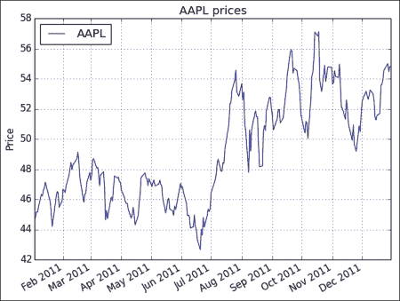
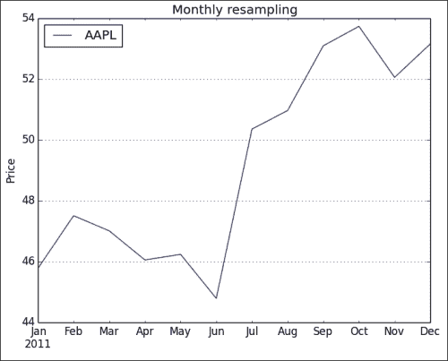

# 第 10 章。有 Scikits 的乐趣

在本章中，我们将介绍以下秘籍：

*   安装 scikit-learn
*   加载示例数据集
*   用 scikit-learn 对道琼斯股票进行聚类
*   安装状态模型
*   使用 statsmodels 执行正常性测试
*   安装 scikit 映像
*   检测角落
*   检测边缘
*   安装熊猫
*   估计股票收益与熊猫的相关性
*   从 statsmodels 中将数据作为 pandas 对象加载
*   重采样时间序列数据

# 简介

**Scikits** 是小型的独立项目，以某种方式与 SciPy 相关，但不属于 SciPy。 这些  项目不是完全独立的，而是作为一个联合体在伞下运行的。 在本章中，我们将讨论几个 Scikits 项目，例如：

*   scikit-learn，机器学习包
*   统计数据包`statsmodels`
*   scikit-image，图像处理包
*   熊猫，数据分析包

# 安装 scikit-learn

scikit-learn 项目旨在提供一种用于机器学习的 API。 我最喜欢的是令人惊叹的文档。 我们可以使用操作系统的软件包管理器安装 scikit-learn。 根据操作系统的不同，此选项可能可用也可能不可用，但它应该是最方便的方法。

Windows 用户只需从项目网站下载安装程序即可。 在 Debian 和 Ubuntu 上，该项目称为 python-sklearn。 在 MacPorts 上，这些端口称为 py26-scikits-learn 和 py27-scikits-learn。 我们也可以从源代码或使用`easy_install`安装。 Python（x，y），Enthought 和 NetBSD 提供了第三方发行版。

## 准备

您需要安装 SciPy 和 NumPy。 返回第 1 章，*和 IPython* 一起缠绕，以获取必要的说明。

## 如何执行...

现在让我们看一下如何安装 scikit-learn 项目：

*   **Installing with** `easy_install`: Type any one of the following commands at the command line:

    ```py
    $ pip install -U scikit-learn
    $ easy_install -U scikit-learn

    ```

    由于权限问题，此  可能无法工作，因此您可能需要在命令前面编写`sudo`，或以管理员身份登录。

*   **从源代码安装**：从[下载](http://pypi.python.org/pypi/scikit-learn/)  源代码 http://pypi.python.org/pypi/scikit-learn/ ，解压缩 和`cd`进入下载的文件夹。 然后发出以下  命令：

    ```py
    $ python setup.py install

    ```

# 加载示例数据集

scikit-learn 项目附带了许多我们可以尝试的数据集和样本图像。 在本秘籍中，我们将加载 scikit-learn 分发中包含的示例数据集。 数据集将数据保存为 NumPy 二维数组，并将元数据链接到该数据。

## 如何执行...

我们将加载波士顿房价样本数据集。 这是一个很小的数据集，因此，如果您要在  波士顿寻找房子，请不要太兴奋！ 其他数据集在[这个页面](http://scikit-learn.org/dev/modules/classes.html#module-sklearn.datasets)中进行了描述。

我们将查看原始数据的形状及其最大值和最小值。 形状是一个元组，表示 NumPy 数组的大小。 我们将对目标数组执行相同的操作，其中  包含作为学习目标（确定房价）的值。 以下`sample_data.py` 中的代码实现了我们的目标：

```py
from __future__ import print_function
from sklearn import datasets

boston_prices = datasets.load_boston()
print("Data shape", boston_prices.data.shape)
print("Data max=%s min=%s" % (boston_prices.data.max(), boston_prices.data.min()))
print("Target shape", boston_prices.target.shape)
print("Target max=%s min=%s" % (boston_prices.target.max(), boston_prices.target.min()))
```

我们计划的结果如下：

```py
Data shape (506, 13)
Data max=711.0 min=0.0
Target shape (506,)
Target max=50.0 min=5.0

```

# 利用 scikits-learn 对道琼斯股票进行聚类

**聚类**是一种  机器学习算法，旨在基于相似度对项目进行分组。 在此示例中，我们将使用**道琼斯工业平均指数**（**DJI** 或 **DJIA**）  索引进行聚类。 本秘籍的大多数步骤已通过前面各章的审查。

## 如何执行...

首先，我们将从 Yahoo!下载这些股票的 EOD 价格数据。 金融。 然后，我们将计算平方亲和矩阵。 最后，我们将股票与`AffinityPropagation`类聚类：

1.  使用 DJI Index 的股票代码下载 2011 年价格数据。 在此示例中，我们仅对收盘价感兴趣：

    ```py
    # 2011 to 2012
    start = datetime.datetime(2011, 01, 01)
    end = datetime.datetime(2012, 01, 01)

    #Dow Jones symbols
    symbols = ["AA", "AXP", "BA", "BAC", "CAT",
       "CSCO", "CVX", "DD", "DIS", "GE", "HD",
       "HPQ", "IBM", "INTC", "JNJ", "JPM", 
       "KO", "MCD", "MMM", "MRK", "MSFT", "PFE",
       "PG", "T", "TRV", "UTX", "VZ", "WMT", "XOM"]

    quotes = []

    for symbol in symbols:
        try:
            quotes.append(finance.quotes_historical_yahoo(symbol, start, end, asobject=True))
        except urllib2.HTTPError as e:
            print(symbol, e)

    close = np.array([q.close for q in quotes]).astype(np.float)
    print(close.shape)
    ```

2.  使用对数收益率作为指标来计算不同股票之间的相似度。 我们正在  要做的是计算数据点的欧几里德  距离：

    ```py
    logreturns = np.diff(np.log(close))
    print(logreturns.shape)

    logreturns_norms = np.sum(logreturns ** 2, axis=1)
    S = - logreturns_norms[:, np.newaxis] - logreturns_norms[np.newaxis, :] + 2 * np.dot(logreturns, logreturns.T)
    ```

3.  Give the `AffinityPropagation` class the result from the previous step. This class labels the data points, or in our case, stocks with the appropriate cluster number:

    ```py
    aff_pro = sklearn.cluster.AffinityPropagation().fit(S)
    labels = aff_pro.labels_

    for symbol, label in zip(symbols, labels):
        print('%s in Cluster %d' % (symbol, label)) 
    ```

    完整的群集程序如下：

    ```py
    from __future__ import print_function
    import datetime
    import numpy as np
    import sklearn.cluster
    from matplotlib import finance
    import urllib2

    #1\. Download price data

    # 2011 to 2012
    start = datetime.datetime(2011, 01, 01)
    end = datetime.datetime(2012, 01, 01)

    #Dow Jones symbols
    symbols = ["AA", "AXP", "BA", "BAC", "CAT",
       "CSCO", "CVX", "DD", "DIS", "GE", "HD",
       "HPQ", "IBM", "INTC", "JNJ", "JPM", 
       "KO", "MCD", "MMM", "MRK", "MSFT", "PFE",
       "PG", "T", "TRV", "UTX", "VZ", "WMT", "XOM"]

    quotes = []

    for symbol in symbols:
        try:
            quotes.append(finance.quotes_historical_yahoo(symbol, start, end, asobject=True))
        except urllib2.HTTPError as e:
            print(symbol, e)

    close = np.array([q.close for q in quotes]).astype(np.float)
    print(close.shape)

    #2\. Calculate affinity matrix
    logreturns = np.diff(np.log(close))
    print(logreturns.shape)

    logreturns_norms = np.sum(logreturns ** 2, axis=1)
    S = - logreturns_norms[:, np.newaxis] - logreturns_norms[np.newaxis, :] + 2 * np.dot(logreturns, logreturns.T)

    #3\. Cluster using affinity propagation
    aff_pro = sklearn.cluster.AffinityPropagation().fit(S)
    labels = aff_pro.labels_

    for symbol, label in zip(symbols, labels):
        print('%s in Cluster %d' % (symbol, label))
    ```

    具有每个库存  的簇号的输出  如下：

    ```py
    (29, 252)
    (29, 251)
    AA in Cluster 0
    AXP in Cluster 6
    BA in Cluster 6
    BAC in Cluster 1
    CAT in Cluster 6
    CSCO in Cluster 2
    CVX in Cluster 7
    DD in Cluster 6
    DIS in Cluster 6
    GE in Cluster 6
    HD in Cluster 5
    HPQ in Cluster 3
    IBM in Cluster 5
    INTC in Cluster 6
    JNJ in Cluster 5
    JPM in Cluster 4
    KO in Cluster 5
    MCD in Cluster 5
    MMM in Cluster 6
    MRK in Cluster 5
    MSFT in Cluster 5
    PFE in Cluster 7
    PG in Cluster 5
    T in Cluster 5
    TRV in Cluster 5
    UTX in Cluster 6
    VZ in Cluster 5
    WMT in Cluster 5
    XOM in Cluster 7

    ```

## 工作原理...

下表是在  秘籍中使用的功能的  概述：

<colgroup class="calibre33"><col class="calibre34"> <col class="calibre34"></colgroup> 
| 

功能

 | 

描述

 |
| --- | --- |
| `sklearn.cluster.AffinityPropagation()` | 创建一个`AffinityPropagation`对象。 |
| `sklearn.cluster.AffinityPropagation.fit()` | 从欧几里得距离计算亲和度矩阵，并应用亲和度传播聚类。 |
| `diff()` | 计算 NumPy 数组中数字的差。 如果未指定，则计算一阶差。 |
| `log()` | 计算 NumPy 数组中元素的自然对数。 |
| `sum()` | 对 NumPy 数组的元素求和。 |
| `dot()` | 这对二维数组执行矩阵乘法。 它还计算一维数组的内积。 |

## 另请参见

*   相关文档  位于[，http：//scikit-learn.org/stable/modules/generation/sklearn.cluster.AffinityPropagation.html](http://scikit-learn.org/stable/modules/generated/sklearn.cluster.AffinityPropagation.html)

# 安装状态模型

`statsmodels` 软件包专注于统计建模。 我们可以将其与 NumPy 和 pandas 集成（在本章稍后的内容中将有更多关于 pandas 的信息）。

## 如何执行...

可以从[这里](http://statsmodels.sourceforge.net/install.html)下载源码和二进制文件。 如果要从源代码安装，请运行以下命令：

```py
$ python setup.py install

```

如果使用`setuptools`，则命令如下：

```py
$ easy_install statsmodels

```

# 使用 statsmodels 执行正常性测试

`statsmodels`程序包具有许多统计测试。 我们将看到这样一个测试的示例 -- **Anderson-Darling 测试**用于[正常性](http://en.wikipedia.org/wiki/Anderson%E2%80%93Darling_test)。

## 如何执行...

我们将像以前的秘籍一样  下载价格数据，但这一次是单只股票。 再次，我们将计算该股票收盘价的对数收益，并将其用作正态性检验函数的输入。

此函数返回一个包含第二个元素的元组，即 **p 值**，介于 0 和 1 之间。本教程的完整代码如下：

```py
from __future__ import print_function
import datetime
import numpy as np
from matplotlib import finance
from statsmodels.stats.adnorm import normal_ad

#1\. Download price data

# 2011 to 2012
start = datetime.datetime(2011, 01, 01)
end = datetime.datetime(2012, 01, 01)

quotes = finance.quotes_historical_yahoo('AAPL', start, end, asobject=True)

close = np.array(quotes.close).astype(np.float)
print(close.shape)

print(normal_ad(np.diff(np.log(close))))

#Retrieving data for AAPL
#(252,)
#(0.57103805516803163, 0.13725944999430437)
```

下面显示了`0.13`为`p-value`的脚本的输出：

```py
Retrieving data for AAPL
(252,)
(0.57103805516803163, 0.13725944999430437)

```

## 工作原理...

如`statsmodels`中所示，此秘籍证明了安德森-达林（Anderson-Darling）统计检验的正态性。 我们使用没有正态分布的股票价格数据作为输入。 对于  数据，我们获得了`0.13`的 p 值。 由于  的概率在 0 到 1 之间，这证实了我们的假设。

# 安装 scikit-image

**scikit 图像**是用于需要 PIL，SciPy，Cython 和 NumPy 的图像处理的  工具包。 Windows 安装程序也可用。 该工具包是 Enthought Python 发行版以及 Python（ *x* ，*和* ）发行版的一部分。

## 如何执行...

与往常一样，使用以下两个命令之一安装 scikit-image：

```py
$ pip install -U scikit-image
$ easy_install -U scikit-image

```

同样，您可能需要以超级用户身份运行这些命令。

另一种选择是通过克隆 Git 存储库或从 Github 下载该存储库作为源归档来获取最新的开发版本。 然后运行以下命令：

```py
$ python setup.py install

```

# 检测角

[**角点检测**](http://en.wikipedia.org/wiki/Corner_detection)是计算机视觉中的标准  技术。 scikit-image 提供了**哈里斯角点检测器**，它很棒，因为角检测非常复杂。 显然，我们可以从头开始做，但是这违反了不重新发明轮子的基本原则。

## 准备

您可能需要在系统上安装`jpeglib`，才能加载 scikit-learn 图像（是 JPEG 文件）。 如果您使用的是 Windows，请使用安装程序。 否则，下载发行版，解压缩它，并使用以下命令从顶部文件夹中进行构建：

```py
$ ./configure
$  make
$  sudo make install

```

## 如何执行...

我们将从 scikit-learn 加载示例图像。 对于此示例，这不是绝对必要的； 您可以改用其他任何图像：

1.  scikit-learn 当前在数据集结构中有两个样本 JPEG 图像。 只看第一张图片：

    ```py
    dataset = load_sample_images()
    img = dataset.images[0]
    ```

2.  自本书第一版以来，API 发生了变化。 例如，对于 scikit-image 0.11.2，我们需要首先将彩色图像的值转换为灰度值。 图像灰度如下：

    ```py
    gray_img = rgb2gray(img)
    ```

3.  Call the `corner_harris()` function to get the coordinates of the corners:

    ```py
    harris_coords = corner_peaks(corner_harris(gray_img))
    y, x = np.transpose(harris_coords)
    ```

    拐角检测的代码如下：

    ```py
    from sklearn.datasets import load_sample_images
    import matplotlib.pyplot as plt
    import numpy as np
    from skimage.feature import corner_harris
    from skimage.feature import corner_peaks
    from skimage.color import rgb2gray

    dataset = load_sample_images()
    img = dataset.images[0]
    gray_img = rgb2gray(img)
    harris_coords = corner_peaks(corner_harris(gray_img))
    y, x = np.transpose(harris_coords)
    plt.axis('off')
    plt.imshow(img)
    plt.plot(x, y, 'ro')
    plt.show()
    ```

    我们得到一个带有点的图像，脚本在其中检测角点，如以下屏幕截图所示：

    

## 工作原理...

我们对 scikit-image 的样本图像应用了 Harris 角点检测。 如您所见，结果非常好。 我们只能使用 NumPy 做到这一点，因为它只是一个简单的线性代数类型的计算。 仍然，可能会变得凌乱。 scikit-image 工具包  具有更多类似的功能，因此，如果需要图像处理例程，请查看 scikit-image 文档。 另外请记住，API 可能会发生快速变化。

## 另请参见

*   [相关的 scikit-image 文档](http://scikit-image.org/docs/dev/auto_examples/plot_corner.html)

# 检测边缘

[**边缘检测**是另一种流行的图像处理技术](http://en.wikipedia.org/wiki/Edge_detection)。 scikit-image 具有基于高斯分布的标准差的 **Canny 过滤器**实施  ，可以开箱即用地执行边缘检测。 除了将图像数据作为 2D 数组外，此过滤器还接受以下参数：

*   高斯分布的标准差
*   下限阈值
*   上限阈值

## 如何执行...

我们将使用与先前秘籍相同的  图像。 代码几乎相同（请参见`edge_detection.py`）。 请特别注意我们称为 Canny 筛选器函数的行：

```py
from sklearn.datasets import load_sample_images
import matplotlib.pyplot as plt
import skimage.feature

dataset = load_sample_images()
img = dataset.images[0] 
edges = skimage.feature.canny(img[..., 0])
plt.axis('off')
plt.imshow(edges)
plt.show()
```

该代码生成原始图像中边缘的图像，如以下屏幕截图所示：



## 另请参见

*   [相关文档](http://scikit-image.org/docs/dev/auto_examples/plot_canny.html)

# 安装熊猫

**Pandas** 是用于数据分析的  Python 库。 它与 R 编程语言有一些相似之处，并非偶然。 R 是一种受数据科学家欢迎的专业编程语言。 例如，R 启发了熊猫的核心`DataFrame`对象。

## 如何执行...

在 PyPi 上，该项目称为`pandas`。 因此，您可以运行以下命令之一：

```py
$ sudo easy_install -U pandas
$ pip install pandas

```

如果使用 Linux 软件包管理器，则需要安装`python-pandas`项目。 在 Ubuntu 上，执行以下操作：

```py
$ sudo apt-get install python-pandas

```

您也可以从源代码安装（除非下载源代码存档，否则需要 Git）：

```py
**$ git clone git://github.com/pydata/pandas.git** 
**$ cd pandas** 
$ python setup.py install

```

## 另请参见

*   [相关文档](http://pandas.pydata.org/pandas-docs/stable/install.html)

# 估计股票收益与熊猫的相关性

大熊猫  `DataFrame`是矩阵  和类似字典的数据结构，类似于 R 中提供的功能。实际上，它是熊猫的中心数据结构，您可以应用 各种操作就可以了。 例如，查看投资组合的相关矩阵是很常见的，所以让我们开始吧。

## 如何执行...

首先，我们将为每个符号的每日对数回报创建带有熊猫的`DataFrame`。 然后，我们将在约会中加入这些。 最后，将打印相关性，并显示一个图：

1.  To create the data frame, create a dictionary containing stock symbols as keys and the corresponding log returns as values. The data frame itself has the date as the index and the stock symbols as column labels:

    ```py
    data = {}

    for i, symbol in enumerate(symbols):
       data[symbol] = np.diff(np.log(close[i]))

    # Convention: import pandas as pd
    df = pd.DataFrame(data, index=dates[0][:-1], columns=symbols)
    ```

    现在，我们可以执行诸如计算相关矩阵或在数据帧上绘制等操作：

    ```py
    print(df.corr())
    df.plot()
    ```

    完整的源代码（也可以下载价格数据）如下：

    ```py
    from __future__ import print_function
    import pandas as pd
    import matplotlib.pyplot as plt
    from datetime import datetime
    from matplotlib import finance
    import numpy as np

    # 2011 to 2012
    start = datetime(2011, 01, 01)
    end = datetime(2012, 01, 01)

    symbols = ["AA", "AXP", "BA", "BAC", "CAT"]

    quotes = [finance.quotes_historical_yahoo(symbol, start, end, asobject=True)
              for symbol in symbols]

    close = np.array([q.close for q in quotes]).astype(np.float)
    dates = np.array([q.date for q in quotes])

    data = {}

    for i, symbol in enumerate(symbols):
       data[symbol] = np.diff(np.log(close[i]))

    df = pd.DataFrame(data, index=dates[0][:-1], columns=symbols)

    print(df.corr())
    df.plot()
    plt.legend(symbols)
    plt.show()

    #           AA       AXP        BA       BAC       CAT
    #AA   1.000000  0.768484  0.758264  0.737625  0.837643
    #AXP  0.768484  1.000000  0.746898  0.760043  0.736337
    #BA   0.758264  0.746898  1.000000  0.657075  0.770696
    #BAC  0.737625  0.760043  0.657075  1.000000  0.657113
    #CAT  0.837643  0.736337  0.770696  0.657113  1.000000
    ```

    这是相关矩阵的输出：

    ```py
     AA       AXP        BA       BAC       CAT
    AA   1.000000  0.768484  0.758264  0.737625  0.837643
    AXP  0.768484  1.000000  0.746898  0.760043  0.736337
    BA   0.758264  0.746898  1.000000  0.657075  0.770696
    BAC  0.737625  0.760043  0.657075  1.000000  0.657113
    CAT  0.837643  0.736337  0.770696  0.657113  1.000000

    ```

    图像后的  显示了五只股票的对数收益图：

    

## 工作原理...

我们使用了以下`DataFrame`方法：

<colgroup class="calibre33"><col class="calibre34"> <col class="calibre34"></colgroup> 
| 

方法

 | 

Description

 |
| --- | --- |
| `pandas.DataFrame()` | 此函数使用指定的数据，索引（行）和列标签构造`DataFrame`。 |
| `pandas.DataFrame.corr()` | 该函数计算列的成对相关，而忽略缺失值。 默认情况下，使用 Pearson 相关。 |
| `pandas.DataFrame.plot()` | 此功能使用`matplotlib`绘制数据帧。 |

## 另请参见

*   [相关文档](http://pandas.pydata.org/pandas-docs/dev/generated/pandas.DataFrame.html)
*   *第 4 章*， *大熊猫入门书*，摘自 Ivan Idris 的  书 *Python 数据* *分析*， *Packt Publishing*

# 从 statsmodels 中将数据作为 pandas 对象加载

statsmodels 在其发行版中有很多样本数据集。 完整列表可以在[这个页面](https://github.com/statsmodels/statsmodels/tree/master/statsmodels/datasets)中找到。

在本教程中，我们将专注于铜数据集，其中包含有关铜价，世界消费量和其他参数的信息。

## 准备

在开始之前，我们可能需要安装 **patsy** 。 patsy 是描述统计模型的库。 很容易看出这个库是否是必需的。 只需运行代码。 如果您收到与 patsy 相关的错误，请执行以下任一命令：

```py
$ sudo easy_install patsy
$ pip install --upgrade patsy

```

## 如何执行...

在本节中，我们将从 statsmodels 中加载数据集作为熊猫`DataFrame`或`Series`对象。

1.  The function we need to call is `load_pandas()`. Load the data as follows:

    ```py
    data = statsmodels.api.datasets.copper.load_pandas()
    ```

    这会将数据加载到包含熊猫对象的`DataSet`对象中。

2.  The `Dataset` object has an attribute called `exog`, which when loaded as a `pandas` object, becomes a `DataFrame` object with multiple columns. It also has an `endog` attribute containing values for the world consumption of copper in our case.

    通过创建`OLS`对象并调用其`fit()`方法来执行普通的最小二乘计算，如下所示：

    ```py
    x, y = data.exog, data.endog

    fit = statsmodels.api.OLS(y, x).fit()
    print("Fit params", fit.params)
    ```

    这应该打印拟合过程的结果：

    ```py
    Fit params COPPERPRICE         14.222028
    INCOMEINDEX       1693.166242
    ALUMPRICE          -60.638117
    INVENTORYINDEX    2515.374903
    TIME               183.193035

    ```

3.  The results of the OLS fit can be summarized by the `summary()` method, as follows:

    ```py
    print(fit.summary())
    ```

    这将为我们提供以下回归结果输出：

    

    加载铜数据集所需的  代码  如下：

    ```py
    from __future__ import print_function
    import statsmodels.api

    # See https://github.com/statsmodels/statsmodels/tree/master/statsmodels/datasets
    data = statsmodels.api.datasets.copper.load_pandas()

    x, y = data.exog, data.endog

    fit = statsmodels.api.OLS(y, x).fit()
    print("Fit params", fit.params)
    print()
    print("Summary")
    print()
    print(fit.summary())
    ```

## 工作原理...

统计模型  的  `Dataset`类中的数据遵循特殊格式。 其中，此类具有`endog`和`exog`属性。 Statsmodels 具有`load()`函数，该函数将数据作为 NumPy 数组加载。 相反，我们使用了`load_pandas()`方法，该方法将数据加载为`pandas`对象。 我们进行了 OLS 拟合，基本上为我们提供了铜价和消费量的统计模型。

## 另请参见

*   [相关文档](http://statsmodels.sourceforge.net/stable/datasets/index.html)

# 重采样时间序列数据

在此  教程中，您将学习如何使用熊猫对时间序列进行重新采样。

## 如何执行...

我们将下载 AAPL 的每日价格时间序列数据，然后通过计算平均值将其重新采样为每月数据。 我们将通过创建熊猫`DataFrame`并调用其`resample()` 方法来做到这一点：

1.  在创建大熊猫`DataFrame`之前，我们需要创建一个`DatetimeIndex`对象传递给`DataFrame`构造函数。 根据下载的报价数据创建索引，如下所示：

    ```py
    dt_idx = pandas.DatetimeIndex(quotes.date)
    ```

2.  获得日期时间索引后，我们将其与收盘价一起使用以创建数据框：

    ```py
    df = pandas.DataFrame (quotes.close, index=dt_idx, columns=[symbol])
    ```

3.  Resample the time series to monthly frequency by computing the mean:

    ```py
    resampled = df.resample('M', how=numpy.mean)
    print(resampled)
    ```

    如下行所示，重新采样的时间序列每个月都有一个值：

    ```py
     AAPL
    2011-01-31  336.932500
    2011-02-28  349.680526
    2011-03-31  346.005652
    2011-04-30  338.960000
    2011-05-31  340.324286
    2011-06-30  329.664545
    2011-07-31  370.647000
    2011-08-31  375.151304
    2011-09-30  390.816190
    2011-10-31  395.532381
    2011-11-30  383.170476
    2011-12-31  391.251429

    ```

4.  Use the `DataFrame plot()` method to plot the data:

    ```py
    df.plot()
    resampled.plot()
    plt.show()
    ```

    原始时间序列的图如下：

    

    重采样的数据具有较少的数据点，因此，生成的图更加混乱，如以下屏幕截图所示：

    

    完整的重采样代码如下：

    ```py
    from __future__ import print_function
    import pandas
    import matplotlib.pyplot as plt
    from datetime import datetime
    from matplotlib import finance
    import numpy as np

    # Download AAPL data for 2011 to 2012
    start = datetime(2011, 01, 01)
    end = datetime(2012, 01, 01)

    symbol = "AAPL"
    quotes = finance.quotes_historical_yahoo(symbol, start, end, asobject=True)

    # Create date time index
    dt_idx = pandas.DatetimeIndex(quotes.date)

    #Create data frame
    df = pandas.DataFrame(quotes.close, index=dt_idx, columns=[symbol])

    # Resample with monthly frequency
    resampled = df.resample('M', how=np.mean)
    print(resampled) 

    # Plot
    df.plot()
    plt.title('AAPL prices')
    plt.ylabel('Price')

    resampled.plot()
    plt.title('Monthly resampling')
    plt.ylabel('Price')
    plt.grid(True)
    plt.show()
    ```

## 工作原理...

我们根据日期和时间列表创建了日期时间索引。 然后，该索引用于创建熊猫`DataFrame`。 然后，我们对时间序列数据进行了重新采样。 单个字符给出重采样  频率，如下所示：

*   每天`D`
*   每月`M`
*   每年`A`

`resample()`方法的`how`参数指示如何采样数据。 默认为计算平均值。

## 另请参见

*   相关  大熊猫文档位于[，http：//pandas.pydata.org/pandas-docs/dev/genic/pandas.DataFrame.resample.html](http://pandas.pydata.org/pandas-docs/dev/generated/pandas.DataFrame.resample.html)