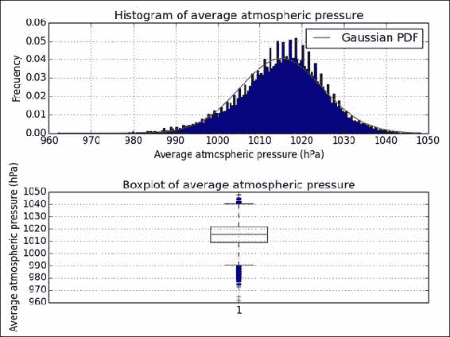
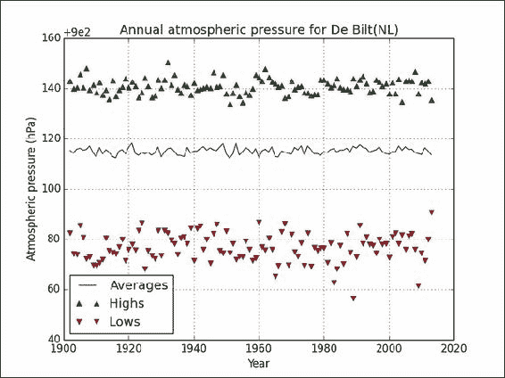
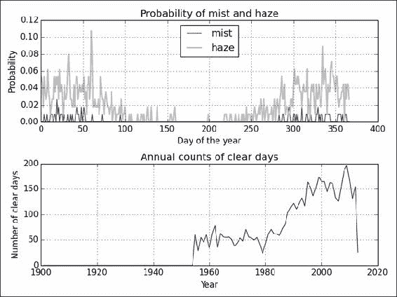
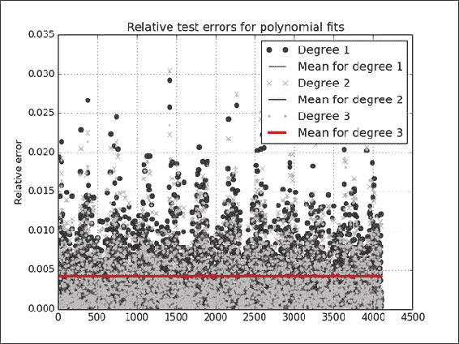
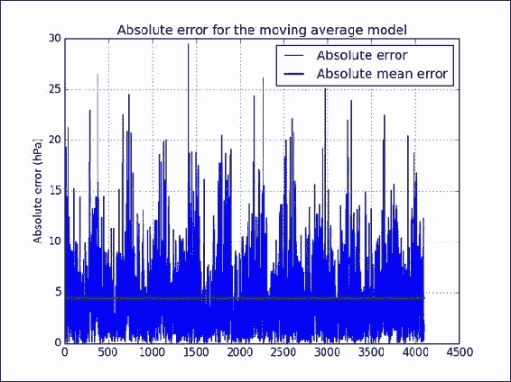
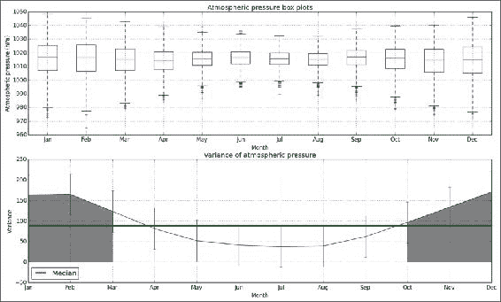
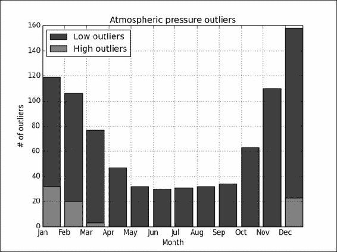

# 十二、使用 NumPy 进行探索性和预测性数据分析

在本章中，我们涵盖以下秘籍：

*   探索大气压
*   探索日常压力范围
*   研究年度大气压平均值
*   分析最大可见度
*   用自回归模型预测压力
*   使用移动平均模型预测压力
*   研究年内平均压力
*   研究大气压力的极值

# 简介

数据分析是 NumPy 最重要的用例之一。 根据我们的目标，我们可以区分数据分析的许多阶段和类型。 在本章中，我们将讨论**探索性**和**预测性数据分析**。 探索性数据分析可探查数据的线索。 在此阶段，我们可能不熟悉数据集。 预测分析试图使用模型来预测有关数据的某些信息。

数据来自荷兰气象局 KNMI。 特别是 KNMI 总部位于  De Bilt 的气象站。 在这些秘籍中，[我们将检查气压和最大可见度](http://www.knmi.nl/climatology/daily_data/download.html)。

我修改了文本数据并将其从 KNMI 转换为 NumPy 特定的`.npy`格式，并保存为 40996 x 5 数组。 该数组包含五个变量的每日值：

*   `YYYYMMDD`格式的日期
*   日平均大气压
*   每日最高气压
*   最低每日大气压
*   每日最大可见度

# 探索大气压

在此秘籍中，我们  将查看由 24 小时值计算出的每日平均海平面压力（0.1 hPa）。 这包括打印描述性统计数据和可视化概率分布。 在自然界中，我们经常处理正态分布，因此使用第 10 章，“使用 Scikits 进行正态性检验”会派上用场。

完整的代码在本书代码捆绑的`exploring.py`文件中：

```py
from __future__ import print_function
import numpy as np
import matplotlib.pyplot as plt
from statsmodels.stats.adnorm import normal_ad

data = np.load('cbk12.npy')

# Multiply to get hPa values
meanp = .1 * data[:,1]

# Filter out 0 values
meanp = meanp[ meanp > 0]

# Get descriptive statistics
print("Max", meanp.max())
print("Min", meanp.min())
mean = meanp.mean()
print("Mean", mean)
print("Median", np.median(meanp))
std = meanp.std()
print("Std dev", std)

# Check for normality
print("Normality", normal_ad(meanp))

#histogram with Gaussian PDF
plt.subplot(211)
plt.title('Histogram of average atmospheric pressure')
_, bins, _ = plt.hist(meanp, np.sqrt(len(meanp)), normed=True)
plt.plot(bins, 1/(std * np.sqrt(2 * np.pi)) * np.exp(- (bins - mean)**2/(2 * std**2)), 'r-', label="Gaussian PDF")
plt.grid()
plt.legend(loc='best')
plt.xlabel('Average atmospheric pressure (hPa)')
plt.ylabel('Frequency')

# boxplot
plt.subplot(212)
plt.boxplot(meanp)
plt.title('Boxplot of average atmospheric pressure')
plt.ylabel('Average atmospheric pressure (hPa)')
plt.grid()

# Improves spacing of subplots
plt.tight_layout()
plt.show()
```

## 准备

如果尚未安装  ，请安装`statsmodels`以进行正常性测试（请参阅第 10 章，“Scikits 的乐趣”的“安装 scikits-statsmodels”秘籍）。

## 如何执行...

请按照以下步骤探索每日大气压：

1.  使用`load()`函数加载数据：

    ```py
    data = np.load('cbk12.npy')
    ```

2.  通常，数据需要进行处理和清理。 在这种情况下，将这些值相乘以获得`hPa`中的值，然后删除与缺失值相对应的`0`值：

    ```py
    # Multiply to get hPa values
    meanp = .1 * data[:,1]

    # Filter out 0 values
    meanp = meanp[ meanp > 0]
    ```

3.  Get descriptive statistics, including maximum, minimum, arithmetic mean, median, and standard deviation:

    ```py
    print("Max", meanp.max())
    print("Min", meanp.min())
    mean = meanp.mean()
    print("Mean", mean)
    print("Median", np.median(meanp))
    std = meanp.std()
    print("Std dev", std)
    ```

    您应该看到以下值：

    ```py
    Max 1048.3
    Min 962.1
    Mean 1015.14058231
    Median 1015.8
    Std dev 9.85889134337

    ```

4.  Apply the normality test from [Chapter 10](../Text/ch10.html "Chapter 10. Fun with Scikits"), *Fun with Scikits*, as follows:

    ```py
    print("Normality", normal_ad(meanp))
    ```

    屏幕上显示以下值：

    ```py
    Normality (72.685781095773564, 0.0)

    ```

    用直方图和箱形图可视化值的分布也很好。 最终结果请参考以下图表：

    

## 另请参见

*   “使用 Statsmodels”秘籍执行正常性测试，该秘籍来自第 10 章，“Scikits 的乐趣”
*   有关箱形图的说明，请参见第 11 章“最新最强的 NumPy”
*   [`load()`函数的文档](http://docs.scipy.org/doc/numpy/reference/generated/numpy.load.html)

# 探索日常压力范围

每日  压力范围是每日最高点和最低点之差。 使用实际数据，有时我们会缺少一些值。 在这里，我们可能会缺少给定一天的高压和/或低压值。 可以通过智能算法来填补这些空白。 但是，让我们保持简单，而忽略它们。 在计算了范围之后，我们将进行与前面的秘籍类似的分析，但是我们将使用可以处理`NaN`值的函数。 另外，我们将研究月份和范围之间的关系。

本书代码捆绑中的`day_range.py`文件位于  对应的代码中：

```py
from __future__ import print_function
import numpy as np
import matplotlib.pyplot as plt
import calendar as cal

data = np.load('cbk12.npy')

# Multiply to get hPa values
highs = .1 * data[:,2]
lows = .1 * data[:,3]

# Filter out 0 values
highs[highs == 0] = np.nan
lows[lows == 0] = np.nan

# Calculate range and stats
ranges = highs - lows
print("Minimum daily range", np.nanmin(ranges))
print("Maximum daily range", np.nanmax(ranges))

print("Average daily range", np.nanmean(ranges))
print("Standard deviation", np.nanstd(ranges))

# Get months
dates = data[:,0]
months = (dates % 10000)/100
months = months[~np.isnan(ranges)]

monthly = []
month_range = np.arange(1, 13)

for month in month_range:
   indices = np.where(month == months)
   monthly.append(np.nanmean(ranges[indices]))

plt.bar(month_range, monthly)
plt.title('Monthly average of daily pressure ranges')
plt.xticks(month_range, cal.month_abbr[1:13])
plt.ylabel('Monthly Average (hPa)')
plt.grid()
plt.show()
```

## 如何执行...

此秘籍的第一步与先前的秘籍几乎相同，因此我们将跳过它们。 继续分析每日压力范围：

1.  我们可以将  的缺失值保留为当前的`0`值。 但是，通常将它们设置为`NaN`较为安全，以避免造成混淆。 将缺失值设置为`NaN`，如下所示：

    ```py
    highs[highs == 0] = np.nan
    lows[lows == 0] = np.nan
    ```

2.  Compute the ranges, minima, maxima, mean, and standard deviations with the `nanmin()`, `nanmax()`, `nanmean()`, and `nanstd()` functions:

    ```py
    ranges = highs - lows
    print("Minimum daily range", np.nanmin(ranges))
    print("Maximum daily range", np.nanmax(ranges))

    print("Average daily range", np.nanmean(ranges))
    print("Standard deviation", np.nanstd(ranges))
    ```

    结果出现在屏幕上：

    ```py
    Minimum daily range 0.4
    Maximum daily range 41.7
    Average daily range 6.11945360571
    Standard deviation 4.42162136692

    ```

3.  如前所述，日期以`YYYYMMDD`格式给出。 有了一点算术，我们就可以轻松地得到几个月。 此外，我们忽略与`NaN`范围值相对应的月份值：

    ```py
    dates = data[:,0]
    months = (dates % 10000)/100
    months = months[~np.isnan(ranges)]
    ```

4.  Average the ranges by month, as follows:

    ```py
    monthly = []
    month_range = np.arange(1, 13)

    for month in month_range:
       indices = np.where(month == months)
       monthly.append(np.nanmean(ranges[indices]))
    ```

    在最后一步中，我们绘制了`matplotlib`条形图，显示了每日压力范围的每月平均值。 最终结果请参考以下图表：

    

## 工作原理...

我们分析了大气压的每日  范围。 此外，我们可视化了每日范围的每月平均值。 似乎有一种模式导致夏季的每日大气压范围变小。 当然，需要做更多的工作来确定。

## 另请参见

*   “探索大气压”秘籍

# 研究年度大气压平均值

您可能听说过  ，全球变暖表明温度逐年稳定上升。 由于压力是另一个热力学变量，因此我们可以预期压力也会跟随趋势。 该秘籍的完整代码在本书代码捆绑的`annual.py`文件中：

```py
import numpy as np
import matplotlib.pyplot as plt

data = np.load('cbk12.npy')

# Multiply to get hPa values
avgs = .1 * data[:,1]
highs = .1 * data[:,2]
lows = .1 * data[:,3]

# Filter out 0 values
avgs = np.ma.array(avgs, mask = avgs == 0)
lows = np.ma.array(lows, mask = lows == 0)
highs = np.ma.array(highs, mask = highs == 0)

# Get years
years = data[:,0]/10000

# Initialize annual stats arrays
y_range = np.arange(1901, 2014)
nyears = len(y_range)
y_avgs = np.zeros(nyears)
y_highs = np.zeros(nyears)
y_lows = np.zeros(nyears)

# Compute stats
for year in y_range:
   indices = np.where(year == years)
   y_avgs[year - 1901] = np.mean(avgs[indices])
   y_highs[year - 1901] = np.max(highs[indices])
   y_lows[year - 1901] = np.min(lows[indices])

plt.title('Annual atmospheric pressure for De Bilt(NL)')
plt.ticklabel_format(useOffset=900, axis='y')

plt.plot(y_range, y_avgs, label='Averages')

# Plot ignoring NaNs
h_mask = np.isfinite(y_highs)
plt.plot(y_range[h_mask], y_highs[h_mask], '^', label='Highs')

l_mask = np.isfinite(y_lows)
plt.plot(y_range[l_mask], y_lows[l_mask], 'v', label='Lows')

plt.xlabel('Year')
plt.ylabel('Atmospheric pressure (hPa)')
plt.grid()
plt.legend(loc='best')
plt.show()
```

## 如何执行...

要检查  趋势，让我们按以下步骤绘制平均，最大和最小年度大气压力：

1.  初始化年度统计数据数组：

    ```py
    y_range = np.arange(1901, 2014)
    nyears = len(y_range)
    y_avgs = np.zeros(nyears)
    y_highs = np.zeros(nyears)
    y_lows = np.zeros(nyears)
    ```

2.  计算年度统计数据：

    ```py
    for year in y_range:
       indices = np.where(year == years)
       y_avgs[year - 1901] = np.mean(avgs[indices])
       y_highs[year - 1901] = np.max(highs[indices])
       y_lows[year - 1901] = np.min(lows[indices])
    ```

3.  Plot, ignoring the `NaN` values, as follows:

    ```py
    h_mask = np.isfinite(y_highs)
    plt.plot(y_range[h_mask], y_highs[h_mask], '^', label='Highs')

    l_mask = np.isfinite(y_lows)
    plt.plot(y_range[l_mask], y_lows[l_mask], 'v', label='Lows')
    ```

    最终结果请参考以下图表：

    

## 工作原理...

年平均压力似乎持平或有所波动，但没有任何趋势。 我们使用`isfinite()`函数忽略了最终图中的`NaN`值。 此函数检查无限值和`NaN`值。

## 另请参见

*   “探索大气压”秘籍
*   [`isfinite()`函数的文档](http://docs.scipy.org/doc/numpy/reference/generated/numpy.isfinite.html)

# 分析最大可见度

如果到目前为止，您在本章的所有秘籍中均未使用  ，则可能需要突破大气压。 因此，让我们来看看能见度。 数据文件具有一列，以提供最大的可视性，KNMI 描述如下：

> `Maximum visibility; 0: <100 m, 1:100-200 m, 2:200-300 m,..., 49:4900-5000 m, 50:5-6 km, 56:6-7 km, 57:7-8 km,..., 79:29-30 km, 80:30-35 km, 81:35-40 km,..., 89: >70 km)`

这里的可见性是一个离散变量，因此取平均值可能没有意义。 此外，似乎我们几乎每天都有 1901 年到 1950 年之间的`0`值。 我不相信 De Bilt 在那个时期会更加迷雾重重。 出于本秘籍的目的，我们将雾定义为 1 至 2 km 之间的可见性，这对应于数据文件中的`10`和`20`值。 让我们还将雾度定义为 2 至 5 公里之间的能见度。 这又对应于我们数据文件中的`20`和`50`。

空气污染会降低能见度，尤其是在晴天。 我们可以将晴天定义为能见度高于 30 km 的晴天，或数据文件中`79`的值。 理想情况下，我们应该使用空气污染数据，但不幸的是，我们没有这些数据。 据我所知，这个特殊气象站周围的空气污染水平不是很高。 知道每年的晴天数很有趣。 分析的代码在本书的代码包的`visibility.py`文件中：

```py
import numpy as np
import matplotlib.pyplot as plt

data = np.load('cbk12.npy')

# Get minimum visibility
visibility = data[:,4]

# doy
doy = data[:,0] % 10000

doy_range = np.unique(doy)

# Initialize arrays
ndoy = len(doy_range)
mist = np.zeros(ndoy)
haze = np.zeros(ndoy)

# Compute frequencies
for i, d in enumerate(doy_range):
   indices = np.where(d == doy)
   selection = visibility[indices]

   mist_truth = (10 < selection) & (selection < 20)
   mist[i] = len(selection[mist_truth])/(1\. * len(selection))

   haze_truth = (20 < selection) & (selection < 50)
   haze[i] = len(selection[haze_truth])/(1\. * len(selection))

# Get years
years = data[:,0]/10000

# Initialize annual stats arrays
y_range = np.arange(1901, 2014)
nyears = len(y_range)
y_counts = np.zeros(nyears)

# Get annual counts
for year in y_range:
   indices = np.where(year == years)
   selection = visibility[indices]
   y_counts[year - 1901] = len(selection[selection > 79])

plt.subplot(211)
plt.plot(np.arange(1, 367), mist, color='.25', label='mist')
plt.plot(np.arange(1, 367), haze, color='0.75', lw=2, label='haze')
plt.title('Probability of mist and haze')
plt.xlabel('Day of the year')
plt.ylabel('Probability')
plt.grid()
plt.legend(loc='best')

plt.subplot(212)
plt.plot(y_range, y_counts)
plt.xlabel('Year')
plt.ylabel('Number of clear days')
plt.title('Annual counts of clear days')
plt.grid()
plt.tight_layout()
plt.show()
```

## 如何执行...

请按照以下步骤来绘制  晴天的年度计数，即一年中的某一天（1-366）对霾和薄雾的可能性：

1.  使用以下代码块计算雾霾的可能性：

    ```py
    for i, d in enumerate(doy_range):
       indices = np.where(d == doy)
       selection = visibility[indices]

       mist_truth = (10 < selection) & (selection < 20)
       mist[i] = len(selection[mist_truth])/(1\. * len(selection))

       haze_truth = (20 < selection) & (selection < 50)
       haze[i] = len(selection[haze_truth])/(1\. * len(selection))
    ```

2.  Get the annual counts using this snippet:

    ```py
    for year in y_range:
       indices = np.where(year == years)
       selection = visibility[indices]
       y_counts[year - 1901] = len(selection[selection > 79])
    ```

    Refer to the following plot for the end result:

    

## 工作原理...

如您所见，我们在 1950 年以后开始变得晴朗。这不是由于 1950 年之前的大雾天气，而是由于数据丢失或无效的现象。 去年的下降也是由于数据不完整。 1980 年以后，晴天明显增加。 这应该是全球变暖和气候变化也加剧的时期。 不幸的是，我们没有与空气污染直接相关的数据，但是我们的探索性分析表明存在趋势。

薄雾似乎主要发生在一年的头两个月中  。 您可以得出有关雾霾的类似结论。 显然，雾气比雾气更有可能，这可能是一件好事。 您也可以绘制直方图以确保。 但是，请记住，正如我之前提到的，您需要忽略`0`值。

## 另请参见

*   “探索大气压”秘籍
*   “研究年度大气压平均值”秘籍
*   [相关维基百科页面](http://en.wikipedia.org/wiki/Visibility)

# 使用自回归模型预测压力

非常简单的  预测模型会获取变量的当前值，并将其外推到下一个周期。 为了推断，我们可以使用一个简单的数学函数。 由于可以通过多项式近似泰勒级数中的多项式，因此低阶多项式可以解决问题。 归结为将先前值回归到下一个值。 因此，相应的  模型称为**自回归**。

我们必须对  谨慎，以免**过拟合**。 **交叉验证**是一种常见的方法  将数据分为**训练**和**测试**集。 我们使用训练集拟合数据，并使用测试集测试拟合度。 这样可以减少偏差（请参见本书代码捆绑中的`autoregressive.py`文件）：

```py
from __future__ import print_function
import numpy as np
import matplotlib.pyplot as plt

data = np.load('cbk12.npy')

# Load average pressure
meanp = .1 * data[:,1]

# Split point for test and train data
cutoff = 0.9 * len(meanp)

for degree, marker in zip(xrange(1, 4), ['o', 'x','.']):
   poly = np.polyfit(meanp[:cutoff - 1], meanp[1:cutoff], degree)
   print('Polynomial coefficients', poly)

   fit = np.polyval(poly, meanp[cutoff:-1])
   error = np.abs(meanp[cutoff + 1:] - fit)/fit
   plt.plot(error, marker, color=str(.25* degree), label='Degree ' + str(degree))
   plt.plot(np.full(len(error), error.mean()), lw=degree, label='Mean for degree ' + str(degree))

   print("Absolute mean relative error", error.mean(), 'for polynomial of degree', degree)
   print()

plt.title('Relative test errors for polynomial fits')
plt.ylabel('Relative error')
plt.grid()
plt.legend(loc='best')
plt.show()
```

## 如何执行...

通过执行以下  ，我们将使用不同程度的多项式拟合大气压：

1.  定义测试和训练集的截止：

    ```py
    cutoff = 0.9 * len(meanp)
    ```

2.  使用`polyfit()`和`polyval()`函数拟合数据：

    ```py
    poly = np.polyfit(meanp[:cutoff - 1], meanp[1:cutoff], degree)
    print('Polynomial coefficients', poly)

    fit = np.polyval(poly, meanp[cutoff:-1])
    ```

3.  Calculate the relative error:

    ```py
    error = np.abs(meanp[cutoff + 1:] - fit)/fit
    ```

    此代码输出以下输出：

    ```py
    Polynomial coefficients [ 0.995542    4.50866543]
    Absolute mean relative error 0.00442472512506 for polynomial of degree 1

    Polynomial coefficients [ -1.79946321e-04   1.17995347e+00   2.77195814e+00]
    Absolute mean relative error 0.00421276856088 for polynomial of degree 2

    Polynomial coefficients [  3.17914507e-06  -6.62444552e-03   4.44558056e+00   2.76520065e+00]
    Absolute mean relative error 0.0041906802632 for polynomial of degree 3

    ```

    Refer to the following plot for the end result:

    

## 工作原理...

这三个多项式的平均  相对误差非常接近-约.004-因此我们在图中看到一条线（很有趣的是知道大气压的典型测量误差是多少）， 小于百分之一。 我们看到了一些潜在的异常值，但是没有太多。 大部分繁重的工作都是通过`polyfit()`和`polyval()`函数完成的，它们分别将数据拟合到多项式并评估该多项式。

## 另请参见

*   “探索大气压”秘籍
*   [有关交叉验证的维基百科页面](http://en.wikipedia.org/wiki/Cross-validation_%28statistics%29)
*   [`polyfit()`的文档](http://docs.scipy.org/doc/numpy/reference/generated/numpy.polyfit.html)
*   [`polyval()`的文档](http://docs.scipy.org/doc/numpy/reference/generated/numpy.polyval.html)

# 使用移动平均模型预测压力

模拟大气  压力的简单  方法是假设值围绕均值`μ`跳动。 然后，在最简单的情况下，我们假设连续值**与平均值的偏差**`ε`遵循以下公式：


该关系是线性的，在最简单的情况下，我们只需要估计一个参数 - `θ`。 为此，我们将需要 SciPy 功能。 该秘籍的完整代码在本书代码捆绑的`moving_average.py`文件中：

```py
from __future__ import print_function
import numpy as np
import matplotlib.pyplot as plt
from datetime import datetime as dt
from scipy.optimize import leastsq

data = np.load('cbk12.npy')

# Load average pressure
meanp = .1 * data[:,1]

cutoff = 0.9 * len(meanp)

def model(p, ma1):
   return p * ma1

def error(p, t, ma1):
   return t - model(p, ma1)

p0 = [.9]
mu = meanp[:cutoff].mean()
params = leastsq(error, p0, args=(meanp[1:cutoff] - mu, meanp[:cutoff-1] - mu))[0]
print(params)

abs_error = np.abs(error(params, meanp[cutoff+1:] - mu, meanp[cutoff:-1] - mu))
plt.plot(abs_error, label='Absolute error')
plt.plot(np.full_like(abs_error, abs_error.mean()), lw=2, label='Absolute mean error')
plt.title('Absolute error for the moving average model')
plt.ylabel('Absolute error (hPa)')
plt.grid()
plt.legend(loc='best')
plt.show()
```

## 入门

如有必要，请按照第 2 章，“高级索引和数组概念”的“安装 SciPy”秘籍中的说明安装 SciPy。

## 如何执行...

以下  步骤将移动平均模型应用于大气压。

1.  定义以下功能：

    ```py
    def model(p, ma1):
       return p * ma1

    def error(p, t, ma1):
       return t - model(p, ma1)
    ```

2.  使用上一步中的函数将移动平均模型与`leastsq()`函数拟合，并将`0.9`的初始猜测作为模型参数：

    ```py
    p0 = [.9]
    mu = meanp[:cutoff].mean()
    params = leastsq(error, p0, args=(meanp[1:cutoff] - mu, meanp[:cutoff-1] - mu))[0]
    ```

3.  Compute the absolute error after fitting using the test dataset:

    ```py
    abs_error = np.abs(error(params, meanp[cutoff+1:] - mu, meanp[cutoff:-1] - mu))
    ```

    请参考以下数据集中每个数据点的绝对误差图：

    

## 工作原理...

`leastsq()`函数  通过最小化误差来拟合模型。 它需要一个函数来计算拟合误差和模型参数的初始猜测。

## 另请参见

*   “探索大气压”秘籍
*   [移动平均模型的 Wikipedia 页面](http://en.wikipedia.org/wiki/Moving-average_model)
*   [`leastsq()`的文档](http://docs.scipy.org/doc/scipy/reference/generated/scipy.optimize.leastsq.html)

# 研究年内平均压力

在一年内探索大气压很有趣。 特别地，检查与变异性相关的模式可能是有益的，因此，与可预测性相关。 原因是几个月中的大气压力会发生很大变化，从而降低了可预测性。 在此秘籍中，我们将绘制每月的箱形图和每月的大气压力方差。

秘籍代码在本书代码捆绑的`intrayear.py`文件中。 请特别注意突出显示的部分：

```py
import numpy as np
import matplotlib.pyplot as plt
import calendar as cal

data = np.load('cbk12.npy')

# Multiply to get hPa values
meanp = .1 * data[:,1]

# Get months
dates = data[:,0]
months = (dates % 10000)/100

monthly = []
vars = np.zeros(12)
month_range = np.arange(1, 13)

for month in month_range:
 indices = np.where(month == months)
 selection = meanp[indices]

 # Filter out 0 values
 selection = selection[selection > 0]

 monthly.append(selection)
 vars[month - 1] = np.var(selection)

def plot():
    plt.xticks(month_range, cal.month_abbr[1:13])
    plt.grid()
    plt.xlabel('Month')

plt.subplot(211)
plot()
plt.title('Atmospheric pressure box plots')
plt.boxplot(monthly)
plt.ylabel('Atmospheric pressure (hPa)')

plt.subplot(212)
plot()

# Display error bars using standard deviation
plt.errorbar(month_range, vars, yerr=vars.std())
plt.plot(month_range, np.full_like(month_range, np.median(vars)), lw=3, label='Median')

# Shades the region above the median
plt.fill_between(month_range, vars, where=vars>np.median(vars), color='0.5')
plt.title('Variance of atmospheric pressure')
plt.ylabel('Variance')
plt.legend(loc='best')

plt.show()
```

## 如何执行...

在我们探索  时，往往会重复这些步骤，并且此秘籍与本书中的其他秘籍之间存在重叠。 以下是此秘籍中的新步骤：

1.  使用标准差显示误差线：

    ```py
    plt.errorbar(month_range, vars, yerr=vars.std())
    ```

2.  Shade the region of the plot with values above the median:

    ```py
    plt.fill_between(month_range, vars, where=vars>np.median(vars), color='0.5')
    ```

    Refer to the following plot for the end result:

    

## 工作原理...

我们将几个月与大气压力的测量相匹配。 我们使用匹配来绘制箱形图并可视化每月变化。 这项研究表明，在 1 月，2 月，11 月和  12 月的最冷月份，气压变化高于中值。 从图中可以看出，在温暖的夏季，压力范围狭窄。 这与其他秘籍的结果一致。

## 另请参见

*   “探索大气压”秘籍
*   “研究年度大气压平均值”秘籍
*   [`var()`的文档](http://docs.scipy.org/doc/numpy/reference/generated/numpy.var.html)

# 研究大气压力的极值

异常值  是一个问题，因为它们会影响我们对数据的理解。 在此秘籍中，我们将异常值定义为与数据的第一或第三四分位数相差至少**四分位数范围**的 1.5 倍。 四分位数间距  是第一和第三四分位数之间的距离。 让我们  计算一年中每个月的异常值。 完整的代码在本书代码捆绑的`extreme.py`文件中：

```py
import numpy as np
import matplotlib.pyplot as plt
import calendar as cal

data = np.load('cbk12.npy')

# Multiply to get hPa values
meanp = .1 * data[:,1]

# Filter out 0 values
meanp = np.ma.array(meanp, mask = meanp == 0)

# Calculate quartiles and irq
q1 = np.percentile(meanp, 25)
median = np.percentile(meanp, 50)
q3 = np.percentile(meanp, 75)

irq = q3 - q1

# Get months
dates = data[:,0]
months = (dates % 10000)/100

m_low = np.zeros(12)
m_high = np.zeros(12)
month_range = np.arange(1, 13)

for month in month_range:
   indices = np.where(month == months)
   selection = meanp[indices]
   m_low[month - 1] = len(selection[selection < (q1 - 1.5 * irq)])
   m_high[month - 1] = len(selection[selection > (q3 + 1.5 * irq)])

plt.xticks(month_range, cal.month_abbr[1:13])
plt.bar(month_range, m_low, label='Low outliers', color='.25')
plt.bar(month_range, m_high, label='High outliers', color='0.5')
plt.title('Atmospheric pressure outliers')
plt.xlabel('Month')
plt.ylabel('# of outliers')
plt.grid()
plt.legend(loc='best')
plt.show()
```

## 如何执行...

要绘制一年中每个月的  离群数，请执行以下步骤：

1.  使用`percentile()`函数计算四分位数和四分位数间距：

    ```py
    q1 = np.percentile(meanp, 25)
    median = np.percentile(meanp, 50)
    q3 = np.percentile(meanp, 75)

    irq = q3 - q1
    ```

2.  Count the number of outliers, as follows:

    ```py
    for month in month_range:
       indices = np.where(month == months)
       selection = meanp[indices]
       m_low[month - 1] = len(selection[selection < (q1 - 1.5 * irq)])
       m_high[month - 1] = len(selection[selection > (q3 + 1.5 * irq)])
    ```

    Refer to the following plot for the end result:

    

## 工作原理...

看起来  离群值大多在下侧，并且夏天不太可能出现。 较高端的异常值似乎仅在某些月份内发生。 我们发现四分位数具有`percentile()`函数，因为四分之一对应 25％。

## 另请参见

*   “探索大气压”秘籍
*   [`percentile()`函数的文档](http://docs.scipy.org/doc/numpy-dev/reference/generated/numpy.percentile.html)