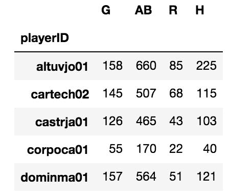
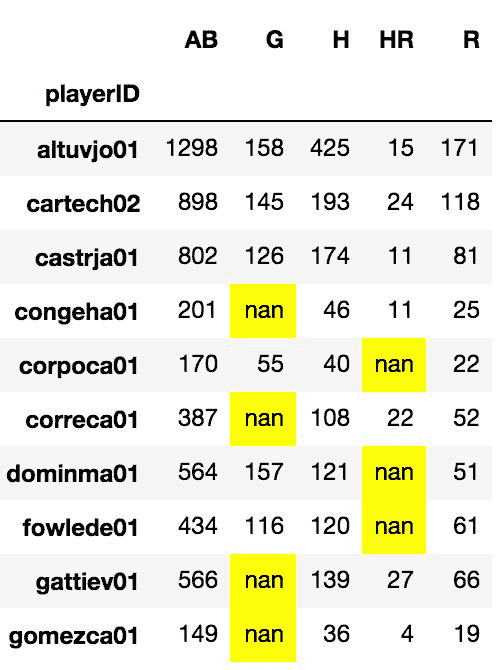
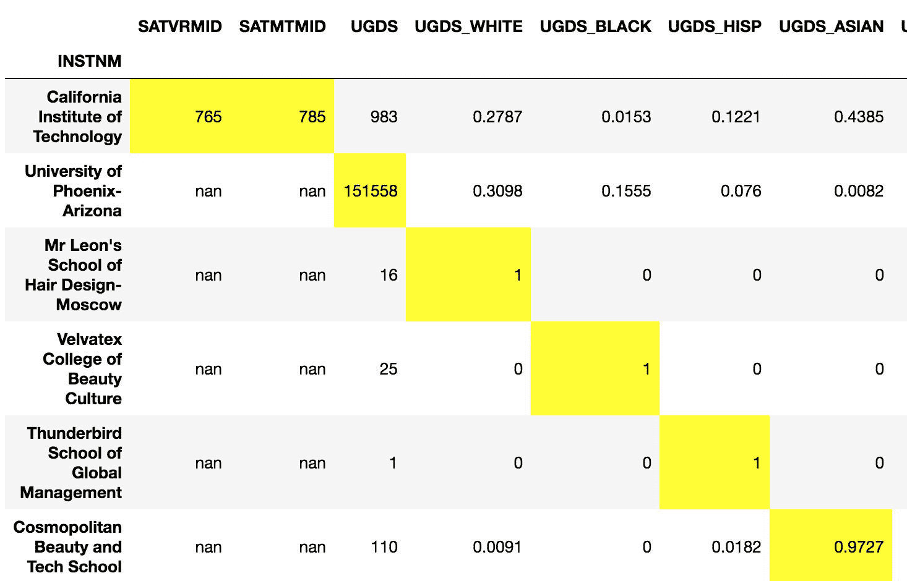
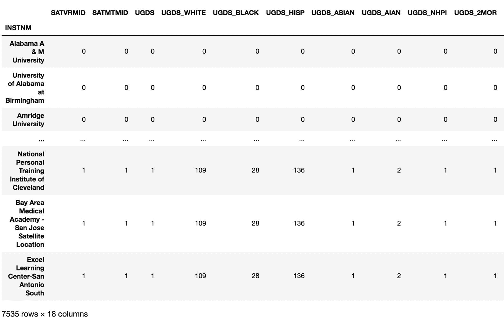
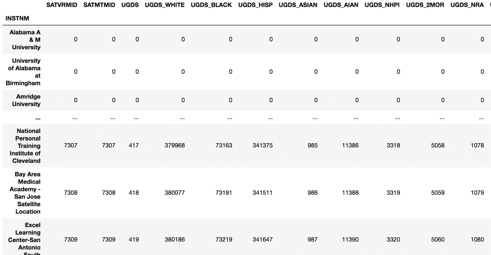

# 索引对齐

在本章中，我们将介绍以下主题：

*   检查索引对象
*   生产笛卡尔积
*   爆炸指数
*   用不相等的索引填充值
*   追加来自不同数据帧的列
*   突出显示每一列的最大值
*   用方法链复制`idxmax`
*   寻找最常见的最大值

# 介绍

当以某种方式组合多个序列或数据帧时，在进行任何计算之前，数据的每个维度会首先自动在每个轴上对齐。 轴的这种无声且自动的对齐会给初学者造成极大的困惑，但它为超级用户提供了极大的灵活性。 本章将深入探讨索引对象，然后展示利用其自动对齐功能的各种秘籍。

# 检查索引对象

如第 1 章，“Pandas 基础”中所讨论的，序列和数据帧的每个轴都有一个索引对象，用于标记值。 有许多不同类型的索引对象，但是它们都具有相同的共同行为。 除特殊的 MultiIndex 之外，所有索引对象都是一维数据结构，结合了 Python 集和 NumPy ndarrays 的功能和实现。

# 准备

在本秘籍中，我们将检查大学数据集的列索引并探索其许多功能。

# 操作步骤

1.  读入大学数据集，为列索引分配一个变量，然后输出：

```py
>>> college = pd.read_csv('data/college.csv')
>>> columns = college.columns
>>> columns
Index(['INSTNM', 'CITY', 'STABBR', 'HBCU', ...], dtype='object')
```

2.  使用`values`属性访问基础的 NumPy 数组：

```py
>>> columns.values
array(['INSTNM', 'CITY', 'STABBR', 'HBCU', ...], dtype=object)
```

3.  通过带有标量，列表或切片的整数位置从索引中选择项目：

```py
>>> columns[5]
'WOMENONLY'

>>> columns[[1,8,10]]
Index(['CITY', 'SATMTMID', 'UGDS'], dtype='object')

>>> columns[-7:-4]
Index(['PPTUG_EF', 'CURROPER', 'PCTPELL'], dtype='object')
```

4.  索引与序列和数据帧共享许多相同的方法：

```py
>>> columns.min(), columns.max(), columns.isnull().sum()
('CITY', 'WOMENONLY', 0)
```

5.  直接在`Index`对象上使用基本算术和比较运算符：

```py
>>> columns + '_A'
Index(['INSTNM_A', 'CITY_A', 'STABBR_A', 'HBCU_A', ...], dtype='object')

>>> columns > 'G'
array([ True, False,  True,  True, ...], dtype=bool)
```

6.  创建索引后尝试直接更改索引值失败。 索引是不可变的对象：

```py
>>> columns[1] = 'city'
TypeError: Index does not support mutable operations
```

# 工作原理

从许多索引对象操作中可以看到，它与序列和`ndarrays`似乎有很多共同点。 最大的差异之一来自第 6 步。索引是不可变的，创建后就无法更改它们的值。

# 更多

索引支持 set 运算，并集，交集，差和对称差：

```py
>>> c1 = columns[:4]
>>> c1
Index(['INSTNM', 'CITY', 'STABBR', 'HBCU'], dtype='object')

>>> c2 = columns[2:6]
>>> c2
Index(['STABBR', 'HBCU', 'MENONLY'], dtype='object')

>>> c1.union(c2) # or `c1 | c2`
Index(['CITY', 'HBCU', 'INSTNM', 'MENONLY', 'RELAFFIL', 'STABBR'], dtype='object')

>>> c1.symmetric_difference(c2) # or `c1 ^ c2`
Index(['CITY', 'INSTNM', 'MENONLY'], dtype='object')
```

索引与 Python 集共享一些相同的操作。 索引在另一重要方面类似于 Python 集。 它们（通常）是使用哈希表实现的，当从数据帧中选择行或列时，哈希表的访问速度非常快。 当使用哈希表实现它们时，索引对象的值必须是不可变的，例如字符串，整数或元组，就像 Python 字典中的键一样。

Indexes support duplicate values, and if there happens to be a duplicate in any Index, then a hash table can no longer be
used for its implementation, and object access becomes much slower.

# 另见

*   Pandas`Index`的官方文档（ [http://bit.ly/2upfgtr](https://pandas.pydata.org/pandas-docs/stable/generated/pandas.Index.html) ）

# 生产笛卡尔积

每当两个序列或数据帧与另一个序列或数据帧一起操作时，每个对象的索引（行索引和列索引）都首先对齐，然后再开始任何操作。 这种索引对齐方式是无声的，对于那些刚接触 Pandas 的人来说可能是非常令人惊讶的。 除非索引相同，否则这种对齐方式总是在索引之间创建笛卡尔乘积。

A Cartesian product is a mathematical term that usually appears in set theory. A Cartesian product between two sets is all the combinations of pairs of both sets. For example, the 52 cards in a standard playing card deck represent a Cartesian product between the 13 ranks (A, 2, 3,..., Q, K) and the four suits.

# 准备

生成笛卡尔积并非总是预期的结果，但是了解发生的方式和时间以避免意外后果至关重要。 在此秘籍中，将具有重叠但不相同的索引的两个系列相加在一起，产生了令人惊讶的结果。

# 操作步骤

请按照以下步骤创建笛卡尔积：

1.  构造两个具有不同索引但包含一些相同值的序列：

```py
>>> s1 = pd.Series(index=list('aaab'), data=np.arange(4))
>>> s1
a    0
a    1
a    2
b    3
dtype: int64

>>> s2 = pd.Series(index=list('cababb'), data=np.arange(6))
>>> s2
c    0
a    1
b    2
a    3
b    4
b    5
dtype: int64
```

2.  将两个系列加在一起以生成笛卡尔积：

```py
>>> s1 + s2
a    1.0
a    3.0
a    2.0
a    4.0
a    3.0
a    5.0
b    5.0
b    7.0
b    8.0
c    NaN
dtype: float64
```

# 工作原理

每个系列都是使用类构造函数创建的，该类构造函数接受各种各样的输入，最简单的是每个参数`index`和数据的值序列。

笛卡尔数学乘积与对两个 Pandas 对象进行运算的结果略有不同。 `s1`中的每个`a`标签与`s2`中的每个`a`标签配对。 该配对在所得系列中产生六个`a`标签，三个`b`标签和一个`c`标签。 笛卡尔积在所有相同的索引标签之间发生。

由于带有标签`c`的元素是系列`s2`所特有的，因此 pandas 默认将其值设置为 missing，因为`s1`中没有标签可以对齐。 每当索引标签对于一个对象唯一时，Pandas 默认为缺少值。 不幸的结果是，将序列的数据类型更改为 float，而每个序列仅具有整数作为值。 发生这种情况是因为 NumPy 缺少值对象。 `np.nan`仅对于浮点数存在，而对于整数不存在。序列和数据帧列必须具有齐次数值数据类型； 因此，每个值都转换为浮点数。 对于这个小的数据集，这几乎没有什么区别，但是对于较大的数据集，这可能会对内存产生重大影响。

# 更多

当索引以相同顺序包含相同的完全相同的元素时，将发生上述示例的异常。 发生这种情况时，不会发生笛卡尔积，而是按其位置对齐索引。 请注意，每个元素均按位置精确对齐，并且数据类型仍为整数：

```py
>>> s1 = pd.Series(index=list('aaabb'), data=np.arange(5))
>>> s2 = pd.Series(index=list('aaabb'), data=np.arange(5))
>>> s1 + s2
a    0
a    2
a    4
b    6
b    8
dtype: int64
```

如果索引的元素相同，但是系列之间的顺序不同，则会产生笛卡尔积。 让我们在`s2`中更改索引的顺序，然后重新运行相同的操作：

```py
>>> s1 = pd.Series(index=list('aaabb'), data=np.arange(5))
>>> s2 = pd.Series(index=list('bbaaa'), data=np.arange(5))
>>> s1 + s2
a    2
a    3
a    4
a    3
a    4
a    5
a    4
a    5
a    6
b    3
b    4
b    4
b    5
dtype: int64
```

有趣的是，Pandas 在同一项操作中有两个截然不同的结果。 如果笛卡尔积是 Pandas 的唯一选择，那么将数据帧列加在一起这样的简单操作将使返回的元素数量激增。

在此秘籍中，每个系列具有不同数量的元素。 通常，当操作维中不包含相同数量的元素时，Python 和其他语言中的类似数组的数据结构将不允许进行操作。 Pandas 可以通过在完成操作之前先对齐索引来实现此目的。

# 另见

*   第 3 章，“开始数据分析”中的“通过更改数据类型来减少内存”秘籍

# 爆炸指数

先前的秘籍中有一个琐碎的示例，其中将两个小系列与不相等的索引一起添加。 处理较大的数据时，此问题可能会产生可笑的错误结果。

# 准备

在此秘籍中，我们添加了两个较大的序列，它们的索引只有几个唯一值，但顺序不同。 结果将使索引中的值数量爆炸。

# 操作步骤

1.  读入员工数据并将索引设置为与 race 列相等：

```py
>>> employee = pd.read_csv('data/employee.csv', index_col='RACE')
>>> employee.head()
```


2.  选择`BASE_SALARY`列作为两个不同的序列。 检查此操作是否确实创建了两个新对象：

```py
>>> salary1 = employee['BASE_SALARY']
>>> salary2 = employee['BASE_SALARY']
>>> salary1 is salary2
True
```

3.  `salary1`和`salary2` 变量实际上是指同一对象。 这意味着对一个的任何更改都会更改另一个。 为确保您收到数据的全新副本，请使用`copy`方法：

```py
>>> salary1 = employee['BASE_SALARY'].copy()
>>> salary2 = employee['BASE_SALARY'].copy()
>>> salary1 is salary2
False
```

4.  让我们通过对其中一个序列进行排序来更改其索引顺序：

```py
>>> salary1 = salary1.sort_index()
>>> salary1.head()
RACE
American Indian or Alaskan Native    78355.0
American Indian or Alaskan Native    81239.0
American Indian or Alaskan Native    60347.0
American Indian or Alaskan Native    68299.0
American Indian or Alaskan Native    26125.0
Name: BASE_SALARY, dtype: float64

>>> salary2.head()
RACE
Hispanic/Latino    121862.0
Hispanic/Latino     26125.0
White               45279.0
White               63166.0
White               56347.0
Name: BASE_SALARY, dtype: float64
```

5.  让我们将这些`salary`系列加在一起：

```py
>>> salary_add = salary1 + salary2
>>> salary_add.head()
RACE
American Indian or Alaskan Native    138702.0
American Indian or Alaskan Native    156710.0
American Indian or Alaskan Native    176891.0
American Indian or Alaskan Native    159594.0
American Indian or Alaskan Native    127734.0
Name: BASE_SALARY, dtype: float64
```

6.  操作成功完成。 让我们再添加一个`salary1`系列，然后输出每个系列的长度。 我们只是将该指数从 2,000 个值分解为超过 100 万个值：

```py
>>> salary_add1 = salary1 + salary1
>>> len(salary1), len(salary2), len(salary_add), len(salary_add1)
(2000, 2000, 1175424, 2000)
```

# 工作原理

首先出现步骤 2，以创建两个唯一的对象，但实际上，它创建了一个由两个不同的变量名称引用的对象。 表达式`employee['BASE_SALARY']`从技术上讲创建的是**视图**，而不是全新的副本。 使用`is`运算符对此进行了验证。

In pandas, a view is not a new object but just a reference to another object, usually some subset of a DataFrame. This shared object can be a cause for many issues.

为了确保两个变量都引用完全不同的对象，我们使用`copy` Series 方法，并再次使用`is`运算符验证它们是否是不同的对象。 步骤 4 使用`sort_index`方法按种族对系列进行排序。 第 5 步将这些不同的系列加在一起以产生一些结果。 仅检查头部，仍不清楚产生了什么。

步骤 6 向其自身添加`salary1`，以显示两个不同系列添加之间的比较。 此秘籍中所有系列的长度都已输出，我们清楚地看到`series_add`现已爆炸超过一百万个值。 索引中的每个唯一值都会产生笛卡尔乘积，因为索引并不完全相同。 此秘籍显着显示了将多个序列或数据帧组合在一起时索引可能产生的影响。

# 更多

通过做一些数学运算，我们可以验证`salary_add`的值的数量。 当笛卡尔积在所有相同的索引值之间发生时，我们可以求和它们各自计数的平方。 索引中甚至缺少的值也会与它们自身产生笛卡尔积：

```py
>>> index_vc = salary1.index.value_counts(dropna=False)
>>> index_vc
Black or African American            700
White                                665
Hispanic/Latino                      480
Asian/Pacific Islander               107
NaN                                   35
American Indian or Alaskan Native     11
Others                                 2
Name: RACE, dtype: int64

>>> index_vc.pow(2).sum()
1175424
```

# 用不相等的索引填充值

当使用加号运算符将两个系列加在一起并且一个索引标签没有出现在另一个索引标签中时，结果值始终会丢失。 Pandas 提供了`add`方法，该方法提供了一种填充缺失值的选项。

# 准备

在本秘籍中，我们使用`add`方法的`fill_value`参数将`baseball`数据集中具有不等索引的多个序列合并在一起，以确保结果中没有缺失值。

# 操作步骤

1.  读取三个`baseball`数据集，并将索引设置为`playerID`：

```py
>>> baseball_14 = pd.read_csv('data/baseball14.csv',
                              index_col='playerID')
>>> baseball_15 = pd.read_csv('data/baseball15.csv',
                              index_col='playerID')
>>> baseball_16 = pd.read_csv('data/baseball16.csv',
                              index_col='playerID')
>>> baseball_14.head()
```


2.  使用索引方法`difference`发现`baseball_14`中而不是`baseball_15`中的索引标签，反之亦然：

```py
>>> baseball_14.index.difference(baseball_15.index)
Index(['corpoca01', 'dominma01', 'fowlede01', 'grossro01',
       'guzmaje01', 'hoeslj01', 'krausma01', 'preslal01',
       'singljo02'], dtype='object', name='playerID')

>>> baseball_14.index.difference(baseball_16.index)
Index(['congeha01', 'correca01', 'gattiev01', 'gomezca01',
       'lowrije01', 'rasmuco01', 'tuckepr01', 'valbulu01'],
       dtype='object', name='playerID')
```

3.  每个索引都有很多独特的参与者。 让我们找出三年内每个玩家的总点击数。 `H` 列包含匹配数：

```py
>>> hits_14 = baseball_14['H']
>>> hits_15 = baseball_15['H']
>>> hits_16 = baseball_16['H']
>>> hits_14.head()
playerID
altuvjo01    225
cartech02    115
castrja01    103
corpoca01     40
dominma01    121
Name: H, dtype: int64
```

4.  我们首先使用 plus 运算符将两个序列相加：

```py
>>> (hits_14 + hits_15).head()
playerID
altuvjo01    425.0
cartech02    193.0
castrja01    174.0
congeha01      NaN
corpoca01      NaN
Name: H, dtype: float64
```

5.  即使玩家`congeha01`和`corpoca01`记录了 2015 年的热门歌曲，但他们的成绩仍然缺失。 让我们使用`add`方法及其参数`fill_value`来避免丢失值：

```py
>>> hits_14.add(hits_15, fill_value=0).head()
playerID
altuvjo01    425.0
cartech02    193.0
castrja01    174.0
congeha01     46.0
corpoca01     40.0
Name: H, dtype: float64
```

6.  我们通过再次链接`add`方法来添加 2016 年的匹配：

```py
>>> hits_total = hits_14.add(hits_15, fill_value=0) \
                        .add(hits_16, fill_value=0)
>>> hits_total.head()
playerID
altuvjo01    641.0
bregmal01     53.0
cartech02    193.0
castrja01    243.0
congeha01     46.0
Name: H, dtype: float64
```

7.  检查结果中是否缺少值：

```py
>>> hits_total.hasnans
False
```

# 工作原理

`add`方法的工作方式与加号运算符相似，但通过提供`fill_value`参数代替不匹配的索引，可以提供更大的灵活性。 在此问题中，将不匹配的索引值默认设置为 0 是有意义的，但是您可以使用其他任何数字。

有时每个系列都包含与缺失值相对应的索引标签。 在此特定实例中，当添加两个序列时，无论是否使用`fill_value`参数，索引标签仍将对应于缺失值。 为了澄清这一点，请看以下示例，其中索引标签`a`对应于每个系列中的缺失值：

```py
>>> s = pd.Series(index=['a', 'b', 'c', 'd'],
                  data=[np.nan, 3, np.nan, 1])
>>> s
a    NaN
b    3.0
c    NaN
d    1.0
dtype: float64

>>> s1 = pd.Series(index=['a', 'b', 'c'], data=[np.nan, 6, 10])
>>> s1
a    NaN 
b    6.0
c   10.0 
dtype: float64

>>> s.add(s1, fill_value=5)
a     NaN
b     9.0
c    15.0
d     6.0
dtype: float64
```

# 更多

此秘籍展示了如何仅将单个索引添加到序列中。 也完全可以将数据帧一起添加。 将数据帧加在一起将在计算之前对齐索引和列，并产生不匹配索引的缺失值。 首先，从 2014 年棒球数据集中选择一些列。

```py
>>> df_14 = baseball_14[['G','AB', 'R', 'H']]
>>> df_14.head()
```

Let's also select a few of the same and a few different columns from the 2015 baseball dataset:

```py
>>> df_15 = baseball_15[['AB', 'R', 'H', 'HR']]
>>> df_15.head()
```


如果行或列标签无法对齐，则将两个数据帧一起添加会丢失值。 使用`style`属性访问`highlight_null`方法可轻松查看缺失值的位置：

```py
>>> (df_14 + df_15).head(10).style.highlight_null('yellow')
```


只有两个数据帧中都出现`playerID`的行才会丢失。 类似地，`AB`，`H`和`R`列是两个数据帧中唯一出现的列。 即使我们在指定`fill_value`参数的情况下使用`add`方法，我们仍然缺少值。 这是因为在我们的输入数据中从来没有行和列的某些组合。 例如，`playerID congeha01`和列`G`的交集。 他只出现在 2015 年没有`G`列的数据集中。 因此，没有任何值被填充：

```py
>>> df_14.add(df_15, fill_value=0).head(10) \
         .style.highlight_null('yellow')
```



# 追加来自不同数据帧的列

所有数据帧都可以向自己添加新列。 但是，像往常一样，每当一个数据帧从另一个数据帧或序列添加一个新列时，索引都将在创建新列之前首先对齐。

# 准备

此秘籍使用`employee`数据集添加一个新列，其中包含该员工部门的最高薪水。

# 操作步骤

1.  导入`employee`数据，然后在新的数据帧中选择`DEPARTMENT`和`BASE_SALARY`列：

```py
>>> employee = pd.read_csv('data/employee.csv')
>>> dept_sal = employee[['DEPARTMENT', 'BASE_SALARY']]
```

2.  将此较小的数据帧按每个部门内的薪水排序：

```py
>>> dept_sal = dept_sal.sort_values(['DEPARTMENT', 'BASE_SALARY'], 
                                      ascending=[True, False])
```

3.  使用`drop_duplicates`方法保留每个`DEPARTMENT`的第一行：

```py
>>> max_dept_sal = dept_sal.drop_duplicates(subset='DEPARTMENT')
>>> max_dept_sal.head()
```


4.  将`DEPARTMENT`列放入每个数据帧的索引中：

```py
>>> max_dept_sal = max_dept_sal.set_index('DEPARTMENT')
>>> employee = employee.set_index('DEPARTMENT')
```

5.  现在索引包含匹配的值，我们可以将新列追加到`employee` DataFrame：

```py
>>> employee['MAX_DEPT_SALARY'] = max_dept_sal['BASE_SALARY']
>>> employee.head()
```


6.  我们可以使用`query`方法验证结果，以检查是否存在`BASE_SALARY`大于`MAX_DEPT_SALARY`的行：

```py
>>> employee.query('BASE_SALARY > MAX_DEPT_SALARY')
```


# 工作原理

步骤 2 和 3 找到每个部门的最高工资。 为了使索引自动对齐正常工作，我们将每个数据帧索引设置为部门。 步骤 5 之所以有效，是因为左侧的数据帧中的每行索引； `employee`与来自右侧 DataFrame `max_dept_sal`的一个且仅一个索引对齐。 如果`max_dept_sal`在其索引中重复了任何部门，则该操作将失败。

例如，让我们看看当我们在具有重复索引值的等式的右侧使用数据帧时会发生什么。 我们使用`sample` DataFrame 方法随机选择十行而不进行替换：

```py
>>> np.random.seed(1234)
>>> random_salary = dept_sal.sample(n=10).set_index('DEPARTMENT')
>>> random_salary
```


注意索引中有几个重复的部门。 现在，当我们尝试创建新列时，将引发一个错误，警告我们有重复项。 `employee` DataFrame 中的至少一个索引标签与`random_salary`中的两个或多个索引标签结合在一起：

```py
>>> employee['RANDOM_SALARY'] = random_salary['BASE_SALARY']
ValueError: cannot reindex from a duplicate axis
```

# 更多

并非等号左侧的所有索引都需要匹配，但最多只能有一个匹配。 如果左对齐的数据帧索引没有任何内容，则将缺少结果值。 让我们创建一个发生这种情况的示例。 我们将仅使用`max_dept_sal`系列的前三行来创建新列：

```py
>>> employee['MAX_SALARY2'] = max_dept_sal['BASE_SALARY'].head(3)
>>> employee.MAX_SALARY2.value_counts()
140416.0    29
100000.0    11
64251.0      5
Name: MAX_SALARY2, dtype: int64

>>> employee.MAX_SALARY2.isnull().mean()
.9775
```

该操作成功完成，但仅为三个部门的填充了薪水。 没有出现在`max_dept_sal`系列的前三行中的所有其他部门导致值丢失。

# 另见

*   第 3 章“开始数据分析”中的“从最大的中选择最小的”秘籍

# 突出显示每一列的最大值

`college`数据集有许多数字列，它们描述了有关每所学校的不同指标。 许多人都对在某些指标上表现最好的学校感兴趣。

# 准备

此秘籍发现每个数字列具有最大值的学校，并设置数据帧的样式以突出显示信息，以便用户轻松使用。

# 操作步骤

1.  阅读以机构名称作为索引的大学数据集：

```py
>>> college = pd.read_csv('data/college.csv', index_col='INSTNM')
>>> college.dtypes
CITY                   object
STABBR                 object
HBCU                  float64
MENONLY               float64
                       ...   
PCTFLOAN              float64
UG25ABV               float64
MD_EARN_WNE_P10        object
GRAD_DEBT_MDN_SUPP     object
Length: 26, dtype: object
```

2.  `CITY`和`STABBR`以外的所有其他列似乎都是数字。 检查上一步中的数据类型会意外显示`MD_EARN_WNE_P10`和`GRAD_DEBT_MDN_SUPP` 列属于对象类型，而不是数字类型。 为了更好地了解这些列中的值是什么，让我们检查它们的第一个值：

```py
>>> college.MD_EARN_WNE_P10.iloc[0]
'30300'

>>> college.GRAD_DEBT_MDN_SUPP.iloc[0]
'33888'
```

3.  这些值是字符串，但我们希望它们是数字。 这意味着在系列的其他地方可能会出现非数字字符。 一种检查方法是按降序对这些列进行排序并检查前几行：

```py
>>> college.MD_EARN_WNE_P10.sort_values(ascending=False).head()
INSTNM
Sharon Regional Health System School of Nursing    PrivacySuppressed
Northcoast Medical Training Academy                PrivacySuppressed
Success Schools                                    PrivacySuppressed
Louisiana Culinary Institute                       PrivacySuppressed
Bais Medrash Toras Chesed                          PrivacySuppressed
Name: MD_EARN_WNE_P10, dtype: object
```

4.  罪魁祸首似乎是一些学校对这两列数据存在隐私问题。 要将这些列强制为数字，请使用 pandas 函数`to_numeric`：

```py
>>> cols = ['MD_EARN_WNE_P10', 'GRAD_DEBT_MDN_SUPP']
>>> for col in cols:
        college[col] = pd.to_numeric(college[col], errors='coerce')

>>> college.dtypes.loc[cols]
MD_EARN_WNE_P10       float64
GRAD_DEBT_MDN_SUPP    float64
dtype: object
```

5.  使用`select_dtypes`方法仅过滤数字列。 这将排除`STABBR`和`CITY` 列，列，其中最大值对于此问题没有意义：

```py
>>> college_n = college.select_dtypes(include=[np.number])
>>> college_n.head()
```


6.  通过利用数据字典，有几列仅具有二进制（0/1）值，不会提供有用的信息。 为了以编程方式找到这些列，我们可以创建布尔系列并使用`nunique`方法找到具有两个唯一值的所有列：

```py
>>> criteria = college_n.nunique() == 2
>>> criteria.head()
HBCU          True
MENONLY       True
WOMENONLY     True
RELAFFIL      True
SATVRMID     False
dtype: bool
```

7.  将此布尔系列传递给列索引对象的索引运算符，并创建二进制列的列表：

```py
>>> binary_cols = college_n.columns[criteria].tolist()
>>> binary_cols
['HBCU', 'MENONLY', 'WOMENONLY', 'RELAFFIL', 'DISTANCEONLY', 'CURROPER']
```

8.  使用`drop`方法删除二进制列：

```py
>>> college_n2 = college_n.drop(labels=binary_cols, axis='columns')
>>> college_n2.head()
```


9.  使用`idxmax`方法查找每一列的最大值的索引标签：

```py
>>> max_cols = college_n2.idxmax()
>>> max_cols
SATVRMID                      California Institute of Technology
SATMTMID                      California Institute of Technology
UGDS                               University of Phoenix-Arizona
UGDS_WHITE                Mr Leon's School of Hair Design-Moscow
                                         ...                    
PCTFLOAN                                  ABC Beauty College Inc
UG25ABV                           Dongguk University-Los Angeles
MD_EARN_WNE_P10                     Medical College of Wisconsin
GRAD_DEBT_MDN_SUPP    Southwest University of Visual Arts-Tucson
Length: 18, dtype: object
```

10.  在`max_cols`系列上调用`unique`方法。 这将返回唯一列名称的`ndarray`：

```py
>>> unique_max_cols = max_cols.unique()
>>> unique_max_cols[:5]
array(['California Institute of Technology',
       'University of Phoenix-Arizona',
       "Mr Leon's School of Hair Design-Moscow",
       'Velvatex College of Beauty Culture',
       'Thunderbird School of Global Management'], dtype=object)
```

11.  使用`max_cols`的值选择仅具有最大值的学校的行，然后使用`style`属性突出显示这些值：

```py
>>> college_n2.loc[unique_max_cols].style.highlight_max()
```



# 工作原理

`idxmax`方法非常强大，当索引被有意义地标记时，它变得非常有用。 出乎意料的是，`MD_EARN_WNE_P10`和`GRAD_DEBT_MDN_SUPP`均为`object`数据类型。 导入时，如果列中至少包含一个字符串，则 pandas 将列的所有数值强制转换为字符串。

通过检查步骤 2 中的特定列值，我们可以清楚地看到  在这些列中有字符串。 在第 3 步中，我们以降序排序，因为数字字符首先出现。 这会将所有字母值提升到该系列的顶部。 我们发现`PrivacySuppressed`字符串造成严重破坏。 Pandas 可以使用`to_numeric`函数将仅包含数字字符的所有字符串强制转换为实际的数字数据类型。 要覆盖在`to_numeric`遇到无法转换的字符串时引发错误的默认行为，必须将`coerce`传递给`errors`参数。 这将强制所有非数字字符串变为缺失值（`np.nan`）。

几列没有有用或有意义的最大值。 在第 4 步到第 6 步中已将它们删除。`select_dtypes`对于具有许多列的非常宽的数据帧极为有用。

在步骤 7 中，`idxmax`遍历所有列以找到每个列的最大值的索引。 它将结果作为系列输出。 SAT 数学和口语成绩均最高的学校是加利福尼亚理工学院。 洛杉矶东国大学的 25 岁以上的学生人数最多。

尽管`idxmax`提供的信息很好，但它不会产生相应的最大值。 为此，我们从`max_cols`系列的值中收集所有唯一的学校名称。

最后，在步骤 8 中，我们使用`.loc`索引器根据索引标签选择行，在第一步中将其作为学校名称。 此过滤器仅适用于具有最大价值的学校。数据帧具有实验性`style`属性，该属性本身具有一些方法来更改显示的数据帧的外观。 突出显示最大值可使结果更加清晰。

# 更多

默认情况下，`highlight_max`方法突出显示每列的最大值。 我们可以使用`axis`参数突出显示每行的最大值。 在这里，我们只选择`college`数据集的种族百分比列，并突出显示每所学校百分比最高的种族：

```py
>>> college = pd.read_csv('data/college.csv', index_col='INSTNM')
>>> college_ugds = college.filter(like='UGDS_').head()
>>> college_ugds.style.highlight_max(axis='columns')
```


尝试在大型数据帧上应用样式会导致 Jupyter 崩溃，这就是为什么仅将样式应用于数据帧的头部的原因。

# 另见

*   Pandas 数据帧*样式*的官方文档（ [http://bit.ly/2hsZkVK](https://pandas.pydata.org/pandas-docs/stable/style.html) ）

# 使用方法链接复制 idxmax

尝试自行实现内置数据帧方法可能是一个很好的练习。 这种复制可以使您对通常不会遇到的其他 Pandas 方法有更深入的了解。 `idxmax`是仅使用本书到目前为止介绍的方法进行复制的一种挑战性方法。

# 准备

此秘籍将基本方法缓慢地链接在一起，以最终找到包含最大列值的所有行索引值。

# 操作步骤

1.  加载大学数据集并执行与上一个秘籍相同的操作，以仅获取感兴趣的数字列：

```py
>>> college = pd.read_csv('data/college.csv', index_col='INSTNM')
>>> cols = ['MD_EARN_WNE_P10', 'GRAD_DEBT_MDN_SUPP']

>>> for col in cols:
        college[col] = pd.to_numeric(college[col], errors='coerce')

>>> college_n = college.select_dtypes(include=[np.number])
>>> criteria = college_n.nunique() == 2
>>> binary_cols = college_n.columns[criteria].tolist()
>>> college_n = college_n.drop(labels=binary_cols, axis='columns')
```

2.  使用`max`方法查找每列的最大值：

```py
>>> college_n.max().head()
SATVRMID         765.0
SATMTMID         785.0
UGDS          151558.0
UGDS_WHITE         1.0
UGDS_BLACK         1.0
dtype: float64
```

3.  使用`eq` DataFrame 方法使用其`max`列测试每个值。 默认情况下，`eq`方法将列数据帧的列与传递的序列索引的标签对齐：

```py
>>> college_n.eq(college_n.max()).head()
```


4.  此数据帧中所有具有至少一个`True`值的行都必须包含最大列数。 让我们使用`any`方法查找具有至少一个`True`值的所有此类行：

```py
>>> has_row_max = college_n.eq(college_n.max()).any(axis='columns')
>>> has_row_max.head()
INSTNM
Alabama A & M University               False
University of Alabama at Birmingham    False
Amridge University                     False
University of Alabama in Huntsville    False
Alabama State University               False
dtype: bool
```

5.  只有 18 列，这意味着`has_row_max`中最多只能有 18 个`True`值。 让我们找出实际有多少个：

```py
>>> college_n.shape
(7535, 18)

>>> has_row_max.sum()
401
```

6.  这有点出乎意料，但是事实证明，有些列的许多行等于最大值。 这对于许多最大值为 1 的百分比列很常见。`idxmax`返回第一次出现的最大值。 让我们备份一下，删除`any`方法，然后看一下步骤 3 的输出。让我们运行`cumsum`方法来累积所有`True`值。 显示了前三行：

```py
>>> college_n.eq(college_n.max()).cumsum()
```



7.  有些列具有一个唯一的最大值，例如`SATVRMID`和`SATMTMID`，而另一些列则具有`UGDS_WHITE`。 109 所学校的本科生中有 100% 是白人。 如果我们再链接一次`cumsum`方法，则值 1 在每一列中只会出现一次，并且它将是最大值的第一次出现：

```py
>>> college_n.eq(college_n.max()).cumsum().cumsum()
```



8.  现在，我们可以使用`eq`方法测试每个值是否等于 1，然后使用`any`方法查找具有至少一个`True`值的行：

```py
>>> has_row_max2 = college_n.eq(college_n.max()) \
                             .cumsum() \
                             .cumsum() \
                             .eq(1) \
                             .any(axis='columns')
>>> has_row_max2.head()
INSTNM
Alabama A & M University               False
University of Alabama at Birmingham    False
Amridge University                     False
University of Alabama in Huntsville    False
Alabama State University               False
dtype: bool
```

9.  测试`has_row_max2`的`True`值不超过列数：

```py
>>> has_row_max2.sum()
16
```

10.  我们需要`has_row_max2`为`True`的所有机构。 我们可以简单地在序列本身上使用布尔索引：

```py
>>> idxmax_cols = has_row_max2[has_row_max2].index
>>> idxmax_cols
Index(['Thunderbird School of Global Management',
       'Southwest University of Visual Arts-Tucson',
       'ABC Beauty College Inc',
       'Velvatex College of Beauty Culture',
       'California Institute of Technology',
       'Le Cordon Bleu College of Culinary Arts-San Francisco',
       'MTI Business College Inc', 'Dongguk University-Los Angeles',
       'Mr Leon's School of Hair Design-Moscow',
       'Haskell Indian Nations University', 'LIU Brentwood',
       'Medical College of Wisconsin', 'Palau Community College',
       'California University of Management and Sciences',
       'Cosmopolitan Beauty and Tech School',
       'University of Phoenix-Arizona'], dtype='object', name='INSTNM')
```

11.  这些机构中的所有 16 个都是至少其中一列的第一个最大出现次数的索引。 我们可以检查它们是否与`idxmax` 方法中找到的相同：

```py
>>> set(college_n.idxmax().unique()) == set(idxmax_cols)
True
```

# 工作原理

第一步通过将两列转换为数字并消除二进制列来复制上一个秘籍的工作。 我们在步骤 2 中找到每列的最大值。在这里，需要谨慎，因为 Pandas 会默默地丢弃无法产生最大值的列。 如果发生这种情况，则第 3 步仍将完成，但将为每列生成所有`False`值，而没有可用的最大值。

步骤 4 使用`any`方法在每一行中进行扫描，以搜索至少一个`True`值。 具有至少一个`True`值的任何行都包含一列的最大值。 我们在步骤 5 中对所得的布尔系列求和，以确定多少行包含最大值。 出乎意料的是，行多于列。 步骤 6 深入说明了为什么会发生这种情况。 我们对步骤 3 的输出进行累计，并检测等于每列最大值的总行数。

许多大学只有一个种族就拥有 100% 的学生人数。 到目前为止，这是最大的多个行的最大贡献者。 如您所见，SAT 成绩栏和大学本科生只有一排具有最大值的行，但是某些种族栏有最大值。

我们的目标是找到具有最大值的第一行。 我们需要再次取累加总和，以使每一列只有一行等于 1。步骤 8 将代码格式化为每行只有一个方法，并完全按照步骤 4 的方式运行`any`方法。 此步骤成功后，则`True`值应不超过列数。 步骤 9 断言这是真的。

为了验证我们是否在前几列中找到与`idxmax`相同的列，我们对`has_row_max2`本身使用了布尔选择。 列将以不同的顺序排列，因此我们将列名称的顺序转换为集合，这些集合固有地无序比较相等性。

# 更多

可以用一长串代码将索引运算符与匿名函数链接起来，从而完成此秘籍。 这个小技巧使您无需执行第 10 步。在此秘籍中，我们可以估算直接`idxmax`方法与我们的手动工作之间的差异：

```py
>>> %timeit college_n.idxmax().values
1.12 ms ± 28.4 µs per loop (mean ± std. dev. of 7 runs, 1000 loops each)

>>> %timeit college_n.eq(college_n.max()) \
                                  .cumsum() \
                                  .cumsum() \
                                  .eq(1) \
                                  .any(axis='columns') \
                                  [lambda x: x].index
5.35 ms ± 55.2 µs per loop (mean ± std. dev. of 7 runs, 100 loops each)
```

不幸的是，我们的工作速度是内置`idxmax`Pandas 方法的五倍，但是不管其性能如何下降，许多创新且实用的解决方案都使用`cumsum`和布尔系列的累积方法来查找条纹或特定模式 一个轴。

# 寻找最常见的最大值

大学数据集包含超过 7,500 所大学的 8 个不同种族的本科人口百分比。 找到每所学校本科生人数最多的种族，然后为整个数据集找到此结果的分布将是很有趣的。 我们将能够回答一个类似“哪个机构的白人学生比其他任何种族都要多”的问题。

# 准备

在此秘籍中，我们使用`idxmax`方法找到每所学校的本科生百分比最高的种族，然后找到这些最大值的分布。

# 操作步骤

1.  阅读大学数据集，然后仅选择那些包含大学种族百分比信息的列：

```py
>>> college = pd.read_csv('data/college.csv', index_col='INSTNM')
>>> college_ugds = college.filter(like='UGDS_')
>>> college_ugds.head()
```


2.  使用`idxmax`方法获取每一行具有最高竞争百分比的列名称：

```py
>>> highest_percentage_race = college_ugds.idxmax(axis='columns')
>>> highest_percentage_race.head()
INSTNM
Alabama A & M University               UGDS_BLACK
University of Alabama at Birmingham    UGDS_WHITE
Amridge University                     UGDS_BLACK
University of Alabama in Huntsville    UGDS_WHITE
Alabama State University               UGDS_BLACK
dtype: object
```

3.  使用`value_counts`方法返回最大出现次数的分布：

```py
>>> highest_percentage_race.value_counts(normalize=True)
UGDS_WHITE    0.670352
UGDS_BLACK    0.151586
UGDS_HISP     0.129473
UGDS_UNKN     0.023422
UGDS_ASIAN    0.012074
UGDS_AIAN     0.006110
UGDS_NRA      0.004073
UGDS_NHPI     0.001746
UGDS_2MOR     0.001164
dtype: float64
```

# 工作原理

此秘籍的关键是要认识到所有列都代表相同的信息单元。 我们可以将这些列相互比较，通常是而不是情况。 例如，直接将 SAT 口语成绩与大学生人数进行比较是没有意义的。 由于数据是以这种方式构造的，因此我们可以将`idxmax`方法应用于数据的每一行，以找到具有最大值的列。 我们需要使用`axis`参数更改其默认行为。

第 2 步完成此操作并返回一个序列，我们现在可以简单地对其应用`value_counts`方法以返回分布。 我们将`True`传递给`normalize`参数，因为我们对分布（相对频率）感兴趣，而不是原始计数。

# 更多

我们可能想探索更多并回答这个问题：对于黑人学生多于其他种族的学校，第二高种族百分比的分布是什么？

```py
>>> college_black = college_ugds[highest_percentage_race == 'UGDS_BLACK']
>>> college_black = college_black.drop('UGDS_BLACK', axis='columns')
>>> college_black.idxmax(axis='columns').value_counts(normalize=True)
UGDS_WHITE    0.661228
UGDS_HISP     0.230326
UGDS_UNKN     0.071977
UGDS_NRA      0.018234
UGDS_ASIAN    0.009597
UGDS_2MOR     0.006718
UGDS_AIAN     0.000960
UGDS_NHPI     0.000960
dtype: float64
```

在此秘籍中应用相同的方法之前，我们需要删除`UGDS_BLACK`列。 有趣的是，这些黑人人口较多的学校似乎倾向于拥有较高的西班牙裔人口。